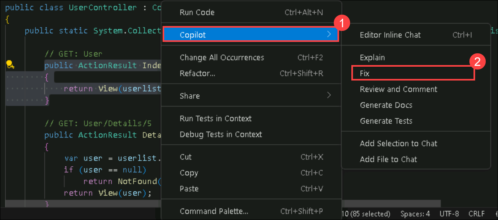
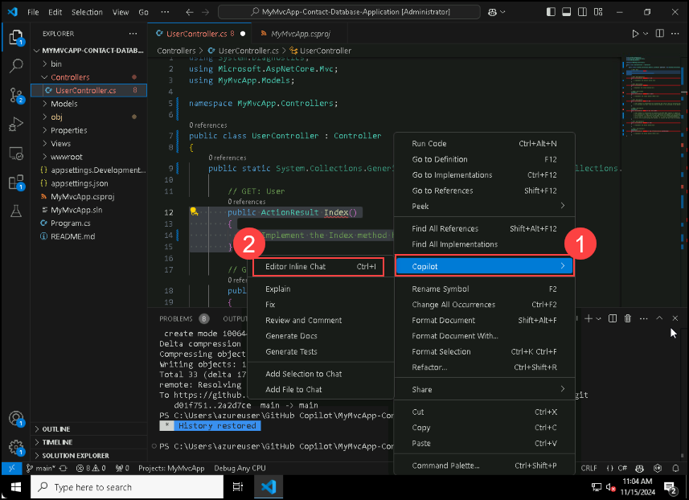
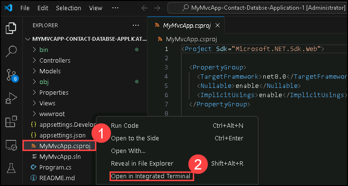

# Challenge 2: Develop an App with GitHub Copilot - Solution Guide

## Task 1: Develop an App

### Log in to GitHub

1. Login to [GitHub](https://github.com/login) with the CloudLabs provided GitHub account. Ensure that you are logged in to the correct GitHub account provided for this lab session.

### Import the Repository

1. Copy the following repository URL [https://github.com/CloudLabsAI-Azure/Code-Generation-Refactoring](https://github.com/CloudLabsAI-Azure/MyMvcApp-Contact-Database-Application) You will need it in the next step.

1. Go to your GitHub account, navigate to the Dashboard, and click on New.

   

1. Click on **Import a repository** at the top of the **Create a new repository** page. 

   

1. **Paste** the source repository URL you recently copied into the **"The URL for your source repository"** field **(1)**. Then, select the appropriate **Owner** from the drop-down list **(2)**, enter a unique **Repository name (3)**, and finally click **Begin import (4)** to clone the project into your GitHub account.

   

1. Then, go to the **browser’s address bar** and **copy the full repository URL** as shown above. This URL will be used later to **clone the repository** into your local environment.

   

### Open Visual Studio Code and Clone Repository

1. Launch Visual Studio and click on **Clone Repository**.

   

1. In the **search bar**, paste the **Git Repository URL** and press **Enter** to begin cloning the repository into Visual Studio Code.

   

1. Select the **GitHub Copilot** folder **(1)** in `C:\Users\azureuser`, then click **Select as Repository Destination** **(2)**.

   

   >**Note:** If the folder does not exist, please create a new one manually before proceeding.

1. A prompt will appear in Visual Studio Code asking: **“Would you like to open the cloned repository?”** — click **Open** to proceed.

   

1. The window will look like this.

   


### Setting Up Visual Studio Code

1. Navigate to **Extensions**. 

   

1. Install **Nuget Gallery** and **C# Dev Kit**

    - Search for **NuGet Gallery** in the Extensions Marketplace **(1)** and click **Install** **(2)**.

      

      >**Note:** When prompted with the message *“Do you trust the publisher 'pcislo'?”* click **Trust Publisher & Install** to proceed.
 
    -  Search for **C# Dev Kit** in the Extensions Marketplace **(1)** and click **Install** **(2)**.

       

       >**Note:** If you receive a warning saying **“.NET Core SDK cannot be located”**, it means that a valid .NET SDK is missing. Click **Get the SDK** to download and install the required .NET Core SDK. 

       
    
    - When the browser opens, you will be prompted to download the .NET Runtime needed to run console apps on Windows.
Click **Download x64** to get the Windows-compatible version. After the download is complete, **double-click the installer** to begin installation

      
   
### Implement Methods using GitHub Copilot
 
1. Navigate to the `UserController.cs` file within the `Controllers` folder.

 
   

#### Scenario 1
 
1. Use GitHub Copilot to generate code for each empty method in the `UserController.cs` file. To generate code for each empty method using GitHub Copilot, select or highlight the lines of the empty method, and then right-click on the highlighted lines to open the context menu.
 
   

   

1. From the context menu, choose the **Copilot (1)** option and click on **Fix (2)**
 
   
 
1. GitHub Copilot will generate a code suggestion based on the context of the method. Review the suggestion provided by GitHub Copilot, and you can choose to accept or discard the suggestion based on its relevance to your requirements.
 
   

#### Scenario 2
 
1. Use GitHub Copilot to generate code for each empty method in the `UserController.cs` file. To generate code for each empty method using GitHub Copilot, select or highlight the lines of the empty method, and then right-click on the highlighted lines to open the context menu.

   

1. From the context menu, choose the **Copilot (1)** option and click on **Editor Inline chat (2)**
   
   
     
1. GitHub Copilot will generate a code suggestion based on the context of the method. Review the suggestion provided by GitHub Copilot, and you can choose to accept or discard the suggestion based on its relevance to your requirements.

   
 
#### Scenario 3
 
1. Use GitHub Copilot to generate code for each empty method in the `UserController.cs` file. To generate code for each empty method using GitHub Copilot, select or highlight the lines of the empty method, and then right-click on the highlighted lines to open the context menu.
 
1. Open GitHub Copilot chat and ask Copilot to **Generate the code for UserController.cs file**

   
 
1. Copy the code and replace it in the UserController.cs file.

1. Following these steps will allow you to efficiently utilize GitHub Copilot to generate code for each empty method in the UserController.cs file.

### Run and test the Application

1. Locate the app file **MyMvcApp.csproj** and right click **Open in Integreted Terminal**.

   

1. Run the below command to run the application on localhost. 

    ```
    dotnet run
    ```

1. A successful run will look like this.

   

1. Once your code builds successfully, the terminal will show output similar to this:

   * `Now listening on: http://localhost:5266`

   This indicates that your app is running locally.
   Open your browser and go to: **`http://localhost:5266`** to view the app in action.
  
   


### Create a New Contact

1. In the browser window of your running Contact Database application, click on the **“Create New”** link to begin adding a new contact record.

   

1. Enter the **Name** and **Email** details in the form, then click **Create** to add the new contact to the database.

   

### Edit a Contact

1. After creating a contact, return to the homepage.

1. Find the contact you created in the list and locate the "Edit" button associated with it. Click on the **Edit** button.

   

1. Modify the existing details (Name or Email) as desired. Save the changes by clicking on the **Save** button.

   

### Verify Details of a Contact

1. Once again, return to the homepage.

1. Locate the contact whose details you want to verify. Click on the **Details** button associated with that contact.

   

1. Verify that the displayed details match the information you entered earlier.

   

### Delete a Contact

1. From the homepage, find the contact you wish to delete.

1. Click on the **Delete** button associated with that contact.

   

1. A confirmation dialog will appear asking **Are you sure you want to delete this**. Click **Delete**.

   

1. Ensure that the contact is removed from the list after deletion.

   

By following these steps meticulously, you can thoroughly test the CRUD (Create, Read, Update, Delete) functionalities of the application and ensure its proper functioning.

# Task 2: Generate Unit Test Cases

1. Run the following commands in the command prompt to create a new folder named **MyMvcApp.Tests** in **C:\Users\azureuser\GitHub Copilot** for generating unit test cases.

   ```
   cd C:\Users\azureuser\GitHub Copilot
   ```

   ```
   dotnet new xunit -n MyMvcApp.Tests
   ```
   

1. In your Visual Studio Code, locate the **MyMvcApp.Tests** folder in the Solution Explorer (1), right-click on it, and select **Open in Integrated Terminal** (2).

   

   -  Run the below command in the terminal to add the dotnet package.

   ```
   dotnet add package Microsoft.CodeDom.Providers.DotNetCompilerPlatform
   ```
   

1. Locate the **MyMvcApp.Tests** folder (1) in the Solution Explorer and rename the **UnitTest1.cs** file to **UserControllerTests.cs** (2).
  
   

1. Run the below command in terminal to add your **MyMvcApp.csproj** project as a reference to generate unit test cases for `UserController.cs`.

   ```
   dotnet add reference ../MyMvcApp-Contact-Database-Application\MyMvcApp.csproj
   ```

   

1. In the **Github Copilot chat** window, ask the GitHub Copilot to **Generate test cases to UserControllerTests for the MyMvcApp.csproj app by using xunit**.

   

1. Copy the code generated by Copilot in the **UserControllerTests.cs** file, which will be similar to the code below.

   ```
    using Xunit;
    using Microsoft.AspNetCore.Mvc;
    using MyMvcApp.Controllers;
    using MyMvcApp.Models;
    using System.Collections.Generic;
    using System.Linq;

     namespace MyApp.Tests
      {
         public class UserControllerTests
      {
         private UserController _controller;
 
         public UserControllerTests()
         {
             // Initialize UserController with an empty list for each test
             UserController.userlist = new List<User>();
             _controller = new UserController();
         }

         [Fact]
         public void Index_ReturnsViewResult_WithAListOfUsers()
         {
             // Arrange
             UserController.userlist.Add(new User { Id = 1, Name = "Test User 1", Email = "test1@example.com" });
             UserController.userlist.Add(new User { Id = 2, Name = "Test User 2", Email = "test2@example.com" });

             // Act
             var result = _controller.Index();

             // Assert
             var viewResult = Assert.IsType<ViewResult>(result);
             var model = Assert.IsAssignableFrom<IEnumerable<User>>(viewResult.Model);
             Assert.Equal(2, model.Count());
         }

         [Fact]
         public void Details_WithUnexistingId_ReturnsNotFound()
         {
             // Act
             var result = _controller.Details(99);

             // Assert
             Assert.IsType<NotFoundResult>(result);
         }

         [Fact]
         public void Details_WithExistingId_ReturnsViewResult()
         {
             // Arrange
             UserController.userlist.Add(new User { Id = 1, Name = "Test User", Email = "test@example.com" });

             // Act
             var result = _controller.Details(1);

             // Assert
             var viewResult = Assert.IsType<ViewResult>(result);
             var model = Assert.IsType<User>(viewResult.Model);
             Assert.Equal(1, model.Id);
         }

         [Fact]
         public void Create_PostValidUser_RedirectsToIndex()
         {
             // Arrange
             var user = new User { Id = 1, Name = "New User", Email = "new@example.com" };
 
             // Act
             var result = _controller.Create(user);

             // Assert
             var redirectToActionResult = Assert.IsType<RedirectToActionResult>(result);
             Assert.Equal("Index", redirectToActionResult.ActionName);
             Assert.Single(UserController.userlist);
         }

         [Fact]
        
         public void Create_PostInvalidUser_ReturnsViewWithModel()
         {
             // Arrange
             _controller.ModelState.AddModelError("Name", "Required");

             // Act
             var result = _controller.Create(new User());

             // Assert
             var viewResult = Assert.IsType<ViewResult>(result);
             Assert.False(viewResult.ViewData.ModelState.IsValid);
         }
       }
    }
   ```

   
    
1. Right-click on the **MyMvcApp.Tests** project folder (1) and select **Open in Integrated Terminal** (2) to access the terminal for running tests.

   

1. Run the below command in the terminal to fetch the unit test results.

   ```
   dotnet test
   ```
   

# Task 3: Develop and Test Features

### Utilize GitHub Copilot Chat for Feature Development:
  
1. Click on the **GitHub Copilot icon** in the top menu bar (1), then select **Open Chat** from the dropdown (2) to open the GitHub Copilot Chat window.

   

### Ask GitHub Copilot Chat for Feature Implementation:
   
1. In the GitHub Copilot Chat panel, enter the prompt: **“How can we add a search feature/functionality to our application?”** Then press **Enter** to get Copilot’s suggestions for implementing the feature

   

1. Based on the response generated by GitHub Copilot, proceed with implementing the suggested code.
  
1. In this case, GitHub Copilot suggested adding a new method to accept a search string as a parameter and filter the user list based on the search string before passing it to the view.

   

1. Copy and paste the provided code snippet into the `UserController.cs` file within the appropriate action method, typically the `Index` method. In this code, if a searchString is provided, the user list is filtered to only include users whose names contain the searchString. If no searchString is provided, all users are returned.

   ```
   // GET: User
   public ActionResult Index(string searchString)
   {
       var users = from u in userlist
       select u;
    if (!String.IsNullOrEmpty(searchString))
   {
       users = users.Where(s => s.Name.Contains(searchString));
   }
     return View(users.ToList());
   }
  
   ```

   

1. GitHub Copilot also suggested modifying the `Index.cshtml` file located in the path **Views\User\Index.cshtml** to include a form for the search string.

1. Copy and paste the provided code snippet found in the Copilot chat into the `Index.cshtml` file. This form sends a GET request to the Index action method, passing the search string as a query string parameter.

   ```
   @using (Html.BeginForm("Index", "User", FormMethod.Get))
   {
      <p>
       Find by name: @Html.TextBox("searchString") 
       <input type="submit" value="Search" />
      </p>
    }
   ```

   

### Save Changes and Run the Application:

1. After making the necessary changes, save both the **UserController.cs** and **Index.cshtml** files by pressing **Ctrl + S**.

1. Run the application by opening the **Terminal** in Visual Studio Code and executing the command:

   ```
   dotnet run
   ```
   This command will start the application and host it on **localhost**, as shown in the output (e.g., `http://localhost:5266`).

   

### Test the Search Functionality:

1. Add a couple of contact entries to the application by clicking on **Create New** and filling in the **Name** and **Email** fields. Once added, the contacts will be listed on the Index page.

   

   

1. Once contacts are added, test the search functionality by typing a contact's name in the **Find by name** input field and then clicking the **Search** button to filter the list.

   

1. If the feature is working as expected, the search result should display only the matching contact—like **John Doe**—based on the entered search keyword.

   

1. Once you have verified that the search functionality works correctly and all changes are complete, the next step is to **push the updated project files to your GitHub repository**.

1. Push the changes to your forked GitHub repository `gh-hack-20250618-1769089/MyMvcApp-Contact-Database-Application` using the following Git commands in your terminal:

   ```bash
   git add .
   git commit -m "Added search functionality and completed contact management features"
   git push -u origin main
   ```
By following these steps, you can effectively utilize GitHub Copilot to implement and test new features in your application, enhancing its functionality and usability.

