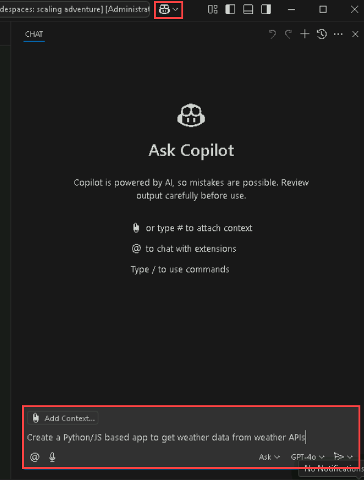

# Desafio 1: Primeiros passos com o GitHub Copilot - Guia da Solução

## Tarefa 1: Configurar o GitHub Copilot no VS Code

Nesta tarefa, você instalará a extensão GitHub Copilot no VS Code.

1. Abra o Visual Studio Code a partir da tela inicial.
   
   

1. Clique no ícone de **Extensões (1)** na barra de atividades, no lado esquerdo da janela do Visual Studio Code.
   
1. Na caixa de pesquisa "**Pesquisar Extensões no Marketplace**", digite e procure pela extensão **GitHub Copilot (2)**.
   
1. Selecione o **GitHub Copilot (3)** na lista de resultados.

1. Clique no botão **Instalar (4)**.

   

## Tarefa 2: Fazer login com uma conta do GitHub

Nesta tarefa, você fará login na sua conta GitHub através da extensão GitHub Copilot.

1. Após a instalação, no canto inferior direito, clique no prompt **Fazer login no GitHub**.
   
   
   
1. Clique em **Permitir** no pop-up.

   

1. Na página de login do GitHub, insira suas credenciais do GitHub e clique em **Sign in**.

1. Para verificar o login da sua conta GitHub, entre no Outlook na máquina virtual do laboratório em uma janela **Privada**  (https://outlook.office365.com/mail/) usando suas credenciais do GitHub, localize o e-mail contendo o código de verificação e selecione **Verificar**.

1. Clique em **Autorizar o Visual-Studio-Code** para fornecer permissões adicionais ao GitHub para o VS Code.

## Tarefa 3: Utilizar o GitHub Codespaces com o Copilot

Nesta tarefa, você criará um novo codespace para o seu repositório do GitHub e usará a extensão do GitHub Codespaces para fazer commit e push das alterações diretamente do VS Code para o repositório escolhido.

1. Faça um fork do repositório **https://github.com/CloudLabsAI-Azure/Code-Generation-Refactoring**. Na página inicial do seu repositório, clique na aba **Código** **(1)** localizada na canto superior esquerdo da tela. Clique no botão **Código** **(2)** localizado no centro da página.

1. Clique na aba **Codespaces (1)** na caixa que aparece e, em seguida, clique no botão **Criar codespace na branch main (2)**.

   >**Observação**: Se um prompt pop-up não aparecer no browser para abrir o Visual Studio Code, inicie manualmente o Visual Studio Code a partir da área de trabalho e feche-o. Em seguida, volte para o browser, atualize a página e inicie o codespace que foi criado anteriormente.

   

>**Observação:** Se um aviso pop-up não aparecer no navegador para abrir o Visual Studio Code, inicie manualmente o Visual Studio Code a partir da área de trabalho e feche-o. Em seguida, retorne ao navegador, atualize a página e inicie o codespace que foi criado anteriormente.

1. Se o Codespace não abrir no seu Visual Studio Code, navegue até o seu repositório GitHub, clique em **Código**, clique no **botão de reticências** do seu codespace atual e, em seguida, clique em **Abrir no Visual Studio Code**.

1. Você verá um aviso pop-up. Clique em **Abrir** para prosseguir. Em seguida, outra janela pop-up aparecerá dentro do Visual Studio Code (VS Code), onde você deve selecionar novamente **Instalar e Abrir** para continuar.

   

   

1. No canto inferior direito, você receberá um prompt para fazer login no GitHub.

1. Em seguida, quando o pop-up aparecer, clique em **Permitir**.

   >**Observação**: Aguarde cerca de 2 minutos para que o codespace seja inicializado.

   

1. Clique em **Autorizar o Visual-Studio-Code** quando a tab Authorize GitHub for VS Code aparecer no navegador.

1. Verifique se o seu codespace está em execução.

1. Agora você pode editar os arquivos do seu repositório do GitHub, fazer commit e push das alterações diretamente para o GitHub através do VS Code.

## Tarefa 4: Teste de Função do Copilot

Nesta tarefa, você avaliará a funcionalidade do GitHub Copilot gerando um trecho de código simples usando o Chat do Copilot.

1. Crie um arquivo com qualquer nome de sua escolha.

   

1. Pressione **Ctrl + I** para solicitar que o GitHub Copilot escreva código para você.
   
1. Quando a minijanela do Copilot aparecer, peça ao Copilot para gerar um código simples em Python.

   

1. Um código básico "Olá, Mundo!" será gerado. Clique em "Aceitar" para inseri-lo no arquivo recém-criado.

   

   >**Observação:** O resultado pode variar no seu caso. Não será exatamente o mesmo, mas será semelhante à imagem fornecida.

Isso confirma que a funcionalidade do Copilot está funcionando corretamente.

## Tarefa 5: Geração de Código com o Copilot e o Copilot Chat

Nesta tarefa, você criará um código em Python/JS para construir uma calculadora e usará chaves da API OpenWeatherMap para obter dados meteorológicos.

1. Abra a janela de chat do GitHub Copilot e peça ao GitHub Copilot para criar um código em Python/JS para construir uma calculadora usando o seguinte prompt.

   ```
   Create a Python/JS based code to build a calculator 
   ```

   

>**Observação:** O resultado pode variar no seu caso. Não será exatamente o mesmo, mas será semelhante à imagem fornecida.

1. Observe como o GitHub Copilot cria códigos para desenvolver uma calculadora tanto em Python quanto em JS. Salve os arquivos para executar os testes.

   - Código Python para criar uma calculadora:
     ```
     def add(x, y):
     return x + y

     def subtract(x, y):
     return x - y

     def multiply(x, y):
     return x * y

     def divide(x, y):
     if y == 0:
        return "Error! Division by zero."
     else:
        return x / y

     print("Select operation:")
     print("1.Add")
     print("2.Subtract")
     print("3.Multiply")
     print("4.Divide")

     while True:
        choice = input("Enter choice(1/2/3/4): ")

        if choice in ('1', '2', '3', '4'):
          num1 = float(input("Enter first number: "))
          num2 = float(input("Enter second number: "))

     if choice == '1':
            print(num1, "+", num2, "=", add(num1, num2))

     elif choice == '2':
            print(num1, "-", num2, "=", subtract(num1, num2))

     elif choice == '3':
            print(num1, "*", num2, "=", multiply(num1, num2))

     elif choice == '4':
            print(num1, "/", num2, "=", divide(num1, num2))
     break

     else:

     print("Invalid Input")

     ```

   - Código JS para criar uma calculadora:
     ```
      // Function to add two numbers
      function add(a, b) {
        return a + b;
      }

      // Function to subtract two numbers
      function subtract(a, b) {
        return a - b;
      }

      // Function to multiply two numbers
      function multiply(a, b) {
        return a * b;
      }

      // Function to divide two numbers
      function divide(a, b) {
        if (b === 0) {
          return "Error: Division by zero";
        }
        return a / b;
      }

      // Declare and assign values to num1 and num2
      var num1 = 5;
      var num2 = 3;

      console.log("Addition:", add(num1, num2));
      console.log("Subtraction:", subtract(num1, num2));
      console.log("Multiplication:", multiply(num1, num2));
      console.log("Division:", divide(num1, num2));
     ```
   > **Observação:** Declare as duas variáveis/números antes de executar os testes com JS.
   
   > **Observação:** O resultado pode variar no seu caso. Não será exatamente o mesmo, mas será semelhante ao código fornecido.

1. Execute testes para os arquivos, experimentando diferentes operações para verificar o funcionamento da calculadora.

1. Para obter os dados meteorológicos das APIs de clima, primeiro faça login no site da API do OpenWeatherMap (https://openweathermap.org/). No menu suspenso do seu perfil, no canto superior direito, clique em **My API Keys**. Você pode utilizar a chave de API padrão ou gerar uma nova para acessar os dados meteorológicos pelo código.

   

1. Crie uma nova conta para obter os dados meteorológicos por código, clicando em **Criar uma Conta**.

   

1. Para criar uma nova conta no OpenWeather, o usuário preenche seu nome de usuário **(1)**, endereço de e-mail **(2)**, senha **(3 e 4)**, concorda com os termos marcando as caixas necessárias **(5 e 6)**, completa o CAPTCHA **(7)** e, finalmente, clica no botão **Criar Conta (8)**.

   

1. Em seguida, faça login usando o mesmo nome de usuário e credenciais.

   >**Observação:**  Por favor, use o nome de usuário e senha ANTIGOS.

1. Abra a janela de chat do GitHub Copilot e peça ao GitHub Copilot para criar um app em Python/JS para obter dados meteorológicos de APIs.

   ```
   Create a Python/JS based app to get weather data from weather APIs
   ```

   

1. Observe como o GitHub Copilot cria códigos para obter dados meteorológicos de APIs tanto em Python quanto em JS.

   - Python:
     ```
     import requests

     def get_weather(city):
       API_KEY = 'ENTER YOUR WEATHER API KEY HERE'
       BASE_URL = f"http://api.openweathermap.org/data/2.5/weather?q={city}&appid={API_KEY}"
       response = requests.get(BASE_URL)
       data = response.json()
       main = data['main']
       print(f"Temperature: {main['temp']}")
       print(f"Humidity: {main['humidity']}")
       print(f"Weather: {data['weather'][0]['description']}")

     city = input("Enter the city: ")
     get_weather(city)
     ```
   - JS:
     ```
     async function getWeather(city) {
        const API_KEY = 'ENTER YOUR WEATHER API KEY HERE';
        const BASE_URL = `http://api.openweathermap.org/data/2.5/weather?q=${city}&appid=${API_KEY}`;
        const response = await fetch(BASE_URL);
        const data = await response.json();
        console.log(`Temperature: ${data.main.temp}`);
        console.log(`Humidity: ${data.main.humidity}`);
        console.log(`Weather: ${data.weather[0].description}`);
     }

     const city = 'Mumbai';  // Replace with the city you want to get the weather for
     getWeather(city);
     ```
   > **Observação:** Insira o nome da cidade antes de executar os testes com JS.

1. Execute testes para os arquivos, inserindo diferentes cidades para verificar se os dados meteorológicos estão sendo buscados das APIs.

1. Faça o push dos arquivos para o seu repositório forkado **CloudLabsAI-Azure/Code-Generation-Refactoring** no GitHub.

## Tarefa 6: Refatoração e Depuração de Código

Nesta tarefa, você refatorará e depurará os códigos Python mal escritos usando o GitHub Copilot e testará alguns cenários.

1. Abra o arquivo **sum_elements.py** clicando duas vezes nele.
   
1. Selecione o código inteiro, clique com o botão direito, clique em **Refatorar** e selecione *Modificar usando o Copilot*, e peça ao Copilot para refatorar o código selecionado.

1. Você notará que o GitHub Copilot refatorou e corrigiu o código.

   ```
   #A poorly written example of a program in Python. It prompts the user for the number of elements to sum, takes those integers as input, and handles some basic error cases
      
   MAX = 100

   def calculate_sum(arr):
         result = 0
         for num in arr:
            result += num
         return result

   def main():
         try:
            n = int(input("Enter the number of elements (1-100): "))
            if not 1 <= n <= MAX:
                  print("Invalid input. Please provide a digit ranging from 1 to 100.")
                  exit(1)

            arr = []

            print(f"Enter {n} integers:")
            for _ in range(n):
                  try:
                     arr.append(int(input()))
                  except ValueError:
                     print("Invalid input. Please enter valid integers.")
                     exit(1)

            total = calculate_sum(arr)

            print("Sum of the numbers:", total)

         except KeyboardInterrupt:
            print("\nProgram terminated by user.")
            exit(1)

   if __name__ == "__main__":
         main()
   ```
1. Aceite as alterações e salve o arquivo. Execute alguns casos de teste para verificar se o código refatorado pelo GitHub Copilot está correto.

1. Abra o arquivo **card_draw.py** clicando duas vezes nele.

1. Selecione o código inteiro, clique com o botão direito, selecione **Copilot** e, em seguida, **Corrigir** para depurar o código selecionado.

1. Você notará que o GitHub Copilot depurou e corrigiu o código.

   ```
   # Intentionally flawed Python program

   # importing modules
   import itertools, random

   # make a deck of cards
   deck = list(itertools.product(range(1,14),['Spade','Heart','Diamond','Club'])

   # shuffle the cards
   random.shuffle(deck)

   # draw five cards
   print("You got:")
   for i in range(5)
      print(deck[i][0], "of", deck[i][1]
   ```
   
1. Aceite as alterações e salve o arquivo. Execute alguns casos de teste para verificar se o código depurado pelo GitHub Copilot está funcionando como esperado.

## Tarefa 7: Explorar Recursos do GitHub Copilot

Nesta tarefa, você explorará vários recursos do GitHub Copilot através de um script Python simples que define uma função para calcular o fatorial de um número.

1. Abaixo está um script Python simples que define uma função para calcular o fatorial de um número. Vamos usá-lo para explorar os recursos do GitHub Copilot.

   ```
   def factorial(n):
       if n == 0:
           return 1
       else:
           return n * factorial(n-1)

   choice = int(input("Enter a number to calculate its factorial: "))
   print(f"The factorial of {choice} is {factorial(choice)}")
   ```

1. Selecione o código inteiro, clique com o botão direito e veja os recursos do **Copilot**.

   

1. O recurso **Chat Integrado do Editor(1)** permite que você faça perguntas ou forneça feedback diretamente no seu editor de código ao usar o GitHub Copilot.

1. O recurso **Explicar (2)** fornece uma explicação detalhada de como o código funciona e sua funcionalidade.

   

1. O recurso **Corrigir (3)** propõe uma correção para os problemas no código selecionado.

   

1. O recurso **Gerar Documentos (4)** era documentação ou comentários sobre o código selecionado.

   

1. O recurso **Gener Testes (5)** gera testes unitários para o código selecionado. Neste caso, o GitHub Copilot gera um script de teste em Python, após o qual você pode executar o script e ver os resultados.

   

   

1. Você também pode perguntar como fazer algo no terminal, perguntar sobre o VS Code e sobre seu workspace simplesmente digitando o caractere especial **@** na janela do Chat do GitHub Copilot.

   

1. O GitHub Copilot também o auxilia na criação do esqueleto de código (scaffolding) para um novo workspace, na geração de um novo Jupyter Notebook e em vários tipos de documentação, como Markdown e Javadoc.

## Conclusão

Neste desafio, você configurou com sucesso o GitHub Copilot no Visual Studio Code, ajustou as configurações da extensão e fez login com sua conta do GitHub. Você também obteve sucesso na criação de código em Python/JS para uma calculadora e um aplicativo para buscar dados meteorológicos das APIs do OpenWeatherMap. Além disso, você aprimorou suas habilidades de codificação ao refatorar trechos de código e depurar com a ajuda do Copilot.

### Clique em Avançar >> para prosseguir com o próximo desafio.


