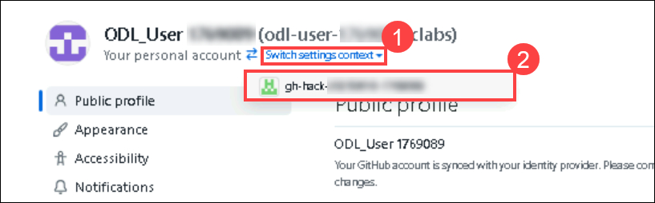
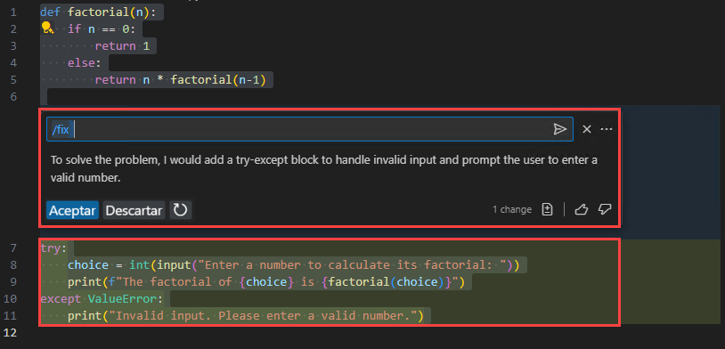

# Challenge 1: Getting Started with GitHub Copilot - Solution Guide

## Task 1: Set up GitHub Copilot in VS Code

In this task, you'll be installing the GitHub Copilot extension in VS Code.

1. Open Visual Studio Code from the desktop screen.
   
   

1. Click on the **Extensions (1)** icon in the activity bar on the left side of the Visual Studio Code window.
   
1. In the "**Search Extensions in Marketplace**" search box, type and search for the **GitHub Copilot (2)** extension.
   
1. Select **GitHub Copilot (3)** from the list of results.

1. Click on the **Install (4)** button.

   

## Task 2: Login with a GitHub Account

In this task, you'll be signing in to your GitHub account through the GitHub Copilot extension.

1. After installation, at the bottom right corner, click on the **Sign in to GitHub** prompt.
   
   
   
1. Click **Allow** if the GitHub Copilot extension wants to sign in using GitHub.

   

1. On the **Sign-in GitHub** page, enter your GitHub credentials and click on **Sign in with identity provider**.

   

1. Click on **Continue** on Single sign-on to **CloudLabs Organizations**.

   

1. On the **Sign in to Microsoft tab**, you will see a login screen. Enter the email/username, and then click on **Next**.

   

   >**Note:** You can find the Username and Password within the lab environment by navigating to the **Environment tab** at the top. Then click on Azure Credentials and copy both the **Username** and **Password** from the Auth Fields section.

1. Now, enter the password and click on **Sign in**.

   

   >**Note:** If you see the pop-up **Stay Signed in?**, click **No**.

1. Click on **Continue** on Select user to authorize **Visual Studio Code**.   

   

1. Click on **Authorize Visual-Studio-Code** to provide additional permissions to GitHub for Visual Studio Code.

   

1. You will encounter a pop-up prompt. click **Open** to proceed.

   

## Task 3: Using GitHub Codespaces with Copilot

In this task, you'll create a new codespace for your GitHub repository and use the GitHub Codespaces extension to commit and push changes directly from VS Code to your chosen GitHub repository.

1. Copy the following repository URL: **https://github.com/CloudLabsAI-Azure/Code-Generation-Refactoring** You will need it in the next step to **import or clone**the repository.
   
1. Go to your GitHub account, navigate to the **Dashboard**, and click on **Import repository.

   

1. **Paste** the source repository URL you recently copied into the **"The URL for your source repository"** field (1). Then, select the appropriate **Owner** from the drop-down list (2), enter a unique **Repository name** (3), and finally click **Begin import** (4) to clone the project into your GitHub account.

   

1. **Once the import is complete**, you will see the confirmation message **"Preparing your new repository"** followed by a green checkmark. This indicates that your new repository is ready. Now, click on the **Code** tab.

   

1. **Go to GitHub Settings**, then click on **Switch settings context (1)**. From the dropdown menu, select your organization **gh-hack-... (2)**.

   

1. In the left sidebar, click **Codespaces (1)**, then select **General (2)**. Under **Codespaces access**, choose **Enable for all members and outside collaborators (3)**, and finally click **Save (4)** to apply the setting.

   

1. Click the **Code (1)** dropdown at the top right, then select the **Codespaces (2)** tab from the pop-up. After that, click **Create codespace on main (3)** to launch a cloud-based development environment.

   

   >**Note**: If a pop-up prompt doesn't appear in the browser to open Visual Studio Code, manually launch Visual Studio Code from the desktop and close it. Next, return to the browser, refresh the page, and launch the codespace that was previously created.

1. **If the Codespace does not automatically open in Visual Studio Code**, follow these steps:

   Click on **Code (1)**, then go to the **Codespaces tab (2)**. Locate your active codespace, click on the **ellipsis menu (3)** next to it, and select **Open in Visual Studio Code (4)** from the dropdown.

   

1. **You will encounter a browser pop-up** asking if you want to open Visual Studio Code. Click **Open** to proceed.

   

1. Inside Visual Studio Code, another prompt will appear asking: **"Would you like to install 'GitHub Codespaces' extension?"** Click **Install Extension and Open URI** to proceed.

   

1. When prompted with **"The extension 'GitHub Codespaces' wants to sign in using GitHub"**, click **Allow** to continue. Next, once you get the pop-up, click on **Allow**.

   

   >**Note:** Wait about 2 minutes for the codespace to spin itself up.

1. On the **"Select user to authorize Visual Studio Code"** screen, click **Continue** next to your signed-in GitHub account.

   

1. Click on **Authorize Visual-Studio-Code** to grant the necessary permissions for Visual Studio Code to access your GitHub Codespaces and repositories.

   

1. Verify your codespace is running.

1. You can now edit your GitHub repository files, commit, and push the changes directly to GitHub through VS Code.

## Task 4: Copilot Function Test

In this task, you will evaluate the functionality of GitHub Copilot by generating a simple code snippet using Copilot Chat.

1. Create a new file with any name of your choice (e.g., `HelloW.py`) in Visual Studio Code.

   

1. Press Ctrl + I to prompt GitHub Copilot to write code for you.

1. When the Copilot mini window appears, enter this prompt: `Create a simple python code`.

   

1. A basic "Hello World" code will be generated. Click **Accept** to insert it into the newly created file.

   

   >**Note:** The output may vary in your case. It won't be the same, but it will be similar to the image provided.

This confirms that the Copilot functionality is working properly.

## Task 5: Code Generation with Copilot and Copilot Chat

In this task, you'll create a Python/JS code to build a calculator and use OpenWeatherMap API keys to get weather data from weather APIs.

1. Click on the **GitHub Copilot Chat** icon at the top right and select **Open Chat**. In the chat window, enter the prompt:
**`Create a Python/JS-based code to build a calculator`**. GitHub Copilot will respond with the relevant code suggestion.

   

   

   >**Note:** The output may vary in your case. It won't be the same, but it will be similar to the image provided.

1. Notice how GitHub Copilot creates code to build a calculator in both Python and JavaScript. Save the files to run tests.

   - Python code to build a calculator:
     ```
     def add(x, y):
     return x + y

     def subtract(x, y):
     return x - y

     def multiply(x, y):
     return x * y

     def divide(x, y):
     if y == 0:
        return "Error! Division by zero."
     else:
        return x / y

     print("Select operation:")
     print("1.Add")
     print("2.Subtract")
     print("3.Multiply")
     print("4.Divide")

     while True:
        choice = input("Enter choice(1/2/3/4): ")

        if choice in ('1', '2', '3', '4'):
          num1 = float(input("Enter first number: "))
          num2 = float(input("Enter second number: "))

     if choice == '1':
            print(num1, "+", num2, "=", add(num1, num2))

     elif choice == '2':
            print(num1, "-", num2, "=", subtract(num1, num2))

     elif choice == '3':
            print(num1, "*", num2, "=", multiply(num1, num2))

     elif choice == '4':
            print(num1, "/", num2, "=", divide(num1, num2))
     break

     else:

     print("Invalid Input")

     ```

   - JS code to build a calculator
     ```
      // Function to add two numbers
      function add(a, b) {
        return a + b;
      }

      // Function to subtract two numbers
      function subtract(a, b) {
        return a - b;
      }

      // Function to multiply two numbers
      function multiply(a, b) {
        return a * b;
      }

      // Function to divide two numbers
      function divide(a, b) {
        if (b === 0) {
          return "Error: Division by zero";
        }
        return a / b;
      }

      // Declare and assign values to num1 and num2
      var num1 = 5;
      var num2 = 3;

      console.log("Addition:", add(num1, num2));
      console.log("Subtraction:", subtract(num1, num2));
      console.log("Multiplication:", multiply(num1, num2));
      console.log("Division:", divide(num1, num2));
     ```
      >**Note:** Declare the two variables/numbers before running tests through JS.

      >**Note:** The output may vary in your case. It won't be the same, but it will be similar to the code provided.

1. Run tests for the files by experimenting with different operations to verify the working of the calculator.

   

   

1. To access weather data using the OpenWeatherMap API, go to [https://openweathermap.org](https://openweathermap.org) and click on **Sign in** at the top-right corner of the page.

   

1. Click on **Create an Account** to register and get access to the OpenWeatherMap API for retrieving weather data.

   

   >**Note:** If a pop-up prompt appears asking "How and where will you use our API?", click **Cancel** to proceed.

1. To create a new OpenWeather account, fill in the following fields:

   * Enter your **Username (1)**
   * Enter your **Email address (2)**
   * Set your **Password (3)** and **Confirm it (4)**
   * Check the box to confirm you are over 16 years old **(5)**
   * Agree to the Privacy Policy and Terms **(6)**
   * Complete the **CAPTCHA verification (7)**
   * Finally, click on **Create Account (8)**

     

1. After creating the account, you will be signed in automatically. If not, **sign in manually** using the **same username and password** you created earlier.

   >**Note:** Please use OLD username and password.

1. To access your API keys, click on your **username (1)** at the top-right corner, then select **My API keys (2)** from the dropdown menu. This will open the section where you can view or manage your API key.  Make sure to copy the API key.

   

1. Open the **GitHub Copilot Chat** window by clicking the Copilot icon from the top bar. Then, in the message box at the bottom, type:
   
   ```
   Create a Python/JS based app to get weather data from weather APIs
   ```

   

1. Notice how GitHub Copilot creates code to get weather data from weather APIs in both Python and JavaScript.

   - Python:
     ```
     import requests

     def get_weather(city):
       API_KEY = 'ENTER YOUR WEATHER API KEY HERE'
       BASE_URL = f"http://api.openweathermap.org/data/2.5/weather?q={city}&appid={API_KEY}"
       response = requests.get(BASE_URL)
       data = response.json()
       main = data['main']
       print(f"Temperature: {main['temp']}")
       print(f"Humidity: {main['humidity']}")
       print(f"Weather: {data['weather'][0]['description']}")

     city = input("Enter the city: ")
     get_weather(city)
     ```
   - JS:
     ```
     async function getWeather(city) {
        const API_KEY = 'ENTER YOUR WEATHER API KEY HERE';
        const BASE_URL = `http://api.openweathermap.org/data/2.5/weather?q=${city}&appid=${API_KEY}`;
        const response = await fetch(BASE_URL);
        const data = await response.json();
        console.log(`Temperature: ${data.main.temp}`);
        console.log(`Humidity: ${data.main.humidity}`);
        console.log(`Weather: ${data.weather[0].description}`);
     }

     const city = 'Mumbai';  // Replace with the city you want to get the weather for
     getWeather(city);
     ```
     > **Note:** Enter the name of the city before running tests through JS.

1. Run tests for the files by entering different cities to verify that the weather data is being fetched from the weather APIs.

1. Run the following commands in your terminal to upload your local files to your GitHub repository:

   ```bash
   git add .
   ```

   ```bash
   git commit -m "Initial commit"
   ```

   ```bash
   git push -u origin main
   ```
   >**Note:** This will upload your project to your repository **`gh-hack-20250618-1769089/Code-Generation-Refactoring`**

   

## Task 6: Code Refactoring & Debugging

In this task, you'll be refactoring and debugging the poorly written Python codes using GitHub Copilot and testing out a few scenarios.

1. Open the **sum_elements.py** file by double-clicking on it.

1. Select the entire code, right-click, and click **Refactor** and select **Modify using Copilot**, and ask the Copilot to refactor the code chosen.

   

   

1. You'll notice that GitHub Copilot has refactored and fixed the code.

   ```
   #A poorly written example of a program in Python. It prompts the user for the number of elements to sum, takes those integers as input, and handles some basic error cases

   MAX = 100

   def calculate_sum(arr):
      return sum(arr)

   def main():
      try:
         n = int(input("Enter the number of elements (1-100): "))
         if not 1 <= n <= MAX:
            print("Invalid input. Please provide a digit ranging from 1 to 100.")
            exit(1)

         arr = []

         print(f"Enter {n} integers:")
         for _ in range(n):
            try:
               arr.append(int(input()))
            except ValueError:
               print("Invalid input. Please enter valid integers.")
               exit(1)

         total = calculate_sum(arr)

         print("Sum of the numbers:", total)

      except KeyboardInterrupt:
         print("\nProgram terminated by user.")
         exit(1)

   if __name__ == "__main__":
      main()
   ```

1. After Copilot suggests changes to your code, click **Accept** to apply the fix. Then, **save the file** and run a few test cases to verify that the code refactored by GitHub Copilot is accurate.

   

1. Open the **card_draw.py** file by double-clicking on it.

1. Select the entire code, then **right-click**, go to **Copilot (1)**, and click **Fix (2)** to let GitHub Copilot automatically suggest a corrected version of the selected code. 

   

1. You'll notice that GitHub Copilot has debugged and fixed the code.

   ```
   # Intentionally flawed Python program

   # importing modules
   import itertools
   import random

   # make a deck of cards
   deck = list(itertools.product(range(1, 14), ['Spade', 'Heart', 'Diamond', 'Club']))

   # shuffle the cards
   random.shuffle(deck)

   # draw five cards
   print("You got:")
   for i in range(5):
      print(deck[i][0], "of", deck[i][1])
   ```

1. After Copilot suggests changes to your code, click **Accept** to apply the fix. Then, **save the file** and run a few test cases to verify that the code debugged by GitHub Copilot is working as expected.

   

## Task 7: Explore GitHub Copilot Features

In this task, you'll explore various GitHub Copilot features through a simple Python script that defines a function to calculate the factorial of a number.

1. Below is a simple Python script that defines a function to calculate the factorial of a number. Let's use this to explore the GitHub Copilot features.

   ```
   def factorial(n):
       if n == 0:
           return 1
       else:
           return n * factorial(n-1)

   choice = int(input("Enter a number to calculate its factorial: "))
   print(f"The factorial of {choice} is {factorial(choice)}")
   ```

1. Select the entire code, right-click, and view the **Copilot** features.

   

1. **Editor Inline Chat(1)** feature allows you to ask questions or provide feedback directly within your code editor while using the GitHub Copilot.

1. **Explain (2)** feature gives a detailed explanation of how the code works and its functionality.

   

1. **Fix (3)** feature proposes a fix for the problems in the selected code.

   

1. **Generate Docs (4)** feature generates documentation or comments about the selected code.

   

1. **Generate Tests (5)** feature generates unit tests for the selected code. In this case, the GitHub Copilot generates a test case Python script, after which you can execute the script and view the results.

   

   

1. You can also ask how to do something in the terminal, ask about VS Code, and ask about your workspace simply by entering the **@** special character in your GitHub Copilot Chat window.

   

1. GitHub Copilot also assists you in scaffolding code for a new workspace, generating a new Jupyter notebook, and various types of documentation like Markdown and Javadoc.

### You have successfully completed the Challenge
