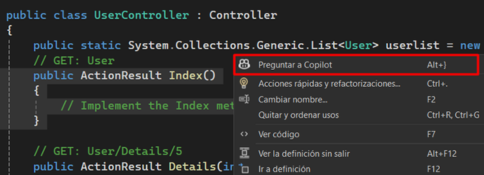
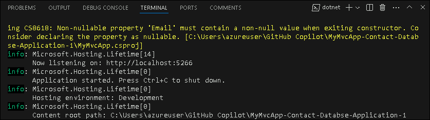
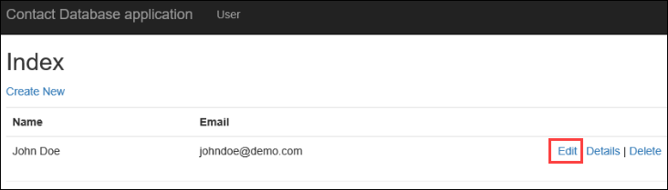
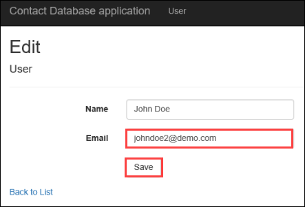
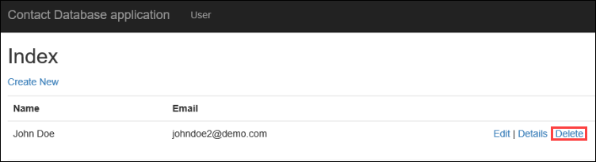
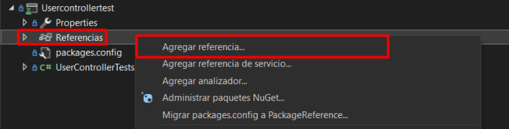
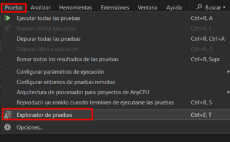
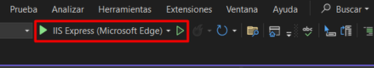

# Desafio 2: Desenvolva uma applicação com o GitHub Copilot - Guia da Solução

## Task 1: Desenvolver uma aplicação

### Login no GitHub

1. Faça login no [GitHub](https://github.com/login) com a conta do GitHub fornecida pela CloudLabs. Certifique-se de que você está conectado à conta correta do GitHub fornecida para este laboratório.

### Faça o Fork do repositório

1. Navegue até o link do repositório do GitHub fornecido: 
[MyMvcApp-Contact-Databse-Application](https://github.com/CloudLabsAI-Azure/MyMvcApp-Contact-Databse-Application.git).

    

1. Faça um fork do repositório para a conta do GitHub fornecida pelo CloudLabs.

    

### Abra o Visual Studio e Clone o Repositório

1. Abra o Explorador de Arquivos e crie uma pasta chamada **GitHub Copilot** em **C:\Users\azureuser**.

1. Inicie o Visual Studio e clique em **Clonar repositório Git**.

   

1. Na barra de pesquisa, insira a URL do Repositório Git e pressione Enter.

    

1. A janela ficará assim:

    

### Configurando o Visual Studio Code

1. Navegue até **Extensões**.

1. Instale o **Nuget Gallery** e o **C# Dev Kit**.
    - Clique no ícone de extensões no lado esquerdo.
    - Procure por Nuget Gallery e C# Dev Kit.
    - Clique em instalar; após isso, as extensões estarão instaladas.

### Implementar Métodos usando o GitHub Copilot

1. Navegue até o arquivo `UserController.cs` dentro da pasta `Controllers`.

    

#### Cenário 1

1. Use o GitHub Copilot para gerar código para cada método vazio no arquivo `UserController.cs`. Para gerar o código, selecione ou destaque as linhas do método vazio e, em seguida, clique com o botão direito nas linhas destacadas para abrir o menu de contexto.

    

    

1. No menu de contexto, escolha a opção **Copilot** e clique em **Corrigir**.

    

1. O GitHub Copilot gerará uma sugestão de código com base no contexto do método. Revise a sugestão fornecida pelo GitHub Copilot e você pode optar por aceitar ou descartar a sugestão com base em sua relevância para seus requisitos.

    

1. O GitHub Copilot gerará uma sugestão de código com base no contexto do método. Revise a sugestão fornecida e você pode escolher **Aceitar** ou **Descartar** a sugestão com base em sua relevância para seus requisitos.

#### Cenário 2

1. Use o GitHub Copilot para gerar código para cada método vazio no arquivo `UserController.cs`. Selecione ou destaque as linhas do método vazio e, em seguida, clique com o botão direito para abrir o menu de contexto.

   

1. No menu de contexto, escolha a opção **Copilot** e clique em **Chat Integrado do Editor**.

   

1. O GitHub Copilot gerará uma sugestão de código com base no contexto do método. Revise a sugestão fornecida e você pode escolher **Aceitar** ou **Descartar** com base em sua relevância.

   

#### Cenário 3

1. Use o GitHub Copilot para gerar código para cada método vazio no arquivo `UserController.cs`.

1. Abra o chat do GitHub Copilot e peça ao Copilot para **Gerar o código para o arquivo UserController.cs**.

   

1. Copie o código e substitua-o no arquivo `UserController.cs`.

1. Seguir esses passos permitirá que você utilize eficientemente o GitHub Copilot para gerar código para cada método vazio no arquivo `UserController.cs`.

### Executar e testar a Aplicação

1. Localize o arquivo do aplicativo **MyMvcApp.csproj** e clique com o botão direito em Abrir no Terminal Integrado.

    

1. Execute o comando abaixo para rodar a aplicação em localhost. 

    ```
    dotnet run
    ```

1. Uma execução bem-sucedida se parecerá com isto.

   

1. Assim que o código for executado e o build for bem-sucedido, você pode navegar para a URL do aplicativo.
  
   

### Criar um Novo Contato

- o navegador aberto, localize o botão **Criar Novo** e clique nele.

    

- Preencha os campos obrigatórios de Nome e E-mail no formulário. Clique no botão Criar para enviar o formulário e criar um novo contato.

    

### Editar um Contato

- Após criar um contato, retorne à página inicial.

- Encontre o contato que você criou na lista e localize o botão **Editar** associado a ele. Clique no botão **Editar**.

    

- Modifique os detalhes existentes (Nome ou E-mail) conforme desejado. Salve as alterações clicando no botão **Salvar**.

    

### Verificar Detalhes de um Contato

- Mais uma vez, retorne à página inicial.

- Localize o contato cujos detalhes você deseja verificar. Clique no botão **Detalhes** associado a esse contato.

    

- Verifique se os detalhes exibidos correspondem às informações que você inseriu anteriormente.

    

### Excluir um Contato

- Na página inicial, encontre o contato que deseja excluir.

- Clique no botão **Excluir** associado a esse contato.

    

- Uma caixa de diálogo de confirmação aparecerá perguntando se você tem certeza de que deseja excluir o contato. Confirme a ação.

    

- Certifique-se de que o contato seja removido da lista após a exclusão.

    

Seguindo esses passos meticulosamente, você pode testar completamente as funcionalidades CRUD (Criar, Ler, Atualizar, Excluir) da aplicação e garantir seu funcionamento adequado.

# Tarefa 2: Gerar Casos de Teste Unitário

- Para gerar casos de teste unitários, precisamos adicionar um novo projeto. No Solution Explorer, clique com o botão direito na Solução.

    

- Clique em Add, e depois em New Project.

    

- Agora, pesquise por Unit test na caixa de pesquisa, selecione Unit Test Project (.Net Framework)  e clique em Next.

    

- Nomeie o projeto como Usercontrollertest e clique em Create.

    

- Renomeie o arquivo UnitTest1.cs para UserControllerTests.cs.

- Agora vamos pedir ao GitHub Copilot Chat para gerar casos de teste. Clique na opção "View" no painel superior do Visual Studio. Nas opções, selecione "GitHub Copilot Chat" para abrir a janela do GitHub Copilot Chat.

    

- Abra o arquivo UserController.cs e selecione/destaque todo o código nele.

    

- Com todo o código destacado, no GitHub Copilot Chat, forneça o prompt "generate unit test cases for usercontroller.cs"

    

- O GitHub Copilot começará a gerar casos de teste unitários para o usercontroller.cs.

    

- Agora copie o código fornecido pelo GitHub Copilot clicando no ícone de copiar.

    

- Remova o código existente e cole o código que copiamos no arquivo.

    

- Agora vamos adicionar referências ao projeto. Localize References para UserControllertest e clique com o botão direito sobre elas. Em seguida, clique em Add Reference.

    

- Na seção Projects, marque a caixa de seleção e clique em OK.

    

- Agora vamos corrigir os problemas no arquivo passando o cursor sobre o Test Fixture e clicando nas opções Ask Copilot ou Quick Actions and Refactoring... (2) features.
  
    

    

- Clique em "Install package NUnit" e depois em "Find and install latest version".

    

- Da mesma forma, passe o cursor sobre controller.Index() clique em Show potential fixes, e depois em "Install package 'Microsoft.ASPNet.Mvc'" e clique em "Use Local version '5.2.7'"

    

- Novamente, para RouteValues, passe o cursor e clique em click on show potential fixes, e depois clique em Add reference.

    

- Novamente, para Assert, passe o cursor e clique em click on show potential fixes e depois clique em using Assert.

    

- Após resolver todos os problemas no arquivo, clique na opção Test no painel superior do Visual Studio. Em seguida, clique em Test Explorer. 

    

- No Test Explorer, clique no botão Run All para executar os casos de teste.

    

- Verifique se todos os casos de teste foram aprovados.

    

# Task 3: Desenvolver e testar funcionalidades

### Utilize o GitHub Copilot Chat para Desenvolvimento de Funcionalidades:
  
   - Clique na opção "View" no painel superior do Visual Studio. Nas opções, selecione "GitHub Copilot Chat" para abrir a janela do GitHub Copilot Chat.
  
        

### Usar o GitHub Copilot Chat para Implementar Funcionalidades:
   
   - Inicie uma conversa com o GitHub Copilot Chat perguntando: "How can we add a search feature/functionality to our application?"

        

   - Com base na resposta gerada pelo GitHub Copilot, prossiga com a implementação do código sugerido.
  
   - Neste caso, o GitHub Copilot sugeriu adicionar um novo método para aceitar uma string de busca como parâmetro e filtrar a lista de usuários com base na string de busca antes de passá-la para a view.

        
  
   - Copie e cole o trecho de código fornecido no arquivo `UserController.cs` dentro do método na Action apropriado, geralmente o método `Index`. Neste código, se uma searchString for fornecida, a lista de usuários é filtrada para incluir apenas usuários cujos nomes contêm a searchString. Se nenhuma searchString for fornecida, todos os usuários são retornados.

        ```
        // GET: User
        public ActionResult Index(string searchString)
        {
            var users = from u in userlist
                        select u;
            if (!String.IsNullOrEmpty(searchString))
            {
                users = users.Where(s => s.Name.Contains(searchString));
            }
            return View(users.ToList());
        }
        ```

        

   - O GitHub Copilot também sugeriu modificar o arquivo `Index.cshtml` localizado no caminho **Views\User\Index.cshtml** para incluir um formulário para a string de busca.

        

   - Copie e cole o trecho de código fornecido no arquivo `Index.cshtml`. Este formulário envia um pedido GET para o método da Action Index, passando a string de busca como um parâmetro de query string.

        ```
        @using (Html.BeginForm("Index", "User", FormMethod.Get))
        {
            <p>
                Find by name: @Html.TextBox("searchString") 
                <input type="submit" value="Search" />
            </p>
        }
        ```

        

### Salvar Alterações e Executar a Aplicação:

   - Salve os arquivos `UserController.cs` e `Index.cshtml` após fazer as alterações necessárias.

   - Execute o aplicativo clicando no botão do IIS Express. Essa ação inicia o aplicativo no localhost no seu browser.

        

### Testar a Funcionalidade de Busca:

   - Adicione algumas entradas de contato ao aplicativo clicando no botão "Create New" e preenchendo os campos Name e Email.

        

   - Após adicionar os contatos, teste a funcionalidade de busca digitando o nome de um contato no campo de busca que foi adicionado anteriormente. Clique no botão "Search" para executar a busca.

        

   - Se a funcionalidade foi implementada corretamente, você deverá conseguir ver o contato pesquisado nos resultados.

        

Seguindo esses passos, você poderá utilizar efetivamente o GitHub Copilot para implementar e testar novas funcionalidades na sua aplicação, aprimorando sua funcionalidade e usabilidade.

# Task 4: Gerar Mensagens de Commit

O novo recurso para gerar mensagens de Commit usa a IA do GitHub Copilot para descrever as alterações no seu código. Isso torna a escrita de mensagens de commit descritivas e úteis tão fácil quanto clicar em um botão e adicionar sua explicação.

- Localize Git Changes and e clique nele.

    

- Use o novo ícone de caneta com brilho “Add AI Generated Commit Message” na janela Git Changes para gerar uma sugestão.

    

- O GitHub Copilot analisará as alterações nos arquivos do seu commit, resumirá e descreverá cada mudança. Você pode então escolher “Insert AI Suggestion” ou “Discard”. Clique em Commit All.

    

- Uma vez que o commit foi feito localmente, clique em Push para enviar as alterações para o repositório.

    

### Clique em Avançar >> para prosseguir com o próximo desafio.


