# Desafio 2: Desenvolva uma applicação com o GitHub Copilot - Guia da Solução

## Tarefa 1: Desenvolver uma aplicação

### Login no GitHub

1. Faça login no [GitHub](https://github.com/login) com a conta do GitHub fornecida pela CloudLabs. Certifique-se de que você está conectado à conta correta do GitHub fornecida para este laboratório.

### Faça o Fork do repositório

1. Navegue até o link do repositório do GitHub fornecido: 
[MyMvcApp-Contact-Databse-Application](https://github.com/CloudLabsAI-Azure/MyMvcApp-Contact-Databse-Application.git).

    

1. Faça um fork do repositório para a conta do GitHub fornecida pelo CloudLabs.

    

### Abra o Visual Studio e Clone o Repositório

1. Inicie o Visual Studio e clique em **Clonar repositório Git**.

   

1. Na barra de pesquisa, insira a URL do Repositório Git e pressione Enter.

    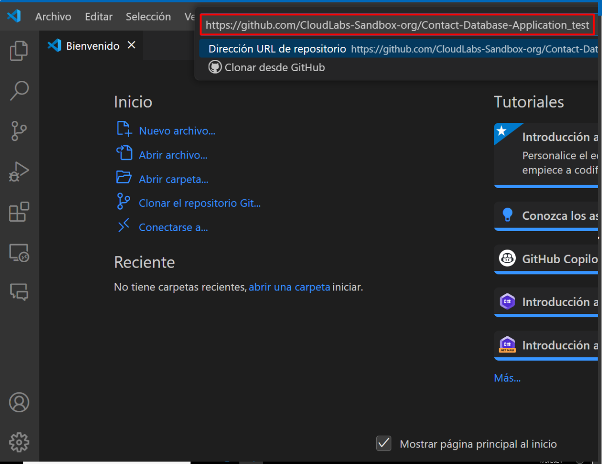

1. A janela ficará assim:

    

### Configurando o Visual Studio 2022

- No Visual Studio, navegue e clique na opção **GitHub Copilot** localizada no canto superior direito e selecione **Instalar Copilot**.

    >**Observação:** Se a pasta **GitHub Copilot** não estiver disponível, crie uma nova.

- No painel do Instalador do Visual Studio, certifique-se de que o **GitHub Copilot** está selecionado e clique em **Instalar**. Isso fechará a aplicação do Visual Studio.

- Aguarde o download completo da extensão GitHub Copilot (isso pode levar alguns minutos) e feche o painel do Instalador do Visual Studio.

  > **Observação:** Ignore a mensagem de erro `Não foi possível instalar Microsoft.Net.4.8.1.FullRedist`, isso não afetará a execução dos desafios.

- Reinicie o Visual Studio e verifique se o GitHub Copilot está ativo. A janela do Chat do GitHub Copilot agora pode ser utilizada.

- Assim que o repositório for clonado, localize e abra o arquivo `MyMvcApp.sln` no Gerenciador de Soluções.

  

- Navegue até Extensões.

  

- Instale o **Nuget Gallery** e **C# Dev Kit**

  - Clique em extensões no lado esquerdo.
  - Procure por Nuget Gallery e C# Dev Kit.
  - Clique em instalar.

- Execute o comando abaixo no console.

    ```
    Update-Package Microsoft.CodeDom.Providers.DotNetCompilerPlatform -r
    ```

    

### Implementar Métodos usando o GitHub Copilot

1. Navegue até o arquivo `UserController.cs` dentro da pasta `Controllers`.

    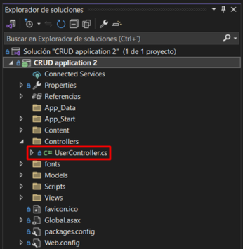

1. Use o GitHub Copilot para gerar código para cada método vazio no arquivo `UserController.cs`. Para isso, selecione ou destaque as linhas do método vazio e, em seguida, clique com o botão direito nas linhas destacadas para abrir o menu de contexto.

    

    

1. No menu de contexto, escolha a opção **Perguntar ao Copilot**. Na caixa de prompt, digite "Preencha o método Index".

    

1. O GitHub Copilot gerará uma sugestão de código com base no contexto do método. Revise a sugestão fornecida e você pode escolher **Aceitar** ou **Descartar** a sugestão com base em sua relevância para seus requisitos.

    

1. Repita este processo para cada método vazio no arquivo `UserController.cs` até que todos os métodos estejam implementados.

>**Observação:** Seguir esses passos permitirá que você utilize eficientemente o GitHub Copilot para gerar código para cada método vazio no arquivo `UserController.cs`.

### Executar e testar a Aplicação

- Localize o botão do IIS Express (um botão verde - play) na barra de ferramentas e clique nele. Esta ação inicia a aplicação em localhost em um navegador web.

    

- Ao executar a aplicação em um navegador local pelo IIS Express, alguns pop-ups serão exibidos solicitando permissão para que a aplicação seja executada com um certificado autoassinado gerado pelo próprio IIS Express.

    

    

### Criar um Novo Contato

- o navegador aberto, localize o botão **Criar Novo** e clique nele.

    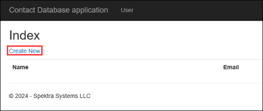

- Preencha os campos obrigatórios de Nome e E-mail no formulário. Clique no botão Criar para enviar o formulário e criar um novo contato.

    

### Editar um Contato

- Após criar um contato, retorne à página inicial.

- Encontre o contato que você criou na lista e localize o botão **Editar** associado a ele. Clique no botão **Editar**.

    

- Modifique os detalhes existentes (Nome ou E-mail) conforme desejado. Salve as alterações clicando no botão **Salvar**.

    

### Verificar Detalhes de um Contato

- Mais uma vez, retorne à página inicial.

- Localize o contato cujos detalhes você deseja verificar. Clique no botão **Detalhes** associado a esse contato.

    

- Verifique se os detalhes exibidos correspondem às informações que você inseriu anteriormente.

    

### Excluir um Contato

- Na página inicial, encontre o contato que deseja excluir.

- Clique no botão **Excluir** associado a esse contato.

    

- Uma caixa de diálogo de confirmação aparecerá perguntando se você tem certeza de que deseja excluir o contato. Confirme a ação.

    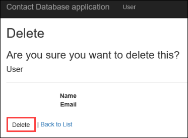

- Certifique-se de que o contato seja removido da lista após a exclusão.

    

Seguindo esses passos meticulosamente, você pode testar completamente as funcionalidades CRUD (Criar, Ler, Atualizar, Excluir) da aplicação e garantir seu funcionamento adequado.

# Tarefa 2: Gerar Casos de Teste Unitário

- Para gerar casos de teste unitário, precisamos adicionar um novo projeto. No Gerenciador de Soluções, clique com o botão direito na Solução.

    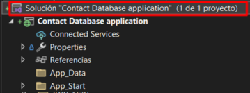

- Clique em Adicionar e, em seguida, em Novo Projeto.

    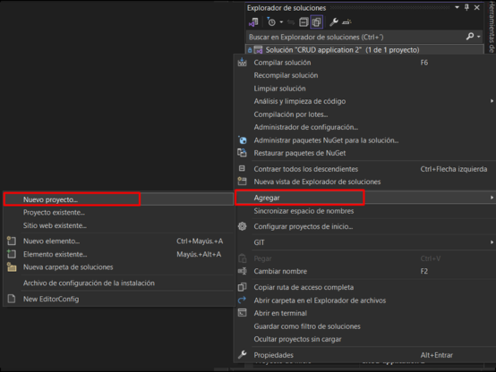

- Agora, pesquise por "Unit test" na caixa de pesquisa, selecione **Projeto de Teste de Unidade (.Net Framework)**  e clique em Próximo.

    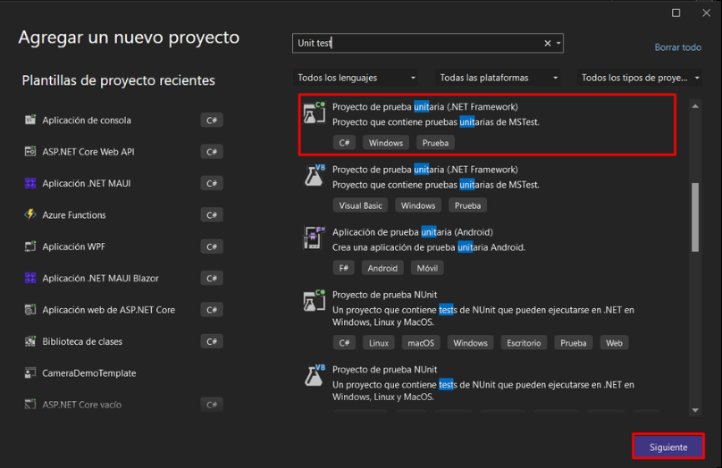

- Nomeie o projeto como `Usercontrollertest` e clique em Criar.

    

- Renomeie o arquivo `UnitTest1.cs` para `UserControllerTests.cs`.

- Agora, vamos pedir ao Chat do GitHub Copilot para gerar casos de teste. Clique na opção "Exibir" no painel superior do Visual Studio. Nas opções, selecione "GitHub Copilot Chat" para abrir a janela correspondente.

    

- Abra o arquivo `UserController.cs` e selecione todo o seu conteúdo.

    

- Com todo o código destacado, no GitHub Copilot Chat, forneça o prompt "generate unit test cases for usercontroller.cs"

    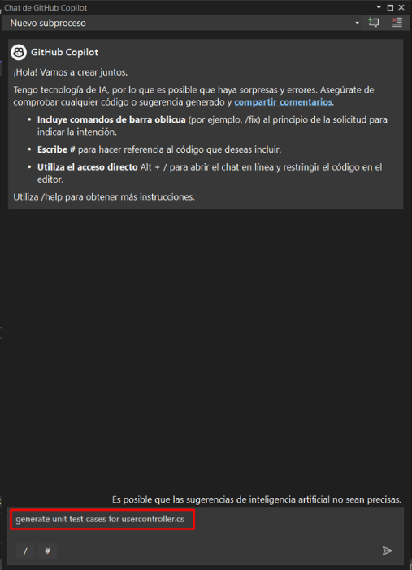

- O GitHub Copilot começará a gerar casos de teste unitários para o usercontroller.cs.

    

- Agora, copie o código fornecido pelo GitHub Copilot clicando no ícone de cópia.

    

- Remova o código existente e cole o código que copiamos no arquivo.

    

- Agora vamos adicionar referências ao projeto. Localize References para `UserControllertest` e clique com o botão direito sobre elas. Em seguida, clique em **Adicionar Referência**.

    

- Na seção Projetos, marque a caixa de seleção e clique em OK.

    

- Agora vamos corrigir os problemas no arquivo passando o cursor sobre o `Test Fixture` e clicando nos recursos **Perguntar ao Copilot (1)** ou **Ações Rápidas e Refatorações... (2)**.
  
    

    

- Clique em "Instalar pacote NUnit" e, em seguida, em "Encontrar e instalar a versão mais recente".

    

- Da mesma forma, passe o cursor sobre `controller.Index()`, clique em "Mostrar possíveis correções", depois em "Instalar pacote 'Microsoft.ASPNet.Mvc'" e, por fim, em "Usar versão local '5.2.7'".

    

- Novamente, para os `RouteValues`, passe o cursor, clique em "mostrar possíveis correções" e, em seguida, em "Adicionar referência".

    

- Mais uma vez, para o `Assert`, passe o cursor, clique em "mostrar possíveis correções" e, em seguida, em "using Assert".

    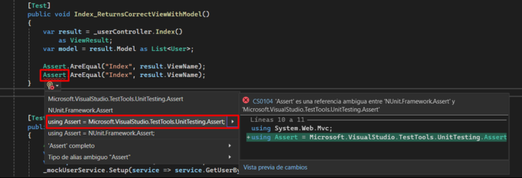

- Após resolver todos os problemas no arquivo, clique na opção "Testar" no painel superior do Visual Studio. Em seguida, clique em "Gerenciador de Testes"

    

- No Gerenciador de Testes, clique no botão "Executar Todos" para rodar os casos de teste.

    

- Verifique se todos os casos de teste passaram.

    

# Tarefa 3: Desenvolver e Testar Funcionalidades

### Utilize o Chat do GitHub Copilot para o Desenvolvimento de Funcionalidades:
  
   - Clique na opção "Exibir" no painel superior do Visual Studio. Nas opções, selecione "GitHub Copilot Chat" para abrir a janela correspondente.
  
        

### Peça ao Chat do GitHub Copilot pela Implementação da Funcionalidade:
   
   - Inicie uma conversa com o Chat do GitHub Copilot perguntando: "Como podemos adicionar uma funcionalidade de busca à nossa aplicação?"

        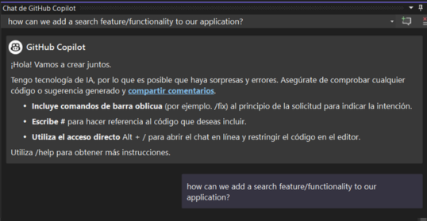

   - Com base na resposta gerada pelo GitHub Copilot, prossiga com a implementação do código sugerido.
  
   - Neste caso, o GitHub Copilot sugeriu adicionar um novo método para aceitar uma string de busca como parâmetro e filtrar a lista de usuários com base nessa string antes de passá-la para a view.

        
  
   - Copie e cole o trecho de código fornecido no arquivo `UserController.cs` dentro do método de ação apropriado, geralmente o método `Index`. Neste código, se uma `searchString` for fornecida, a lista de usuários é filtrada para incluir apenas os usuários cujos nomes contêm a `searchString`. Se nenhuma `searchString` for fornecida, todos os usuários são retornados.

        ```
        // GET: User
        public ActionResult Index(string searchString)
        {
            var users = from u in userlist
                        select u;
            if (!String.IsNullOrEmpty(searchString))
            {
                users = users.Where(s => s.Name.Contains(searchString));
            }
            return View(users.ToList());
        }
        ```

        

   - O GitHub Copilot também sugeriu modificar o arquivo `Index.cshtml` localizado no caminho **Views\User\Index.cshtml** para incluir um formulário para a string de busca.

        

   - Copie e cole o trecho de código fornecido no arquivo `Index.cshtml`. Este formulário envia um pedido GET para o método da `Action Index`, passando a string de busca como um parâmetro de query string.

        ```
        @using (Html.BeginForm("Index", "User", FormMethod.Get))
        {
            <p>
                Find by name: @Html.TextBox("searchString") 
                <input type="submit" value="Search" />
            </p>
        }
        ```

        

### Salvar Alterações e Executar a Aplicação:

   - Salve os arquivos `UserController.cs` e `Index.cshtml` após fazer as alterações necessárias.

   - Execute o aplicativo clicando no botão do IIS Express. Essa ação inicia o aplicativo no localhost em um navegador web.

        

### Testar a Funcionalidade de Busca:

   - Adicione algumas entradas de contato na aplicação clicando no botão "Criar Novo" e preenchendo os campos Nome e E-mail.

        

   - Assim que os contatos forem adicionados, teste a funcionalidade de busca digitando o nome de um contato no campo de busca que foi adicionado anteriormente. Clique no botão "Procurar" para executar a busca.

        

   - Se a funcionalidade foi implementada corretamente, você deverá conseguir ver o contato pesquisado nos resultados.

        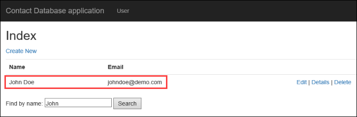

Seguindo esses passos, você pode utilizar eficazmente o GitHub Copilot para implementar e testar novas funcionalidades em sua aplicação, aprimorando sua funcionalidade e usabilidade.

# Tarefa 4: Gerando Mensagens de Commit

O novo recurso de Geração de Mensagem de Commit usa a IA do GitHub Copilot para descrever suas alterações de código. Isso torna a escrita de mensagens de commit descritivas e úteis tão fácil quanto clicar em um botão e, em seguida, adicionar sua explicação.

- Localize a janela de Alterações do Git e clique nela.

    

- Use o novo ícone de caneta com brilhos "Adicionar Mensagem de Commit Gerada por IA" na janela de Alterações do Git para gerar uma sugestão.

    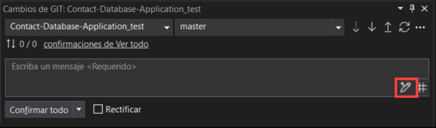

- O GitHub Copilot analisará as alterações de arquivo em seu commit, as resumirá e descreverá cada alteração. Você pode então "Inserir Sugestão da IA" ou "Descartar". Clique em "Fazer Commit de Tudo".

    

- Uma vez que o commit seja feito localmente, clique em "Push" para enviar as alterações para o repositório.

    

### Clique em Avançar >> para prosseguir com o próximo desafio.


