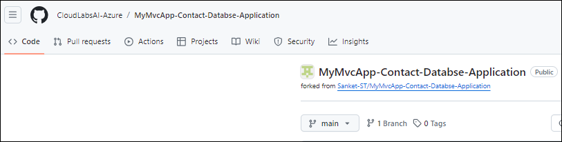
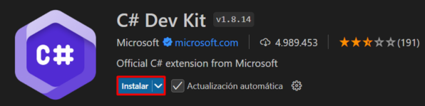
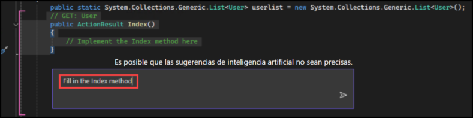
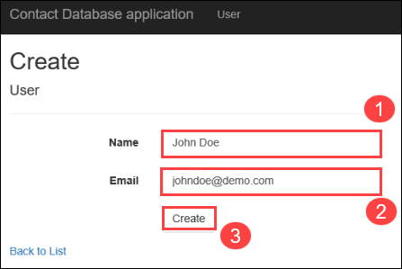
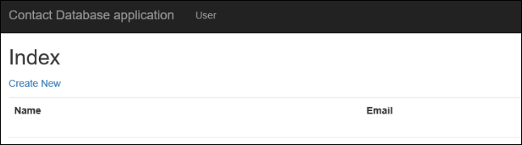
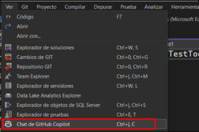
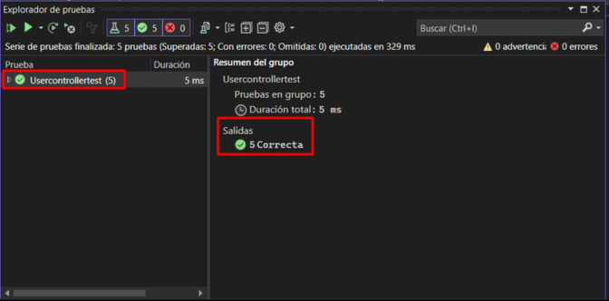
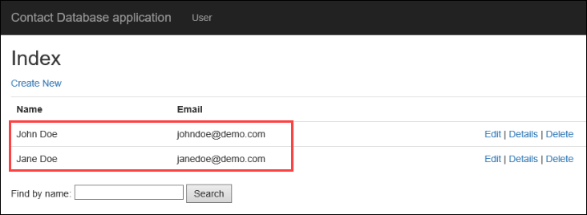

# Desafío 2: Desarrollar una Aplicación con GitHub Copilot - Guía de Soluciones

## Tarea 1: Desarrollar una Aplicación

En esta tarea, creará y probará una aplicación Contact Database MVC utilizando GitHub Copilot en Visual Studio. Implica bifurcar y clonar un repositorio, configurar extensiones, generar métodos de controlador con Copilot y ejecutar la aplicación. Finalmente, las operaciones CRUD de creación, lectura, actualización y eliminación se prueban para garantizar una funcionalidad adecuada.


### Iniciar sesión en GitHub

1. Inicie sesión en [GitHub](https://github.com/login) con la cuenta de GitHub proporcionada por CloudLabs. Asegúrese de haber iniciado sesión en la cuenta de GitHub correcta proporcionada para esta sesión de laboratorio.

### Bifurcar (Hacer fork) el Repositorio

1. Navegue hasta el enlace del repositorio de GitHub proporcionado: [MyMvcApp-Contact-Database-Application](https://github.com/CloudLabsAI-Azure/MyMvcApp-Contact-Databse-Application.git).

    

1. Bifurque (haga fork) el repositorio en la cuenta de GitHub proporcionada por CloudLabs.

    

### Abrir Visual Studio y Clonar el Repositorio

- Inicie Visual Studio y haga clic en "Clonar el repositorio Git".

   

- Ingrese la URL del Repositorio Git y haga presione Enter

    

- La ventana se verá así.

    


### Configurar Visual Studio 2022

1. En Visual Studio, navegue y haga clic en la opción **GitHub Copilot** ubicada en la parte superior derecha y seleccione **Instalar Copilot**.

1. En el panel Instalador de Visual Studio, asegúrese de que **GitHub Copilot** esté seleccionado y haga clic en **Instalar**. Esto cerrará la aplicación Visual Studio.

1. Espere a que la extensión GitHub Copilot se descargue por completo (esto puede tardar unos minutos) y cierre el panel del Instalador de Visual Studio.

  > **Nota:** Ignore el mensaje de error 'Couldn't install Microsoft.Net.4.8.1.FullRedist', esto no afectará los desafíos.

1. Vuelva a iniciar Visual Studio y verifique que GitHub Copilot esté activo. Ahora se puede utilizar la ventana GitHub Copilot Chat.

1. Una vez que se haya clonado el repositorio, busque y abra el archivo `MyMvcApp.sln` desde el Explorador de Soluciones.

  

1. Vaya a Extensiones 

  

1. Instale **Nuget Gallery** y **C# Dev Kit**

    

1. Ejecute el siguiente comando en la consola.

    ```
    Update-Package Microsoft.CodeDom.Providers.DotNetCompilerPlatform -r
    ```

    

### Implementar Métodos usando GitHub Copilot

1. Navegue hasta el archivo `UserController.cs` dentro de la carpeta `Controllers`.

    

1. Utilice GitHub Copilot para generar código para cada método vacío en el archivo `UserController.cs`. Para generar código para cada método vacío con GitHub Copilot, seleccione o resalte las líneas del método vacío y luego haga clic derecho en las líneas resaltadas para abrir el menú contextual.

    
    

1. En el menú contextual, seleccione la opción "Preguntar a Copilot". En el cuadro de mensaje, escriba "Fill in the Index method".

    

1. GitHub Copilot generará una sugerencia de código basada en el contexto del método. Revise la sugerencia proporcionada por GitHub Copilot y podrá elegir aceptarla o descartarla según su relevancia para sus requisitos.

    

1. Repita este proceso para cada método vacío en el archivo UserController.cs hasta que se hayan implementado todos los métodos.

1. Siguiendo estos pasos, podrá utilizar eficientemente GitHub Copilot para generar código para cada método vacío en el archivo UserController.cs.

### Ejecutar y probar la Aplicación

1. Localice el botón IIS Express (un botón de reproducción verde) en la barra de herramientas y haga clic en él. Esta acción inicia la aplicación en localhost en un navegador web.

    

1. Una vez que ejecute la aplicación en un navegador web local a través de IIS Express, aparecerán un par de ventanas emergentes que permitirán que la aplicación se ejecute con un certificado autofirmado que IIS Express ha generado.

    

    

### Crear un Nuevo Contacto

1. En el navegador web abierto, localice el botón "Create New" y haga clic en él.

    

1. Complete los campos obligatorios de Name y Email en el formulario proporcionado. Haga clic en el botón "Create" para enviar el formulario y crear un nuevo contacto.

    

### Editar un Contacto

1. Después de crear un contacto, vuelva a la página de inicio.

1. Busque el contacto que creó en la lista y localice el botón "Edit" asociado a él. Haga clic en el botón "Edit".

    

1. Modifique los detalles existentes (Name o Email) como desee. Guarde los cambios haciendo clic en el botón "Save".

    

### Verificar los Detalles de un Contacto

1. Una vez más, vuelva a la página de inicio.

1. Localice el contacto cuyos datos desea verificar. Haga clic en el botón "Details" asociado a ese contacto.

    

1. Compruebe que los detalles que se muestran coincidan con la información que introdujo anteriormente.

    

### Eliminar un Contacto

1. Desde la página de inicio, busque el contacto que desea eliminar.

1. Haga clic en el botón "Delete" asociado a ese contacto.

    

1. Aparecerá un cuadro de diálogo de confirmación que le preguntará si está seguro de que desea eliminar el contacto. Haga clic en Eliminar..

    

1. Asegúrese de que el contacto se remueva de la lista después de la eliminación.

    

Siguiendo estos pasos meticulosamente, podrá probar a fondo las funcionalidades CRUD (Crear, Leer, Actualizar, Borrar) de la aplicación y garantizar su correcto funcionamiento.

# Tarea 2: Generar Casos de Pruebas Unitarias

Esta tarea implica generar y ejecutar casos de prueba unitaria para la aplicación Contact Database MVC. Crea un nuevo proyecto de prueba xUnit, agrega los paquetes y referencias necesarios y cambia el nombre del archivo de prueba. Con GitHub Copilot, genera casos de prueba para UserController.cs, los ejecuta con dotnet test y valida los resultados.

1. Para generar casos de pruebas unitarias, necesitamos agregar un nuevo proyecto. En el explorador de soluciones, haga clic derecho en la Solución.

    

1. Haga clic en Agregar y luego en Nuevo Proyecto.

    

1. Ahora busque Unit Test (Prueba Unitaria) en el cuadro de búsqueda, seleccione Unit Test Project (.NET Framework) (Proyecto de Prueba Unitaria) y luego haga clic en Siguiente.

    

1. Nombre al proyecto como Usercontrollertest y luego haga clic en Crear.

    

1. Cambie el nombre del archivo UnitTest1.cs a UserControllerTests.cs.

1. Ahora, pidamos a Github Copilot Chat que genere casos de prueba. Haga clic en la opción "Ver" en el panel superior de Visual Studio. En las opciones, seleccione "Chat de GitHub Copilot" para abrir la ventana de GitHub Copilot Chat.

    

1. Abra el archivo UserController.cs y seleccione/resalte todo el código que contiene.

    

1. Una vez que se haya resaltado todo el código, en Github Copilot Chat, proporcione un prompt como "generate unit test cases for usercontroller.cs"

    

1. Github Copilot comenzará a generar casos de prueba unitaria para usercontroller.cs.

    

1. Ahora copie el código proporcionado por Github Copilot haciendo clic en el ícono de copiar.

    

1. Elimine el código existente y pegue el código que copiamos en el archivo.

    

1. Ahora agreguemos referencias al proyecto. Localice las Referencias para UserControllertest y luego haga clic derecho sobre ellas. Luego haga clic en Agregar referencia.

    

1. Ahora, en Proyectos, marque la casilla de verificación y luego haga clic en Aceptar.

    

1. Ahora, solucionemos los problemas del archivo colocando el cursor sobre TestFixture y luego haciendo clic en las funciones Preguntar a Copilot (1) o Acciones rápidas y refactorizaciones... (2).
  
    

    

1. Haga clic en "Instalar paquete NUnit" y luego en "Buscar e instalar la última versión".

    

1. De manera similar, pase el cursor sobre controller.Index(), haga clic en Mostrar posibles correcciones y, a continuación, haga clic en "Instalar paquete 'Microsoft.ASPNet.Mvc'" y luego en "Usar la versión local '5.2.7'"

    

1. Nuevamente, para RouteValues pase el cursor por encima y luego haga clic en Mostrar posibles correcciones, y luego haga clic en Agregar referencia.

    

1. De nueva cuenta, para Assert, pase el cursor por encima y haga clic en Mostrar posibles correcciones y luego en using Assert.

    

1. Después de resolver todos los problemas en el archivo, haga clic en la opción Prueba (Test) en el panel superior de Visual Studio. Luego haga clic en Explorador de pruebas.

    

1. En el Explorador de pruebas, haga clic en el botón Ejecutar Todo para ejecutar los casos de prueba.

    

1. Verifique que se hayan aprobado todos los casos de prueba.

    

# Tarea 3: Desarrollar y Probar funciones

Esta tarea se centra en mejorar la aplicación de base de datos de contactos mediante la implementación de una función de búsqueda con GitHub Copilot. Actualiza los archivos UserController.cs e Index.cshtml para habilitar la función de búsqueda, ejecutar la aplicación y probar la función. Esto demuestra la utilidad de Copilot para agregar funciones nuevas y fáciles de usar de manera eficiente.

### Utilizar GitHub Copilot Chat para el Desarrollo de Funciones:
  
   - Haga clic en la opción "Ver" en el panel superior de Visual Studio. De las opciones, seleccione "Chat de GitHub Copilot" para abrir la ventana de GitHub Copilot Chat.

        

        >**Note:** Abra la ventana de chat de GitHub Copilot seleccionando el menú desplegable Alternar chat y seleccione Abrir chat para abrir la ventana de chat de GitHub Copilot.

### Solicitar a GitHub Copilot Chat la Implementación de Funciones:
   
    1. Inicie una conversación con GitHub Copilot Chat preguntando "How can we add a search feature/functionality to our application?"

        

    1. Según la respuesta generada por GitHub Copilot, proceda a implementar el código sugerido.
  
    1. En este caso, GitHub Copilot sugirió agregar un nuevo método para aceptar una cadena de búsqueda como parámetro y filtrar la lista de usuarios según la cadena de búsqueda antes de pasarla a la vista.

        
  
    1. Copie y pegue el fragmento de código proporcionado en el archivo `UserController.cs` dentro del método de acción apropiado, generalmente el método `Index`. En este código, si se proporciona una cadena de búsqueda (searchString), la lista de usuarios se filtra para incluir solo los usuarios cuyos nombres contienen la cadena de búsqueda. Si no se proporciona ninguna cadena de búsqueda, se devuelven todos los usuarios.

        ```
        // GET: User
        public ActionResult Index(string searchString)
        {
            var users = from u in userlist
                        select u;
            if (!String.IsNullOrEmpty(searchString))
            {
                users = users.Where(s => s.Name.Contains(searchString));
            }
            return View(users.ToList());
        }
        ```

        

   - GitHub Copilot también sugirió modificar el archivo `Index.cshtml` ubicado en la ruta **Views\User\Index.cshtml** a fin de incluir un formulario para la cadena de búsqueda.

        

   - Copie y pegue el fragmento de código proporcionado en el archivo `Index.cshtml`. Este formulario envía una solicitud GET al método de acción Index, pasando la cadena de búsqueda como un parámetro de cadena de consulta.

        ```
        @using (Html.BeginForm("Index", "User", FormMethod.Get))
        {
            <p>
                Find by name: @Html.TextBox("searchString") 
                <input type="submit" value="Search" />
            </p>
        }
        ```

        

### Guardar los Cambios y Ejecutar la Aplicación:

    1. Guarde los archivos `UserController.cs` e `Index.cshtml` después de realizar los cambios necesarios.

    1. Ejecute la aplicación haciendo clic en el botón IIS Express. Esta acción inicia la aplicación en localhost en un navegador web.

        

### Probar la Función de Búsqueda:

    1. Agregue un par de entradas de contacto a la aplicación haciendo clic en el botón "Create New" y rellenando los campos Name y Email.

        

    1. Una vez que añadidos los contactos, pruebe la funcionalidad de búsqueda escribiendo el nombre de un contacto en el campo de búsqueda previamente añadido. Haga clic en el botón "Search" para ejecutar la búsqueda.

        

    1. Si la función se ha implementado correctamente, debería poder ver el contacto buscado en los resultados.

        

Siguiendo estos pasos, puede utilizar GitHub Copilot de manera efectiva para implementar y probar nuevas características en su aplicación, mejorando su funcionalidad y usabilidad.

# Tarea 4: Generar Mensajes de Confirmación (Commit)

La nueva función Generated Commit Message utiliza GitHub Copilot AI para describir los cambios de código. Esto hace que escribir mensajes de confirmación descriptivos y útiles sea tan fácil como hacer clic en un botón y luego agregar una explicación.

1. Localice Cambios de GIT y haga clic en él.

    

1. Use el nuevo ícono de lápiz brillante “Add AI Generated Commit Message” en la ventana Cambios de GIT para generar una sugerencia.

    

1. GitHub Copilot analizará los cambios en los archivos de su confirmación, los resumirá y luego describirá cada cambio. Luego puede “Insert AI Suggestion” o “Discard”. Haga clic en Commit All.

    

1. Una vez confirmado localmente, haga clic en Push para insertar los cambios en el repositorio.

    

### Conclusión

En este desafío, logró desarrollar una aplicación de base de datos de contactos completamente funcional predominantemente con la ayuda de GitHub Copilot, demostrando su utilidad práctica en un escenario de desarrollo de software del mundo real. Ha navegado con éxito por el proceso de desarrollo, desde la generación de código para métodos vacíos en el archivo UserController.cs hasta la creación de funciones esenciales para la aplicación. Ha utilizado GitHub Copilot para comprender su contexto y proporcionar sugerencias de código relevantes, mejorando su experiencia de codificación.

La interacción con Copilot Chat ha enriquecido su colaboración y ha proporcionado recomendaciones de codificación interesantes, mostrando cómo la IA se puede integrar perfectamente en el flujo de trabajo de desarrollo. Los casos de prueba generados con la ayuda de GitHub Copilot han garantizado la solidez y confiabilidad de su aplicación. Sus logros en este desafío han demostrado el potencial de la IA en el desarrollo de software y han proporcionado información valiosa sobre su implementación práctica. Ha demostrado que con las herramientas adecuadas, como GitHub Copilot, el proceso de desarrollo puede volverse más eficiente y productivo.

### Ahora, haga clic en Siguiente en la esquina inferior derecha para pasar al siguiente desafío.

   
