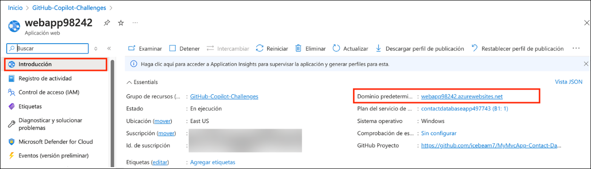
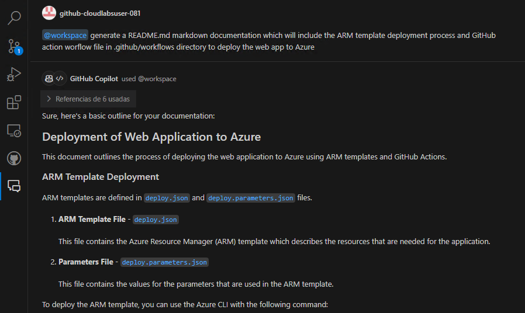

# Desafio 3: Implante uma aplicação no Azure - Guia da Solução

## Acessando o Portal do Azure

1. Para acessar o portal do Azure, abra uma janela privada/anônima em seu navegador e navegue até **[Portal do Azure](https://portal.azure.com)**.

1. Na aba **Entrar no Microsoft Azure**, você verá uma tela de login. Insira o seguinte e-mail/nome de usuário e clique em **Avançar**. 

   * E-mail/Usuário: <inject key="AzureAdUserEmail"></inject>
        
1. Agora, insira a seguinte senha e clique em **Entrar**.

   * Senha: <inject key="AzureAdUserPassword"></inject>
     
1. Se aparecer o pop-up **Permanecer conectado?**, clique em **Não**.

1. Se aparecer o pop-up de **Bem-vindo ao Microsoft Azure**, clique em **Cancelar** para ignorar o tour.
   
1. Agora você verá o Painel do Portal do Azure. Clique em **Grupos de Recursos** no painel de navegação para ver os grupos de recursos.
  
1. Confirme que você tem um grupo de recursos **GitHub-Copilot-Challenges**, como mostrado na captura de tela abaixo.  Você precisará usar o grupo de recursos **GitHub-Copilot-Challenges** ao longo deste desafio.

## Tarefa 1: Desenvolva um template ARM para implantar um aplicativo no Azure

Nesta tarefa, você gerará um template ARM para implantar uma aplicação web no Azure usando os Serviços de Aplicativos do Azure e definirá os recursos necessários.

1. Na janela do seu Chat do GitHub Copilot, peça ao GitHub Copilot para gerar um template ARM para implantar um aplicativo web com os recursos necessários definidos (plano de preços básico/gratuito, autenticação básica habilitada e configuração de GitHub Actions desabilitada).

   

1. O GitHub Copilot gerará um template ARM básico (que pode não ser preciso). Copie e cole o template ARM em um novo arquivo chamado **deploy.json** e utilize as Sugestões e o Chat do GitHub Copilot para refatorar o template de acordo com suas especificações. O template ARM gerado deve corresponder ao exemplo abaixo, com os recursos e especificações indicados.

   ```
   {
    "$schema": "http://schema.management.azure.com/schemas/2015-01-01/deploymentTemplate.json#",
    "contentVersion": "1.0.0.0",
    "parameters": {
        "subscriptionId": {
            "type": "String"
        },
        "resourceGroupName": {
            "type": "String"
        },
        "name": {
            "type": "String"
        },
        "location": {
            "type": "String"
        },
        "hostingPlanName": {
            "type": "String"
        }
    },
    "variables": {},
    "resources": [
        {
            "type": "Microsoft.Web/sites",
            "apiVersion": "2018-11-01",
            "name": "[parameters('name')]",
            "location": "[parameters('location')]",
            "dependsOn": [
                "[concat('Microsoft.Web/serverfarms/', parameters('hostingPlanName'))]"
            ],
            "tags": {},
            "properties": {
                "name": "[parameters('name')]",
                "siteConfig": {
                    "appSettings": [],
                    "metadata": [
                        {
                            "name": "CURRENT_STACK",
                            "value": "dotnet"
                        }
                    ],
                    "phpVersion": "OFF",
                    "netFrameworkVersion": "v8.0",
                    "alwaysOn": false,
                    "ftpsState": "FtpsOnly"
                },
                "serverFarmId": "[concat('/subscriptions/', parameters('subscriptionId'),'/resourcegroups/', parameters('resourceGroupName'), '/providers/Microsoft.Web/serverfarms/', parameters('hostingPlanName'))]",
                "clientAffinityEnabled": true,
                "virtualNetworkSubnetId": null,
                "httpsOnly": true,
                "publicNetworkAccess": "Enabled"
            },
            "resources": [
                {
                    "type": "Microsoft.Web/sites/basicPublishingCredentialsPolicies",
                    "apiVersion": "2022-09-01",
                    "name": "[concat(parameters('name'), '/scm')]",
                    "dependsOn": [
                        "[resourceId('Microsoft.Web/Sites', parameters('name'))]"
                    ],
                    "properties": {
                        "allow": true
                    }
                },
                {
                    "type": "Microsoft.Web/sites/basicPublishingCredentialsPolicies",
                    "apiVersion": "2022-09-01",
                    "name": "[concat(parameters('name'), '/ftp')]",
                    "dependsOn": [
                        "[resourceId('Microsoft.Web/Sites', parameters('name'))]"
                    ],
                    "properties": {
                        "allow": true
                    }
                }
            ]
        },
        {
            "type": "Microsoft.Web/serverfarms",
            "apiVersion": "2018-11-01",
            "name": "[parameters('hostingPlanName')]",
            "location": "[parameters('location')]",
            "dependsOn": [],
            "tags": {},
            "sku": {
                "Tier": "Basic",
                "Name": "B1"
            },
            "kind": "",
            "properties": {
                "name": "[parameters('hostingPlanName')]",
                "workerSize": "0",
                "workerSizeId": "0",
                "numberOfWorkers": "1",
                "zoneRedundant": false
            }
         }
      ] 
   }
   ```

1. No VS Code, crie um novo arquivo **deploy.parameters.json** para definir os parâmetros a partir do seu arquivo **deploy.json**.

   ```
   {
    "$schema": "https://schema.management.azure.com/schemas/2015-01-01/deploymentParameters.json#",
    "contentVersion": "1.0.0.0",
    "parameters": {
        "subscriptionId": {
            "type": "String"
        },
        "resourceGroupName": {
            "type": "String"
        },
        "name": {
            "type": "String"
        },
        "location": {
            "type": "String"
        },
        "hostingPlanName": {
            "type": "String"
        }
     }
   }
   ```
  
1. No Portal de Azure, procure pelo serviço **Implantar um modelo personalizado**. Você usará este serviço do Azure para implementar seu template ARM personalizado.

   

1. Na sua aba de implantação personalizada, clique em **Criar seu próprio modelo no editor**.

   
 
1. Na aba Editar modelo, exclua o template ARM template existente, copie e cole o template ARM recém-gerado usando o GitHub Copilot e clique em **Salvar**.

   

1. Insira as especificações para implantar seu aplicativo web. Certifique-se de implantar o aplicativo web no grupo de recursos existente chamado **GitHub-Copilot-Challenges**.

1. Assim que tiver especificado todos os parâmetros, clique em **Revisar + Criar** e, em seguida, em **Criar**.

   
   
1. Aguarde a conclusão da implantação e verifique se os recursos do seu serviço de aplicativo web e do plano de serviço de aplicativo existem no grupo de recursos.

   

## Tarefa 2: Gerar um Workflow do GitHub Actions usando o Centro de Implantação do Aplicativo Web no portal do Azure

Nesta tarefa, você gerará um pipeline de workflow do GitHub Actions usando o Centro de Implantação do Aplicativo Web no portal do Azure.

1. Navegue até o seu serviço de aplicativo web e, em **Implantação**, selecione **Centro de Implantação**.

   

1. Especifique as seguintes configurações para gerar um arquivo YAML relativo ao workflow de GitHub Action e clique em **Salvar**:

   * **Origem**: GitHub
   * **Logado como**: A sua conta de GitHub Account
   * **Organização**: A sua organização de GitHub
   * **Repositório**: O seu repositório de Github (**MyMvcApp-Contact-Database-Application**)
   * **Branch**: O seu Branch
   * **Runtime stack**: .NET
   * **Versão**: v8.0
   * **Tipo de autenticação**: Basic authentication
  
        

        

1. Você também pode visualizar a configuração do seu workflow clicando no botão **Visualizar arquivo**.

1. Navegue até o seu repositório do GitHub e, na aba **Ações**, você notará que o build foi iniciado para o seu aplicativo web.

   

1. O workflow falhará com um erro de **build**, informando que o processo foi concluído com o código de saída 1 devido ao problema de caminho não definido no seu arquivo YAML do workflow.

   

   

1. Agora, vamos navegar até o arquivo YAML do workflow, editando o arquivo e definindo os caminhos para as etapas **dotnet publish** e **Upload artifact for deployment job**.

   

1. Localize as etapas **dotnet publish** e **Upload artifact for deployment job** em seu arquivo de workflow e substitua os caminhos **${{env.DOTNET_ROOT}}/myapp** por **D:\a\MyMvcApp-Contact-Databse-Application\MyMvcApp-Contact-Databse-Application\bin\Release\net8.0\MyMvcApp** e clique em **Fazer commit das alterações**.

   

   

1. Navegue de volta a aba **Ações**. você notará que o build foi reiniciado para o seu aplicativo web após a definição dos caminhos. Aguarde a conclusão bem-sucedida do build do workflow.

   

## Tarefa 3: Fazer a aplicação funcionar no Azure

Nesta tarefa, você verificará se o build do pipeline do GitHub Actions foi bem-sucedido, se o arquivo de workflow foi criado e se seu aplicativo web está funcionando como esperado no Azure.

1. Nas configurações de Ações do seu repositório do GitHub, verifique se o build de ambos os jobs foi concluído com sucesso **(1)**.

   

1. Verifique se seu aplicativo web está funcionando como esperado navegando até a aplicação web **(2)** em outra aba.

   

1. Além disso, verifique se o seu arquivo de workflow foi criado em um novo diretório **.github/workflows**.

   

1. Seu arquivo de workflow do GitHub estará no formato abaixo:

   ```
   # Docs for the Azure Web Apps Deploy action: https://github.com/Azure/webapps-deploy
   # More GitHub Actions for Azure: https://github.com/Azure/actions

   name: Build and deploy ASP.Net Core app to Azure Web App - mymvcapp-webapp949348

   on:
     push:
       branches:
         - main
     workflow_dispatch:

   jobs:
     build:
       runs-on: windows-latest

       steps:
         - uses: actions/checkout@v4

         - name: Set up .NET Core
           uses: actions/setup-dotnet@v4
           with:
             dotnet-version: '8.x'

         - name: Build with dotnet
           run: dotnet build --configuration Release

         - name: dotnet publish
           run: dotnet publish -c Release -o D:\a\MyMvcApp-Contact-Databse-Application\MyMvcApp-Contact-Databse-Application\bin\Release\net8.0\MyMvcApp

         - name: Upload artifact for deployment job
           uses: actions/upload-artifact@v4
           with:
             name: .net-app
             path: D:\a\MyMvcApp-Contact-Databse-Application\MyMvcApp-Contact-Databse-Application\bin\Release\net8.0\MyMvcApp

     deploy:
       runs-on: windows-latest
       needs: build
       environment:
         name: 'Production'
         url: ${{ steps.deploy-to-webapp.outputs.webapp-url }}
    
       steps:
         - name: Download artifact from build job
           uses: actions/download-artifact@v4
           with:
             name: .net-app
      
         - name: Deploy to Azure Web App
           id: deploy-to-webapp
           uses: azure/webapps-deploy@v3
           with:
             app-name: 'mymvcapp-webapp949348'
             slot-name: 'Production'
             package: .
             publish-profile: ${{ secrets.AZUREAPPSERVICE_PUBLISHPROFILE_EA47AEBAC2C64100A420A4304676DAF5 }}
   ```

1. Você também pode verificar o funcionamento do seu aplicativo web navegando até o portal do Azure, Serviço de Aplicativo, na configuração de Visão Geral e clicando no **Domínio Padrão**.

   

## Tarefa 4: Gerar documentação com o Copilot para o aplicativo

Nesta tarefa, você utilizará o GitHub Copilot para gerar documentação específica para este desafio, que incluirá o template ARM e o arquivo de workflow do GitHub Actions para implantar o aplicativo web no Azure.

1. Na janela do Chat do GitHub Copilot, peça ao GitHub Copilot para gerar uma documentação que especifique a implantação do template ARM e o arquivo de workflow do GitHub Actions para implantar o aplicativo web no Azure para o seu workspace.

    ```
    @workspace generates documentation that will include the ARM template deployment process and GitHub action workflow file in the .github/workflows directory to deploy the web app to Azure.
    ```

1. Você notará que o GitHub Copilot gera uma breve documentação sobre a implantação do template ARM do seu workspace no Azure, o funcionamento do arquivo de workflow e alguns arquivos de configuração.

   ```
   # Deployment of Web Application to Azure
   This document outlines the process of deploying the web application to Azure using ARM templates and GitHub Actions.

   ## ARM Template Deployment
   ARM templates are defined in deploy.json and deploy.parameters.json files.

   ### ARM Template File - deploy.json

   This file contains the Azure Resource Manager (ARM) template which describes the resources that are needed for the application.

   ### Parameters File - deploy.parameters.json

   This file contains the values for the parameters that are used in the ARM template.

   ### To deploy the ARM template, you can use the Azure CLI with the following command:

   az deployment group create --name ExampleDeployment --resource-group ExampleGroup --template-file ./deploy.json --parameters ./deploy.parameters.json

   ## GitHub Actions Workflow
   The GitHub Actions workflow is defined in the .github/workflows directory.

   #### Workflow File - .github/workflows/workflow.yml

   This file contains the GitHub Actions workflow that automates the deployment process. It is triggered on a push to the main branch and it runs the Azure CLI command to deploy the ARM template.

   In this workflow, replace ExampleDeployment and ExampleGroup with your actual deployment name and resource group name. Also, make sure to store your Azure credentials as a secret in your GitHub repository.

   ## Web Configuration
   The web application's configuration is defined in the Web.config, Web.Debug.config, and Web.Release.config files.

   ### Web Configuration File - Web.config

   This file contains the main configuration for the web application.

   ### Debug Configuration File - Web.Debug.config

   This file contains the configuration for the web application when it is in debug mode.

   ### Release Configuration File - Web.Release.config

   This file contains the configuration for the web application when it is in release mode.
   ```

   

## Conclusão

Neste desafio, você demonstrou como a IA pode auxiliar significativamente no desenvolvimento e na implantação de aplicações, especificamente através do uso do GitHub Copilot. Você não apenas desenvolveu uma aplicação de Banco de Dados de Contatos totalmente funcional no desafio anterior, mas também a implantou eficazmente no Azure usando um template ARM gerado com a ajuda do GitHub Copilot. Você utilizou o GitHub Copilot para otimizar a criação do template ARM, que é um exemplo poderoso de Infraestrutura como Código (IaC), e também automatizou o processo de build e teste do seu código criando um pipeline do GitHub Actions, com o GitHub Copilot auxiliando na geração dos scripts necessários. Além disso, você produziu uma documentação abrangente e precisa para este desafio, servindo como um guia valioso para projetos futuros.

Através deste desafio, você demonstrou à Contoso Ltd. o potencial de integrar a IA ao fluxo de trabalho de desenvolvimento. Você mostrou como o GitHub Copilot pode auxiliar não apenas no desenvolvimento de aplicações, mas também na implantação e gerenciamento de infraestrutura, destacando assim sua versatilidade e valor. Ao implantar com sucesso a aplicação de Banco de Dados de Contatos no Azure e verificar sua funcionalidade, você forneceu uma demonstração tangível dos benefícios da IA no desenvolvimento de software.

### Clique em Avançar >> para prosseguir com o próximo desafio.


