# Challenge 3: Deploy the App to Azure - Solution Guide

## Accessing Azure Portal

1. To access the Azure portal, open a private/incognito window in your browser and navigate to **[Azure Portal](https://portal.azure.com)**.

1. On the **Sign in to Microsoft Azure** tab, you will see a login screen. Enter the following email/username and then click on **Next**. 
   * Email/Username: <inject key="AzureAdUserEmail"></inject>

     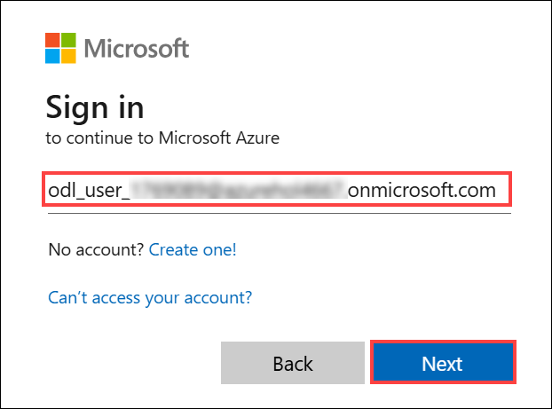
     
1. Now enter the following password and click on **Sign in**.
   * Password: <inject key="AzureAdUserPassword"></inject>

     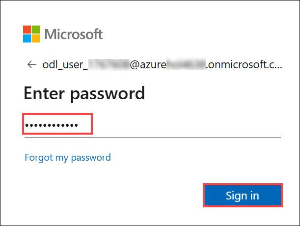
     
1. If you see the pop-up **Stay Signed in?**, click No.

   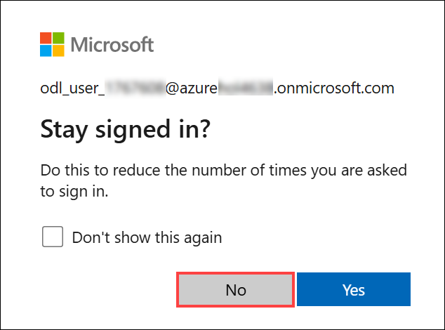

1. If you see the pop-up **You have free Azure Advisor recommendations!**, close the window to continue the lab.

1. If a **Welcome to Microsoft Azure** pop-up window appears, click **Cancel** to skip the tour.
   
1. Now you will see the Azure Portal Dashboard. Click on **Resource groups** from the Navigate panel to see the resource groups.

   
  
1. Confirm you have a resource group **GitHub-Copilot-Challenges** present, as shown in the below screenshot. You need to use the **GitHub-Copilot-Challenges** resource group throughout this challenge.

   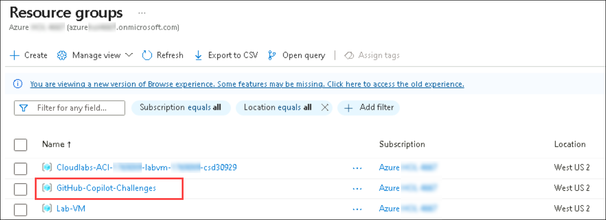

## Task 1: Develop an ARM Template to deploy an app to Azure

In this task, you'll be generating an ARM template to deploy a web application to Azure using Azure App Services and defining the necessary resources.

1. In the GitHub Copilot Chat panel, type and ask: **"Generate an ARM template to deploy a web app with the necessary resources defined (basic/free pricing plan, basic authentication enabled, and GitHub actions setting disabled)"**.

   

1. GitHub Copilot will generate a basic ARM template (which might not be accurate). Copy and paste the ARM template in a new file named **deploy.json**, and utilize GitHub Copilot Suggestions and Chat to refactor the template to your specifications. Your ARM template must resemble what is given below, with the resources and specifications.

   ```
   {
    "$schema": "http://schema.management.azure.com/schemas/2015-01-01/deploymentTemplate.json#",
    "contentVersion": "1.0.0.0",
    "parameters": {
        "subscriptionId": {
            "type": "String"
        },
        "resourceGroupName": {
            "type": "String"
        },
        "name": {
            "type": "String"
        },
        "location": {
            "type": "String"
        },
        "hostingPlanName": {
            "type": "String"
        }
    },
    "variables": {},
    "resources": [
        {
            "type": "Microsoft.Web/sites",
            "apiVersion": "2018-11-01",
            "name": "[parameters('name')]",
            "location": "[parameters('location')]",
            "dependsOn": [
                "[concat('Microsoft.Web/serverfarms/', parameters('hostingPlanName'))]"
            ],
            "tags": {},
            "properties": {
                "name": "[parameters('name')]",
                "siteConfig": {
                    "appSettings": [],
                    "metadata": [
                        {
                            "name": "CURRENT_STACK",
                            "value": "dotnet"
                        }
                    ],
                    "phpVersion": "OFF",
                    "netFrameworkVersion": "v8.0",
                    "alwaysOn": false,
                    "ftpsState": "FtpsOnly"
                },
                "serverFarmId": "[concat('/subscriptions/', parameters('subscriptionId'),'/resourcegroups/', parameters('resourceGroupName'), '/providers/Microsoft.Web/serverfarms/', parameters('hostingPlanName'))]",
                "clientAffinityEnabled": true,
                "virtualNetworkSubnetId": null,
                "httpsOnly": true,
                "publicNetworkAccess": "Enabled"
            },
            "resources": [
                {
                    "type": "Microsoft.Web/sites/basicPublishingCredentialsPolicies",
                    "apiVersion": "2022-09-01",
                    "name": "[concat(parameters('name'), '/scm')]",
                    "dependsOn": [
                        "[resourceId('Microsoft.Web/Sites', parameters('name'))]"
                    ],
                    "properties": {
                        "allow": true
                    }
                },
                {
                    "type": "Microsoft.Web/sites/basicPublishingCredentialsPolicies",
                    "apiVersion": "2022-09-01",
                    "name": "[concat(parameters('name'), '/ftp')]",
                    "dependsOn": [
                        "[resourceId('Microsoft.Web/Sites', parameters('name'))]"
                    ],
                    "properties": {
                        "allow": true
                    }
                }
            ]
        },
        {
            "type": "Microsoft.Web/serverfarms",
            "apiVersion": "2018-11-01",
            "name": "[parameters('hostingPlanName')]",
            "location": "[parameters('location')]",
            "dependsOn": [],
            "tags": {},
            "sku": {
                "Tier": "Basic",
                "Name": "B1"
            },
            "kind": "",
            "properties": {
                "name": "[parameters('hostingPlanName')]",
                "workerSize": "0",
                "workerSizeId": "0",
                "numberOfWorkers": "1",
                "zoneRedundant": false
            }
         }
      ] 
   }
   ```

1. In your **Visual Studio Code**, create a new file named **`deploy.parameters.json`** to define the parameter values referenced in your **`deploy.json`** ARM template file.

  

   ```
   {
    "$schema": "https://schema.management.azure.com/schemas/2015-01-01/deploymentParameters.json#",
    "contentVersion": "1.0.0.0",
    "parameters": {
        "subscriptionId": {
            "type": "String"
        },
        "resourceGroupName": {
            "type": "String"
        },
        "name": {
            "type": "String"
        },
        "location": {
            "type": "String"
        },
        "hostingPlanName": {
            "type": "String"
        }
     }
   }
   ```

1. In the Azure portal, type **Deploy a custom template(1)** into the search bar and select the **Deploy a custom template(2)** option from the results.

   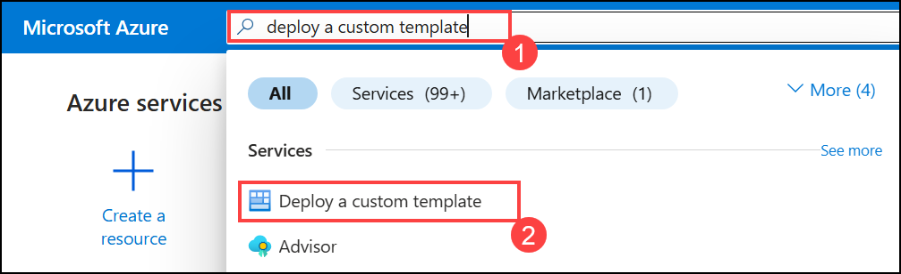

1. In your **Custom deployment** tab, click on **Build your own template in editor**.

   

1. In your **Edit Template** tab, delete the existing skeleton ARM template, copy & paste the newly generated ARM template using GitHub Copilot, and click **Save**.

   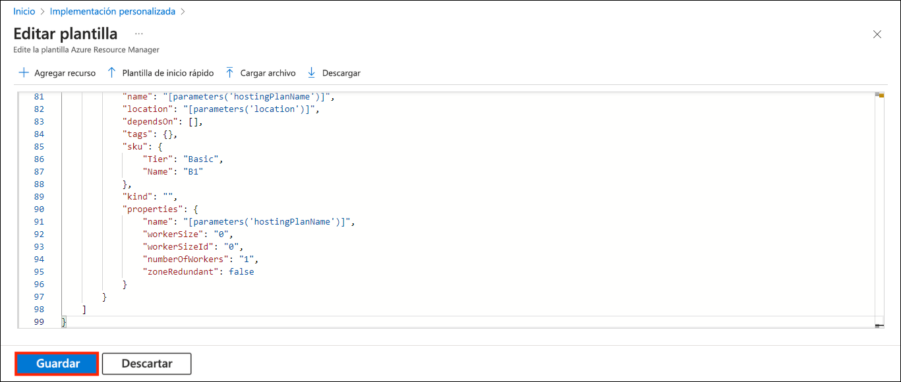

1. On the **Basics** tab of the deployment form, enter instance details:

  - **resource group**: `GitHub-Copilot-Challenges` **(1)**
  - **Region**: `(US) West US 2` **(2)**
  - **Subscription ID**: *Enter your AzureSubscription ID)* **(3)**
  - **Resource Group Name**: `GitHub-Copilot-Challenges` **(4)**
  - **Name**: `contactdatabaseapp` *(or your desired app name)* **(5)**
  - **Location**: `west us 2` **(6)**
  - **Hosting Plan Name**: `webapp12345` **(7)**
 
1. Once you have specified all the parameters, click **Review + Create (8)**, and **Create**.

   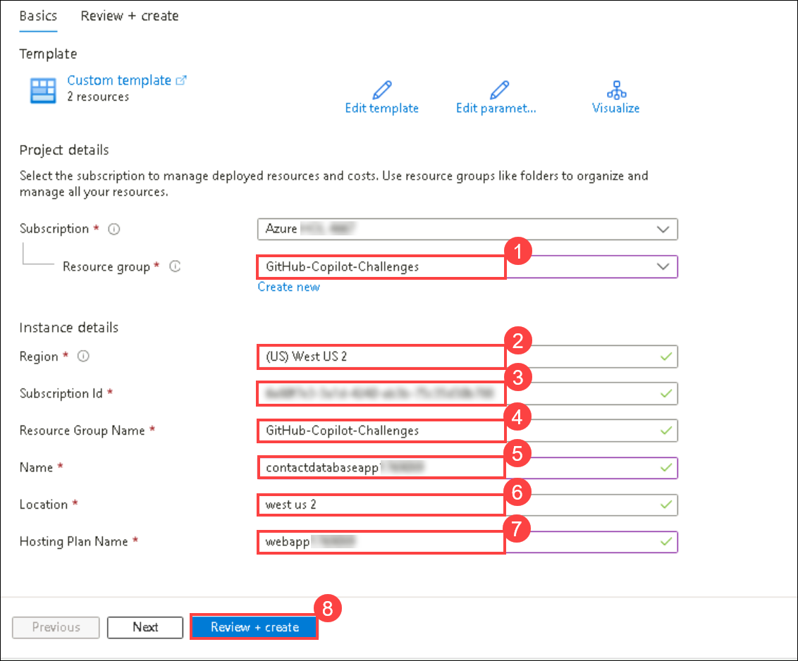

1. Wait for the deployment to succeed and verify that your **web app service and app service plan** resources exist in the resource group.

   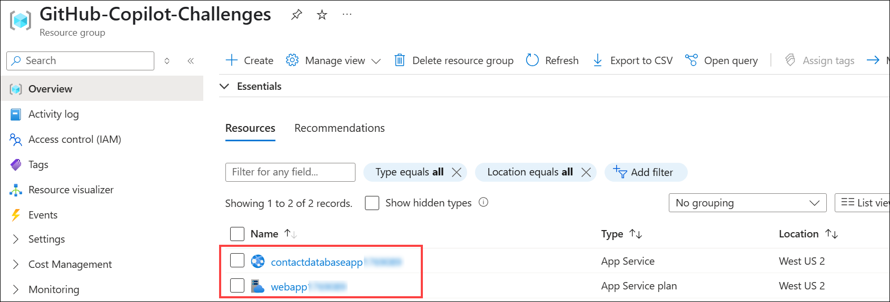

## Task 2: Generate GitHub Action Workflow using Deployment Center from Web App in Azure portal

In this task, you'll generate a GitHub Action workflow pipeline using the Deployment Center from the Web App in the Azure portal.

1. Navigate to your web app in the Azure portal. Under the **Deployment section (1)** in the left-hand menu, select **Deployment Center (2)**.

   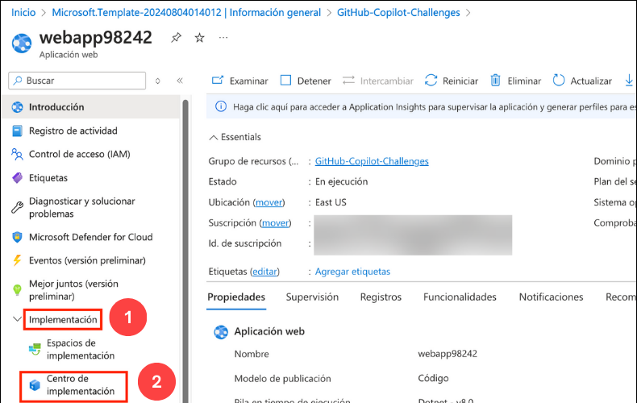

1. Specify the following settings to generate a GitHub Action workflow YAML file and click **Save (9)**:

   * **Source**: GitHub **(1)**
   * **Signed in as**: Your GitHub Account **(2)**
   * **Organization**: Your GitHub Organization **(3)**
   * **Repository**: Your Github Repository (**MyMvcApp-Contact-Database-Application**) **(4)**
   * **Branch**: Your GitHub Repository Branch **(5)**
   * **Runtime stack**: .NET **(6)**
   * **Version**: v8.0  **(7)**
   * **Authentication type**: Basic authentication  **(8)**

     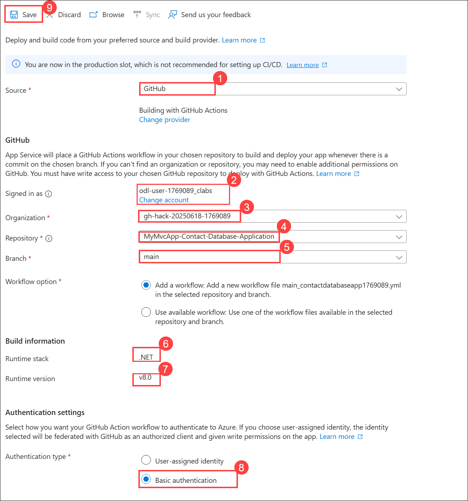

1. Navigate to your GitHub repository, and under the **Actions** tab, you'll notice that the build has started for your web app. 

   

1. The workflow will fail with the **build error(1)** stating that the process completed with **exit code 1 (2)** due to the undefined path issue in your workflow YAML file.

   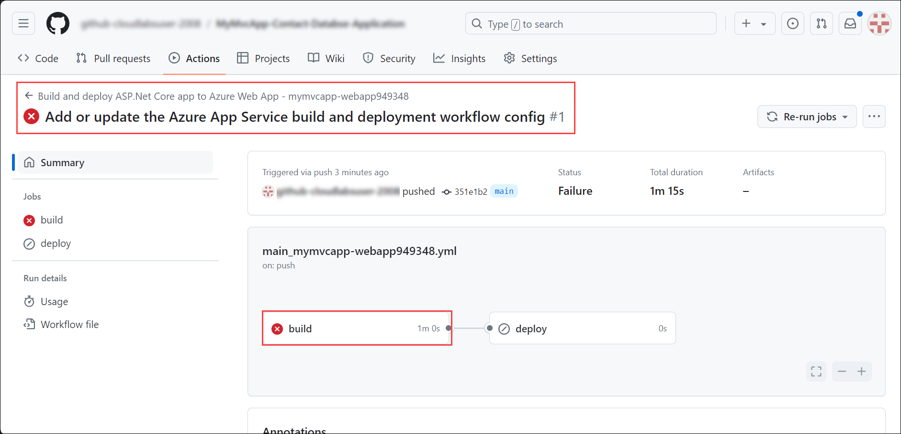

   

1.  **(1) Navigate to the workflow YAML file** Go to your repository: `MyMvcApp-Contact-Database-Application → .github → workflows → main_mymvcapp-webapp949348.yml` **(2) Click the pencil icon** to begin editing the YAML file.

   

1. Locate the steps **dotnet publish** and **Upload artifact for deployment job** in your workflow file and replace the **${{env.DOTNET_ROOT}}/myapp** paths with **D:\a\MyMvcApp-Contact-Databse-Application\MyMvcApp-Contact-Databse-Application\bin\Release\net8.0\MyMvcApp** and click on **Commit changes**.

   

   

1. Navigate back to the **Actions (1)** tab, and you'll notice that the build has restarted for your web app after defining the paths. Wait for the workflow build to succeed**(2)**.

   

## Task 3: Get the app working on Azure

In this task, you'll verify that the GitHub action pipeline build has succeeded, the workflow file has been created, and your  web app is working as expected on Azure.

1. In your GitHub repository Actions setting, verify that the pipeline build of both jobs has succeeded **(1)**.

   

1. Verify that your web app is working as expected by navigating to the web application **(2)** in a different tab.

   

1. Also, verify that your workflow file has been created in a new directory **.github/workflows**.

   

1. Your GitHub workflow file will be in the below format:

   ```
   # Docs for the Azure Web Apps Deploy action: https://github.com/Azure/webapps-deploy
   # More GitHub Actions for Azure: https://github.com/Azure/actions

   name: Build and deploy ASP.Net Core app to Azure Web App - mymvcapp-webapp949348

   on:
     push:
       branches:
         - main
     workflow_dispatch:

   jobs:
     build:
       runs-on: windows-latest

       steps:
         - uses: actions/checkout@v4

         - name: Set up .NET Core
           uses: actions/setup-dotnet@v4
           with:
             dotnet-version: '8.x'

         - name: Build with dotnet
           run: dotnet build --configuration Release

         - name: dotnet publish
           run: dotnet publish -c Release -o D:\a\MyMvcApp-Contact-Databse-Application\MyMvcApp-Contact-Databse-Application\bin\Release\net8.0\MyMvcApp

         - name: Upload artifact for deployment job
           uses: actions/upload-artifact@v4
           with:
             name: .net-app
             path: D:\a\MyMvcApp-Contact-Databse-Application\MyMvcApp-Contact-Databse-Application\bin\Release\net8.0\MyMvcApp

     deploy:
       runs-on: windows-latest
       needs: build
       environment:
         name: 'Production'
         url: ${{ steps.deploy-to-webapp.outputs.webapp-url }}
    
       steps:
         - name: Download artifact from build job
           uses: actions/download-artifact@v4
           with:
             name: .net-app
      
         - name: Deploy to Azure Web App
           id: deploy-to-webapp
           uses: azure/webapps-deploy@v3
           with:
             app-name: 'mymvcapp-webapp949348'
             slot-name: 'Production'
             package: .
             publish-profile: ${{ secrets.AZUREAPPSERVICE_PUBLISHPROFILE_EA47AEBAC2C64100A420A4304676DAF5 }}
   ```

1. You can also verify the workings of your web app by navigating to the Azure portal, App Service, in the Overview setting and clicking on the **Default Domain**.

   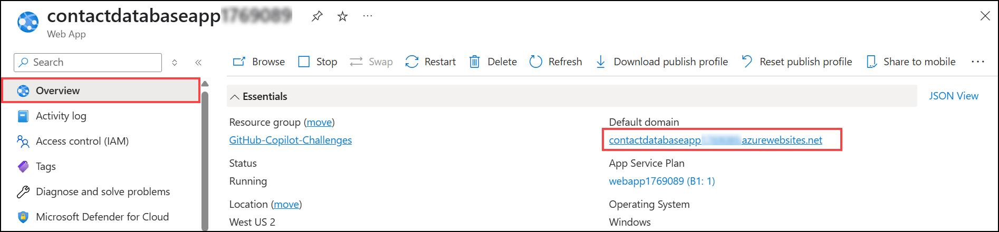

## Task 4: Generate Documentation with Copilot for the App

In this task, you'll utilize GitHub Copilot to generate documentation specific to this challenge, which will include the ARM template and GitHub action workflow file to deploy the web app to Azure.

1. In your GitHub Copilot Chat window, ask the GitHub Copilot to generate documentation that specifies the ARM template deployment and GitHub action workflow file to deploy the web app to Azure for your workspace.

   * @workspace generates documentation that will include the ARM template deployment process and GitHub action workflow file in the .github/workflows directory to deploy the web app to Azure.

1. You'll notice that the GitHub Copilot generates brief documentation about your workspace's ARM template deployment to Azure, and the workings of the workflow file and a few config files.

   ```
   # Deployment of Web Application to Azure
   This document outlines the process of deploying the web application to Azure using ARM templates and GitHub Actions.

   ## ARM Template Deployment
   ARM templates are defined in deploy.json and deploy.parameters.json files.

   ### ARM Template File - deploy.json

   This file contains the Azure Resource Manager (ARM) template which describes the resources that are needed for the application.

   ### Parameters File - deploy.parameters.json

   This file contains the values for the parameters that are used in the ARM template.

   ### To deploy the ARM template, you can use the Azure CLI with the following command:

   az deployment group create --name ExampleDeployment --resource-group ExampleGroup --template-file ./deploy.json --parameters ./deploy.parameters.json

   ## GitHub Actions Workflow
   The GitHub Actions workflow is defined in the .github/workflows directory.

   #### Workflow File - .github/workflows/workflow.yml

   This file contains the GitHub Actions workflow that automates the deployment process. It is triggered on a push to the main branch and it runs the Azure CLI command to deploy the ARM template.

   In this workflow, replace ExampleDeployment and ExampleGroup with your actual deployment name and resource group name. Also, make sure to store your Azure credentials as a secret in your GitHub repository.

   ## Web Configuration
   The web application's configuration is defined in the Web.config, Web.Debug.config, and Web.Release.config files.

   ### Web Configuration File - Web.config

   This file contains the main configuration for the web application.

   ### Debug Configuration File - Web.Debug.config

   This file contains the configuration for the web application when it is in debug mode.

   ### Release Configuration File - Web.Release.config

   This file contains the configuration for the web application when it is in release mode.
   ```

   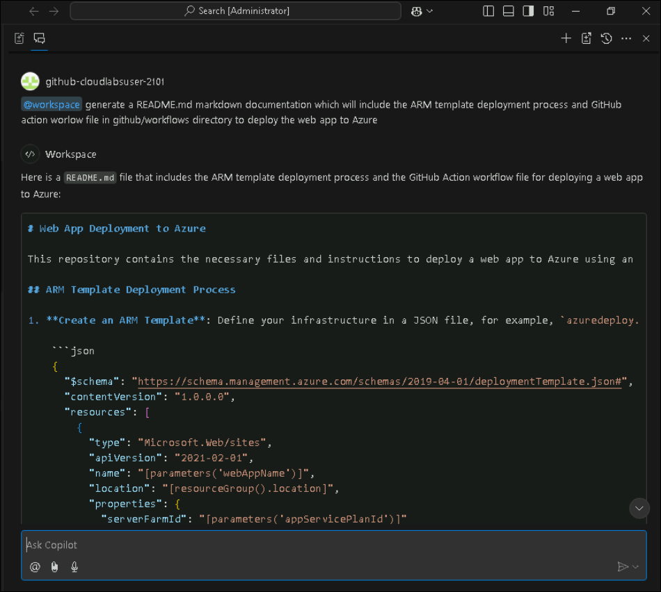


