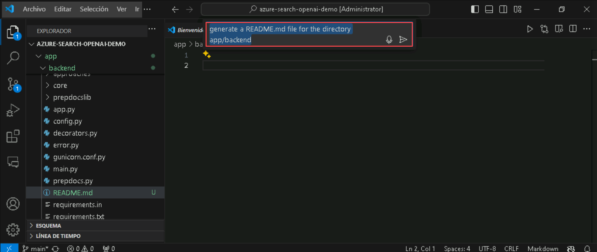
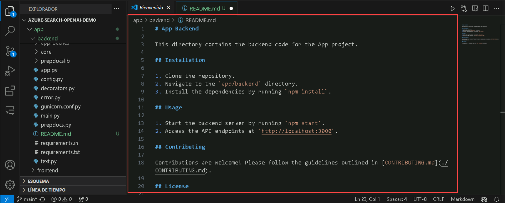

# Desafio 5: Crie Documentação usando o GitHub Copilot - Guia da Solução

## Tarefa 1: Gerar documentação com o Copilot

Nesta tarefa, você utilizará o GitHub Copilot para gerar documentação em markdown para a aplicação backend do repositório Github [Azure-Samples/azure-search-openai-demo](https://github.com/Azure-Samples/azure-search-openai-demo) e também fará uso dos recursos do GitHub Copilot para gerar comentários.

1. Abra o Visual Studio Code e clone o repositório do GitHub [Azure-Samples/azure-search-openai-demo](https://github.com/Azure-Samples/azure-search-openai-demo).

1. Navegue até a pasta **C:\Users\azureuser\azure-search-openai-demo\app\backend** e crie um novo arquivo com o nome **README.md**.

1. No arquivo README.md vazio, clique em **Ctrl+I** para abrir a janela do Copilot Chat e peça ao Copilot para gerar um arquivo README.md no diretório app/backend.

   

1. **Aceite** o código gerado pelo Copilot para ser introduzido no arquivo README.md.

   

   

1. Navegue até o arquivo app/backend/requirements.txt e examine os requisitos. 

   

1. Agora, selecione o arquivo inteiro, clique com o botão direito e, em seguida, **Copilot** e **Gerar Documentos**.

   

1. Observe como o GitHub Copilot lista todos os requisitos no início do arquivo.

   

1. Navegue até o arquivo *app/backend/approaches/approach.py*. Você notará que não há comentários para nenhum dos módulos, funções ou classes.

1. Agora selecione o arquivo inteiro, clique com o botão direito e selecione **Copilot** e **Chat Integrado do Editor**. Peça ao GitHub Copilot para gerar comentários para o código selecionado.

   

   

1. Observe como o GitHub Copilot gera comentários no código.

## Tarefa 2: Melhorar e Refinar a Documentação

Nesta tarefa, você aprimorará e refinará sua documentação do README.md utilizando o recurso de Sugestões do GitHub Copilot.

1. Abra seu arquivo **README.md**, que você salvou na tarefa anterior.

1. Selecione toda a documentação e clique em **Ctrl+Enter** para visualizar as sugestões fornecidas pelo GitHub Copilot para aprimorar a documentação.

   

1. Você encontrará várias sugestões para o documento selecionado que ajudarão a refiná-lo.

1. Navegue pelas sugestões do GitHub Copilot e **Aceite** as sugestões mais adequadas.

## Task 3: Explorar Vários Estilos de Documentação

Nesta tarefa, você explorará os vários estilos de documentação que pode gerar utilizando o GitHub Copilot.

1. No VS Code, crie um novo arquivo, clique com o botão direito em qualquer lugar do novo arquivo, selecione **Copilot** e **Iniciar Chat Integrado**.

1. Peça ao GitHub Copilot para gerar uma documentação em markdown para implementar uma VNet no Azure e clique em **Aceitar**.

1. Você notará que o GitHub Copilot gerou uma documentação em markdown passo a passo para implantar uma VNet no Azure.

   ```
   # Deploy a Virtual Network (VNet) in Azure

   ## Introduction
   In this guide, we will walk you through the steps to deploy a Virtual Network (VNet) in Azure. A VNet is a fundamental building block for any Azure infrastructure deployment, as it provides isolation and segmentation of resources.

   ## Prerequisites
   Before you begin, make sure you have the following:
   - An Azure subscription
   - Sufficient permissions to create resources in Azure
   
   ## Steps

   ### 1. Sign in to the Azure portal
   - Open a web browser and navigate to the [Azure portal](https://portal.azure.com).
   - Sign in with your Azure account.

   ### 2. Create a new Virtual Network
   - In the Azure portal, click on the **Create a resource** button.
   - Search for "Virtual Network" and select **Virtual Network** from the search results.
   - Click on the **Create** button to start the creation process.

   ### 3. Configure the Virtual Network
   - Provide a **Name** for the Virtual Network.
   - Select the appropriate **Subscription**.
   - Choose a **Resource group** or create a new one.
   - Select the **Region** where you want to deploy the Virtual Network.
   - Configure the **Address space** for the Virtual Network.
   - Optionally, configure the **Subnets** within the Virtual Network.
   - Click on the **Review + create** button to proceed.

   ### 4. Review and create the Virtual Network
   - Review the configuration settings for the Virtual Network.
   - Click on the **Create** button to start the deployment process.
   
   ### 5. Monitor the deployment
   - Once the deployment is initiated, you can monitor the progress in the Azure portal.
   - Wait for the deployment to complete.

   ## Conclusion
   Congratulations! You have successfully deployed a Virtual Network in Azure. You can now start using the Virtual Network to host your    Azure resources.

   ## Next Steps
   - Connect the Virtual Network to other Azure resources.
   - Configure network security and routing within the Virtual Network.
   - Explore advanced networking features in Azure.
   ```

1. Você também pode utilizar o Chat do GitHub Copilot para gerar um Javadoc para criar uma calculadora.

   ```
   /**
    * This class represents a calculator that can perform basic arithmetic operations.
    */
   public class Calculator {
    
       /**
        * Adds two numbers and returns the result.
        *
        * @param num1 The first number.
        * @param num2 The second number.
        * @return The sum of the two numbers.
        */
       public int add(int num1, int num2) {
           return num1 + num2;
       }
    
       /**
        * Subtracts two numbers and returns the result.
        *
        * @param num1 The first number.
        * @param num2 The second number.
        * @return The difference between the two numbers.
        */
       public int subtract(int num1, int num2) {
           return num1 - num2;
       }
    
       /**
        * Multiplies two numbers and returns the result.
        *
        * @param num1 The first number.
        * @param num2 The second number.
        * @return The product of the two numbers.
        */
       public int multiply(int num1, int num2) {
           return num1 * num2;
       }
    
       /**
        * Divides two numbers and returns the result.
        *
        * @param num1 The first number.
        * @param num2 The second number.
        * @return The quotient of the two numbers.
        * @throws ArithmeticException if the second number is zero.
        */
       public double divide(int num1, int num2) {
           if (num2 == 0) {
               throw new ArithmeticException("Cannot divide by zero");
           }
           return (double) num1 / num2;
       }
   }
   /**
    * Performs multiplication for three variables or numbers.
    *
    * @param a The first number.
    * @param b The second number.
    * @param c The third number.
    * @return The result of multiplying the three numbers.
    */
   public int multiply(int a, int b, int c) {
       return a * b * c;
   }
   ```
## Conclusão

Neste desafio, você utilizou o GitHub Copilot para gerar comentários e documentação em markdown para a aplicação backend através dos recursos do GitHub Copilot. Você também aprimorou e refinou sua documentação em markdown recém-gerada para a aplicação backend através das Sugestões do GitHub Copilot. Além disso, você explorou os vários estilos de documentação que o GitHub Copilot oferece, gerando documentos em markdown para implantar uma VNet no Azure e um Javadoc para criar uma calculadora do zero.

### Clique em Avançar >> para prosseguir com o próximo desafio.


