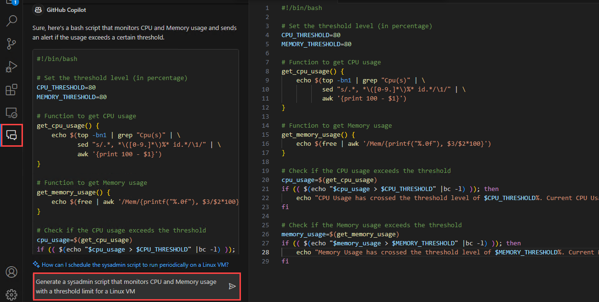
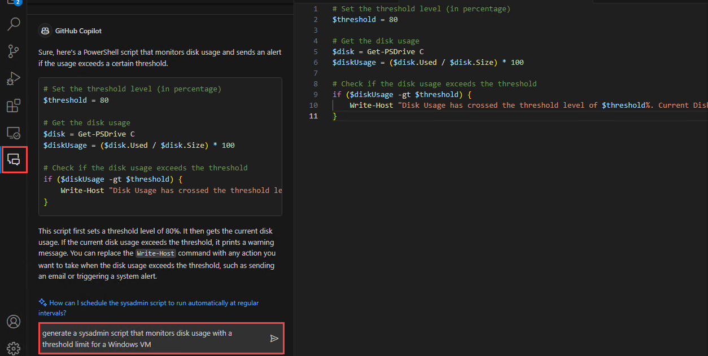
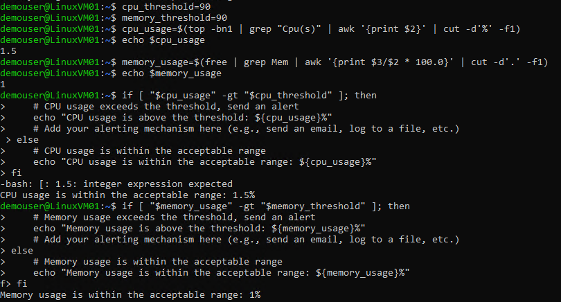
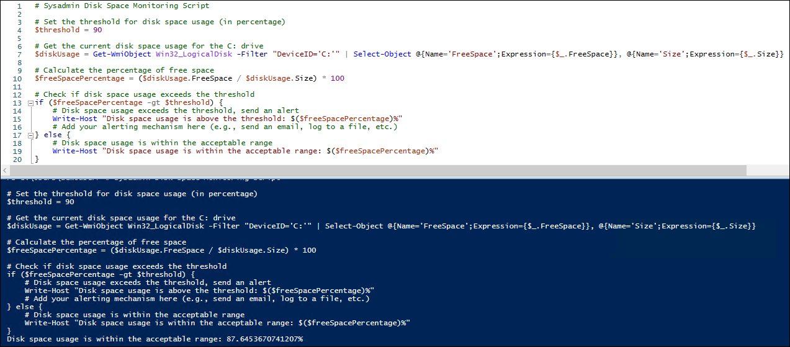

# Desafio 6: Gere Scripts usando o GitHub Copilot - Guia da Solução

## Tarefa 1: Gerar Scripts de Sysadmin

Nesta tarefa, você utilizará o GitHub Copilot para gerar scripts de monitoramento de recursos de sysadmin para uso de CPU e memória em uma VM Linux e para uso de disco em uma VM Windows.

1. No seu VS Code, peça ao Chat do GitHub Copilot para gerar um script de sysadmin que monitore o uso de CPU e memória com um limite de threshold para uma VM Linux e copie o script para um novo arquivo.

   

1. Agora, peça ao GitHub Copilot Chat para gerar um script de administração de sistema que monitore o uso de disco com um limite para uma VM Windows e copie o script para um novo arquivo.

   

1. Você notará que o GitHub Copilot gera um script PowerShell que monitora o uso de disco para um determinado limite de threshold e também explica seu uso.

## Tarefa 2: Refatorar ou depurar os scripts gerados

Nesta tarefa, você refatorará ou depurará os scripts de sysadmin gerados pelo GitHub Copilot na tarefa anterior.

1. Selecione o script inteiro e pressione **Ctrl+Enter** para ver as sugestões fornecidas pelo GitHub Copilot para refatorar e/ou fazer depurar o script.

1. **Aceite** as sugestões mais adequadas para corrigir os scripts.

1. Você também pode utilizar o **Chat Integrado do GitHub Copilot**. Oriente o GitHub Copilot para melhorar e corrigir os scripts.

1. Salve os arquivos após ter utilizado com sucesso o GitHub Copilot para refatorar e corrigir os scripts.

   - Script Bash para monitorar o uso de CPU e memória em uma VM Linux.
     ```
     #!/bin/bash

     # Sysadmin Resource Monitoring Script

     # Set the thresholds for CPU and memory usage (in percentage)
     cpu_threshold=90
     memory_threshold=90

     # Get the current CPU usage
     cpu_usage=$(top -bn1 | grep "Cpu(s)" | awk '{print $2}' | cut -d'%' -f1)

     # Get the current memory usage
     memory_usage=$(free | grep Mem | awk '{print $3/$2 * 100.0}' | cut -d'.' -f1)

     # Check CPU usage
     if [ "$cpu_usage" -gt "$cpu_threshold" ]; then
         # CPU usage exceeds the threshold, send an alert
         echo "CPU usage is above the threshold: ${cpu_usage}%"
         # Add your alerting mechanism here (e.g., send an email, log to a file, etc.)
     else
         # CPU usage is within the acceptable range
         echo "CPU usage is within the acceptable range: ${cpu_usage}%"
     fi

     # Check memory usage
     if [ "$memory_usage" -gt "$memory_threshold" ]; then
         # Memory usage exceeds the threshold, send an alert
         echo "Memory usage is above the threshold: ${memory_usage}%"
         # Add your alerting mechanism here (e.g., send an email, log to a file, etc.)
     else
         # Memory usage is within the acceptable range
         echo "Memory usage is within the acceptable range: ${memory_usage}%"
     fi
     ```
     
   - Script PowerShell para monitorar o uso de disco em uma VM Windows.
     ```
     # Sysadmin Disk Space Monitoring Script

     # Set the threshold for disk space usage (in percentage)
     $threshold = 90

     # Get the current disk space usage for the C: drive
     $diskUsage = Get-WmiObject Win32_LogicalDisk -Filter "DeviceID='C:'" | Select-Object @{Name='FreeSpace';Expression={$_.FreeSpace}}, @{Name='Size';Expression={$_.Size}}

     # Calculate the percentage of free space
     $freeSpacePercentage = ($diskUsage.FreeSpace / $diskUsage.Size) * 100

     # Check if disk space usage exceeds the threshold
     if ($freeSpacePercentage -gt $threshold) {
         # Disk space usage exceeds the threshold, send an alert
         Write-Host "Disk space usage is above the threshold: $($freeSpacePercentage)%"
         # Add your alerting mechanism here (e.g., send an email, log to a file, etc.)
     } else {
         # Disk space usage is within the acceptable range
         Write-Host "Disk space usage is within the acceptable range: $($freeSpacePercentage)%"
     }
     ```

## Tarefa 3: Executar os scripts

Nesta tarefa, você executará os scripts de administração de sistema gerados pelo GitHub Copilot em VMs Linux e Windows

1. Abra o command prompt e faça login na sua VM Linux.

   > **Observação:** Insira o nome de usuário administrador, a senha e o endereço IP público da sua VM Linux. 

1. Execute cada comando do seu script Bash que monitora o uso de CPU e memória e verifique os resultados.

   

1. Abra o PowerShell ISE como administrador, copie e cole o script PowerShell que monitora o uso de disco em um novo arquivo, execute o script e verifique os resultados.

   

## Conclusão

Neste desafio, você utilizou com sucesso o GitHub Copilot para gerar scripts de monitoramento de sysadmin para VMs Linux e Windows, aprimorou os scripts usando as sugestões do GitHub Copilot e o chat integrado, e verificou que os scripts gerados foram executados com sucesso.

### Você concluiu o Hackathon com sucesso.   
