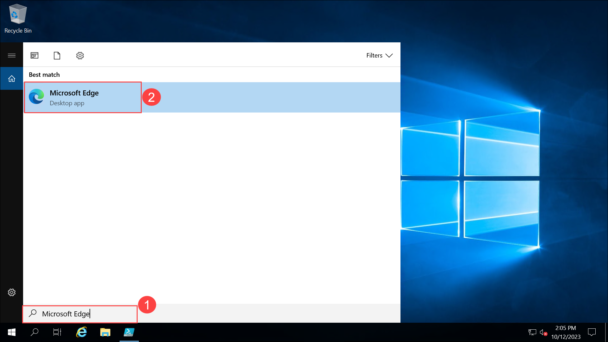

# Desafio 1: Primeiros Passos com o GitHub Copilot

### Duração Estimada: 45 Minutos

## Introdução

Como desenvolvedor(a) de software na **Contoso Ltda**, uma empresa líder em desenvolvimento de software, você tem a tarefa de pesquisar e implementar ferramentas e tecnologias inovadoras para aprimorar o processo de codificação e a produtividade da empresa. A empresa está particularmente interessada em soluções que possam melhorar a eficiência do código, otimizar o processo de desenvolvimento e fortalecer a colaboração entre suas equipes distribuídas globalmente.

A **Contoso Ltda** identificou o **GitHub Copilot**, um assistente de programação baseado em IA, como uma solução em potencial e inscreveu você em uma série de desafios para explorar e entender suas capacidades. Sua missão é dar os primeiros passos com o **GitHub Copilot**, configurando-o em seu ambiente de desenvolvimento, explorando seus recursos e utilizando-o para geração e sugestão de código. 

O **GitHub Copilot** é um revolucionário companheiro de programação baseado em IA, perfeitamente integrado ao **Visual Studio Code**, projetado para aprimorar sua experiência de codificação. Ao aproveitar o aprendizado de máquina, o Copilot auxilia os desenvolvedores na criação de código, sugerindo conclusões de forma inteligente e gerando trechos de código contextualmente relevantes.

Imagine navegar em um projeto de desenvolvimento complexo e encontrar desafios que exigem atenção meticulosa aos detalhes. O **GitHub Copilot** entra em cena como seu aliado na programação, oferecendo sugestões perspicazes e autocompletação adaptada ao contexto do código. Isso não apenas aumenta a eficiência do desenvolvimento, mas também serve como uma ferramenta valiosa de aprendizado, proporcionando uma compreensão mais profunda das estruturas e padrões de código.

Você experimentará o **GitHub Copilot** em vários cenários de desenvolvimento, como a criação de uma calculadora baseada em Python/JavaScript e uma aplicação que busca dados meteorológicos de APIs. Você também usará o GitHub Copilot para refatorar trechos de código fornecidos e depurar código intencionalmente defeituoso, entendendo assim o processo de melhoria de código e depuração eficaz. Além disso, você explorará a integração do **GitHub Copilot** com o GitHub Codespaces, um recurso que amplia o potencial colaborativo do seu ambiente de desenvolvimento. Isso permitirá que você entenda como o Copilot pode ser utilizado em um ambiente de desenvolvimento colaborativo, permitindo que equipes trabalhem em projetos de forma integrada, independentemente das fronteiras geográficas.

Nesta série de desafios, você explorará as capacidades do **GitHub Copilot**, começando pela configuração e exploração de seus recursos. Desde o desenvolvimento colaborativo com o GitHub Codespaces até a experimentação das sugestões do Copilot e a criação de código para diversas tarefas, você embarcará em uma jornada para aproveitar todo o potencial deste assistente de desenvolvimento revolucionário. Ao final deste desafio, você terá como objetivo demonstrar como o **GitHub Copilot** pode ser utilizado de forma eficaz para aumentar a produtividade na desenvolvimento, melhorar a qualidade do código e otimizar o processo de desenvolvimento de software na **Contoso Ltda**.

## Pré-requisitos

Certifique-se de ter o seguinte no ambiente integrado fornecido pela CloudLabs:

> **Observação**: Os pré-requisitos já estão configurados no ambiente fornecido pelo CloudLabs. Se você estiver usando seu computador pessoal ou laptop, certifique-se de que todos os pré-requisitos necessários estejam instalados para completar este hackathon.

- [Visual Studio Code](https://code.visualstudio.com/)
- [Conta do GitHub](https://github.com/)
- Módulos Python e NodeJs estão instalados na sua Lab-VM no diretório **C:\Program Files**.

## Login no GitHub

1. Na área de trabalho da LABVM, procure por **Microsoft Edge** **(1)** e dê um duplo clique no navegador **Microsoft Edge** **(2)**.

   

1. Navegue até a página de login do GitHub usando a URL fornecida abaixo:

   ```
   https://github.com/login
   ```

1. Na aba **Sign in to GitHub**, você verá a tela de login. Nessa tela, insira o e-mail **email** **(1)** e a senha **password** **(2)**. Em seguida, clique em **Sign in** **(3)**.

   >**Observação**:Para obter as credenciais do GitHub, navegue até a aba **Detalhes do Ambiente** e clique na opção **Credenciais do GitHub** para visualizar os pares de chave-valor do **GitHub UserEmail** e **GitHub Password**. Você pode usar os botões de copiar na coluna de ações para ter os valores copiados instantaneamente. Alternativamente, sugere-se copiar os valores para um bloco de notas para fácil acesso.

   

1. Em seguida, para obter o código de autenticação, faça login no Outlook (https://outlook.office365.com/mail/) com as credenciais do GitHub da etapa anterior, localizadas na aba Ambiente. Após fazer login no Outlook, encontre o e-mail recente contendo o código de verificação. Insira o código de verificação e clique em **Verify**.

   >**Observação:** O e-mail com o código de verificação pode, ocasionalmente, ser direcionado para as pastas de lixo eletrônico ou arquivamento do seu Outlook.

   

## Objetivos do Desafio:

1. **Configurar o GitHub Copilot no VS Code:**
   
      - Abra o Visual Studio Code, navegue até Extensões, procure por GitHub Copilot e clique em Instalar.
      - Configure as definições da extensão de acordo com suas preferências.

   <validation step="afc73673-26ad-4c49-b013-4632e09d8634" />

2. **Fazer login com uma conta do GitHub:**
   
      - Faça login no GitHub dentro do Visual Studio Code usando as credenciais do GitHub fornecidas. Você pode encontrar essas credenciais na aba **Ambiente > Credenciais do GitHub**.
      - Na página de login do GitHub, insira suas credenciais do GitHub e clique em **Sign in**.
      - Para verificar o login da sua conta do GitHub, faça login no **Outlook** no Lab VM através de uma janela Privada (https://outlook.office365.com/mail/) usando suas credenciais do GitHub. Localize o e-mail contendo o código de verificação e selecione **Verify**.
      - Clique em **Authorize Visual Studio Code** para fornecer permissões adicionais ao GitHub para o VS Code.

3. **Usando o GitHub Codespaces com o Copilot:**
   
      - Crie um Codespace para seu repositório GitHub. Navegue até o repositório **https://github.com/CloudLabsAI-Azure/Code-Generation-Refactoring** e faça um fork deste repositório para a conta do GitHub fornecida pela CloudLabs para criar um novo codespace.
      - Clone o repositório bifurcado acima no Visual Studio Code usando a conta GitHub fornecida pelo CloudLabs.
      - Entenda como o Copilot pode ser utilizado em um ambiente de codificação colaborativo.
      - Use o GitHub Codespaces para fazer push/commit dos arquivos locais do VS Code para o GitHub nos próximos desafios.

4. **Teste de Função do Copilot:**
     
   - Crie um Novo Arquivo Python:
     
      - Abra o Visual Studio Code e crie um novo arquivo chamado `hello.py`.

   - Utilizando o GitHub Copilot:
   
     - Pressione **Ctrl + I** para solicitar sugestões de código ao GitHub Copilot.
     - Na minijanela do Copilot, digite "Gerar um programa 'Olá, Mundo!' básico em Python".
     - Revise o código gerado, que deve ser semelhante a:

         ```
         print("Hello, World!")
         ```

     - Clique em Aceitar para inserir o código em seu arquivo.

         > **Dica**: Acesse a janela de Sugestões do GitHub Copilot pressionando Ctrl + Enter no Visual Studio Code.

5. **Geração de Código com Copilot e Copilot Chat:**
   
      - Crie código baseado em Python/JS para construir uma calculadora.
         
         - Utilize o GitHub Copilot para auxiliar na geração do código. Comece digitando um comentário como `# Crie uma calculadora básica` para solicitar que o Copilot sugira trechos de código.
         - Implemente várias operações matemáticas, como adição, subtração, multiplicação e divisão, bem como interações com o usuário para receber entradas e exibir resultados.
         - Após escrever o código, salve o arquivo como **calculator.py** se estiver usando Python, ou calculator.js se estiver usando JavaScript, e envie-o para o seu repositório bifucado **CloudLabsAI-Azure/Code-Generation-Refactoring** no GitHub.
         - Sinta-se à vontade para experimentar recursos adicionais, como lidar com múltiplos cálculos ou melhorar a interface do usuário.
           
      - Crie um aplicativo em Python/JS para obter dados meteorológicos das APIs do OpenWeatherMap.

         - Primeiro, crie uma conta no site do OpenWeatherMap (https://openweathermap.org/).

         >**Observação:** Se você já possui uma conta no OpenWeatherMap, por favor, continue usando a mesma conta.

         - Use o GitHub Copilot para gerar o código que se conecta à API do OpenWeatherMap. Comece escrevendo um comentário como `# Buscar dados meteorológicos da API do OpenWeatherMap`, o que ajudará o Copilot a entender seu objetivo e fornecer trechos de código relevantes.
         - Garanta que o código inclua a funcionalidade para fazer requisições à API e processar os dados recebidos para exibir informações meteorológicas como temperatura, umidade e condições do tempo.
         - Salve este arquivo como **weather_script.py** para Python ou **weather_script.js** para JavaScript, e envie-o para o seu repositório bifucado **CloudLabsAI-Azure/Code-Generation-Refactoring** no GitHub.
         - Teste o aplicativo inserindo diferentes locais para ver como ele busca e apresenta os dados meteorológicos.
       
   <validation step="b5244888-2b42-4686-b326-465182a86561" />

6. **Refatoração e Depuração de Código:**

      - Refatore o código `sum_elements.py` do seu repositório GitHub bifurcado **CloudLabsAI-Azure/Code-Generation-Refactoring** no GitHub usando o Copilot, compreendendo o processo de melhoria de código.

        >**Dica:** Utilize o recurso **Refatorar** do GitHub Copilot.

      - Depure o código `card_draw.py` de maneira eficaz a partir de seu repositório GitHub bifurcado **CloudLabsAI-Azure/Code-Generation-Refactoring** no GitHub de forma eficaz com a ajuda do Copilot, abordando e corrigindo os problemas identificados.

         >**Dica:**  Utilize o recurso **Corrigir** do GitHub Copilot.
         
7. **Explore os Recursos do GitHub Copilot:**
      - Experimente fornecer contexto ou restrições específicas em seus comentários. Isso ajuda o Copilot a gerar trechos de código mais personalizados que se ajustam ao seu estilo de codificação ou aos requisitos do projeto.

      - Use o Copilot para ajudá-lo a pensar em casos extremos, pedindo para ele gerar código para cenários que talvez não sejam imediatamente óbvios. Isso pode aprimorar suas habilidades de resolução de problemas e garantir que seu código lide com várias entradas de forma eficaz.

        >**Dica:** Acesse a janela de Sugestões do GitHub Copilot com o atalho **Ctrl+Enter** no seu VS Code.

## Critérios de Sucesso:

- Verificar se o GitHub Copilot foi instalado, configurado e logado com sucesso no Visual Studio Code.
- Ter explorado com sucesso a integração com o GitHub Codespaces e compreendido seus recursos de colaboração.
- Ter experimentado com sucesso o Copilot em cenários de codificação, testando suas capacidades de geração de código.
- Verificar se o código em Python/JS para uma calculadora e um aplicativo para obter dados meteorológicos foi criado e executado com sucesso usando o Copilot.
- Verificar se o trecho de código escolhido foi refatorado com sucesso, com legibilidade e qualidade geral aprimoradas.

## Recursos Adicionais:

- [Documentação do GitHub Copilot](https://github.com/github/copilot-docs)
- [Documentação do GitHub Codespaces](https://docs.github.com/en/codespaces)

### Conclusão

Neste desafio, você configurou com sucesso o GitHub Copilot no Visual Studio Code, ajustou as configurações da extensão e fez login com sua conta do GitHub. Você também obteve sucesso na criação de código em Python/JS para uma calculadora e um aplicativo para buscar dados meteorológicos das APIs do OpenWeatherMap. Além disso, você aprimorou suas habilidades de codificação ao refatorar trechos de código e depurar com a ajuda do Copilot.

### Clique em Avançar >> para prosseguir com o próximo desafio.


