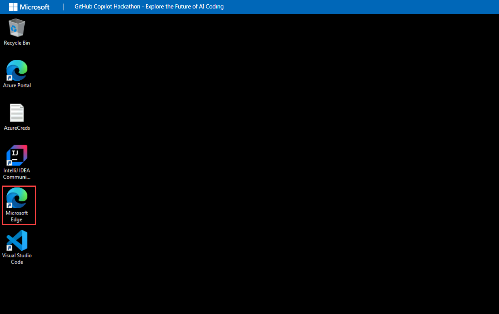
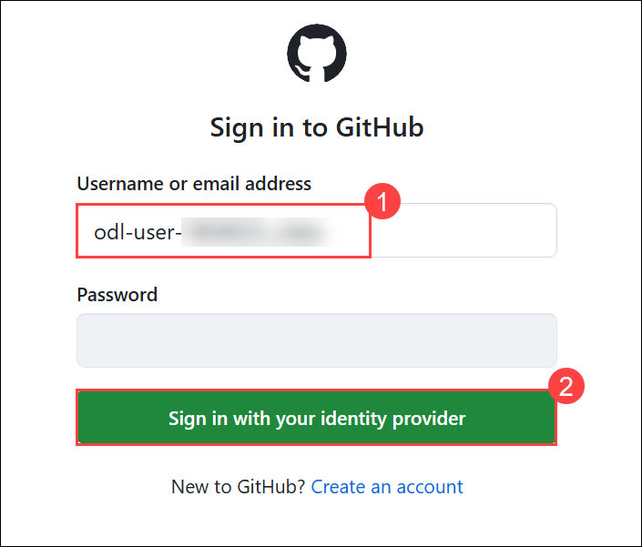
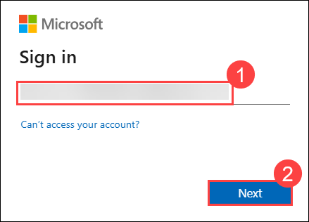
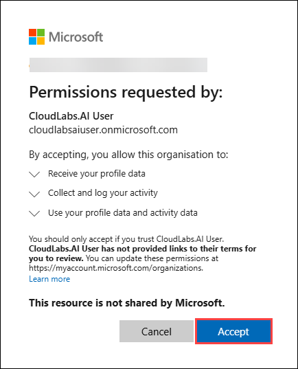
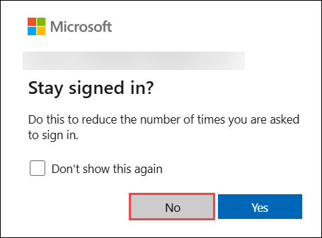
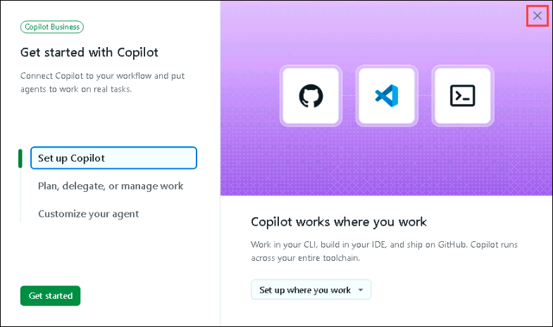
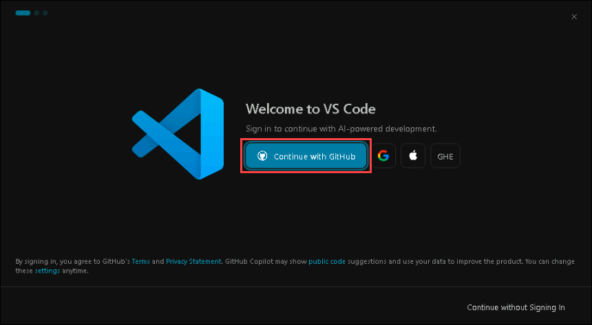
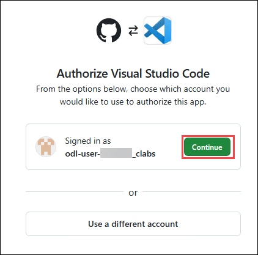
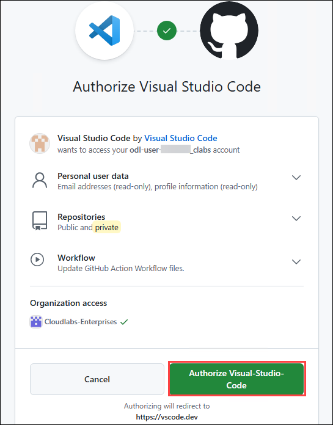
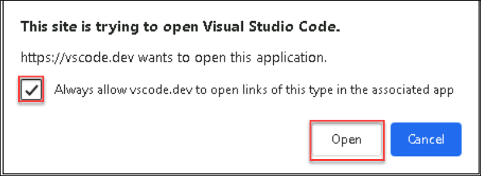

# Challenge 01: Getting Started with GitHub Copilot

### Estimated Duration: 70 Minutes

## Introduction

As a software developer at **Contoso Ltd.**, a leading software development company, you are tasked with researching and implementing innovative tools and technologies to enhance the company's coding process and productivity. The company is particularly interested in solutions that can improve code efficiency, streamline the development process, and enhance collaboration among its globally distributed teams.

**Contoso Ltd.** has identified **GitHub Copilot**, an AI-powered coding assistant, as a potential solution and enrolled you in a challenge series to explore and understand its capabilities. Your mission is to get started with **GitHub Copilot**, setting it up in your coding environment, exploring its features, and using it for code generation and suggestions. **GitHub Copilot** is a groundbreaking AI-powered coding companion seamlessly integrated into **Visual Studio Code**, designed to enhance your coding experience. By leveraging machine learning, Copilot assists developers in crafting code by intelligently suggesting completions and generating contextually relevant code snippets.

Imagine navigating a complex coding project and encountering puzzles that demand meticulous attention to detail. **GitHub Copilot** steps in as your coding ally, offering insightful suggestions and autocompletion tailored to the coding context. This not only boosts coding efficiency but also serves as a valuable learning tool, providing a deeper understanding of coding structures and patterns.

You will experiment with **GitHub Copilot** in various coding scenarios, such as creating a Python/JavaScript-based calculator and an application that fetches weather data from APIs. You will also leverage GitHub Copilot to refactor given code snippets and debug intentionally flawed code, thereby understanding the process of code improvement and effective debugging.

In this challenge series, you'll dive into **GitHub Copilot's** capabilities, starting with the setup and exploration of its features, creating code for various tasks, you'll embark on a journey to harness the full potential of this revolutionary coding assistant. By the end of this challenge, you aim to demonstrate how **GitHub Copilot** can be effectively used to enhance coding productivity, improve code quality, and streamline the software development process at **Contoso Ltd**.

## Prerequisites

Make sure you have the following from the CloudLabs-provided integrated environment:

> **Note**: Prerequisites are already set up in the CloudLabs provided environment. If you're using your personal computer or laptop, please make sure that all necessary prerequisites are installed to complete this hackathon.

- [Visual Studio Code](https://code.visualstudio.com/)
- [GitHub account](https://github.com/)
- Python and NodeJs modules are installed in your Lab-VM.

## Login to GitHub

1. On the **LABVM desktop**, double-tap **Microsoft Edge**.

   

1. Navigate to **GitHub** login page using the provided URL below:
   
   ```
   https://github.com/login
   ```
   
1. On the **Sign in to GitHub** tab, enter the provided **GitHub username** in the input field, and click on **Sign in with your identity provider** **(2)**.

    - Email/Username: <inject key="GitHub User Name" enableCopy="true"/> **(1)**

      

1. Click on **Continue** on the **Single sign-on to CloudLabs Organizations** page to proceed.

   

1. You'll see the **Sign in** tab. Here, enter your Azure Entra credentials and click **Next (2)**.

   - **Email/Username:** <inject key="AzureAdUserEmail"></inject> **(1)**

     

1. Next, provide your Temporary Password and click on **Sign in (2)**

   - **Temporary Access Pass:** <inject key="AzureAdUserPassword"></inject> **(1)**

     

1. On the **Permissions requested by:** tab, click on **Accept**.

   

1. On the **Stay Signed in?** pop-up, click on No.

   

1. When the **Get started with Copilot** pop-up appears, close the window to continue.

   

1. You are now successfully logged in to **GitHub** and have been redirected to the **GitHub homepage**.

   

## Challenge Objectives:

1. **Login to GitHub Copilot in VS Code:**
   
   - Open the **Visual Studio Code** shortcut from the desktop of your **Lab VM**.

     

   - Once VS Code opens, you will see a prompt to sign in to GitHub. Click 

     

   - Now, in the browser, click on **Continue** to Authorize Visual Studio Code. 

     

   - On the next window, click on **Authorize Visual-Studio-Code**.

     

   - You will see a pop-up asking **This site is trying to open Visual Studio Code**. Enable the **CheckBox** (1) and then click on **Open** (2). It will take you to VS Code. 

     

2. **Copilot Function Test:**
     
   - Create a New Python File:
     
      - In Visual Studio Code and create a new file named **hello.py**.

   - Use GitHub Copilot:

     - In the Copilot Chat window, using either **Ask** or **Agent** mode, enter the following prompt:
    
       ```
       Generate a basic Hello World program in Python
       ```
     
     - Review the generated code, which should resemble the following:

         ```
         print("Hello, World!")
         ```

     - Run the Python file using either the Command Prompt or Visual Studio Code to verify Copilot functionality.

3. **Code Generation with Copilot and Copilot Chat:**

      - Create Python/JS-based code to build a calculator.

         - Utilize GitHub Copilot Chat to assist in generating the code. Start by typing the prompt like:
           ```
           Create a basic calculator in Python/JS (your preferred programming language)
           ```
         - Implement various mathematical operations, such as addition, subtraction, multiplication, and division, as well as user interactions to take input and display results.
         - Once you’ve written the code, save the file as ***calculator.py*** (if you’re using Python), or ***calculator.js*** (if you’re using JavaScript).
         - Feel free to experiment with additional features, like handling multiple calculations or improving the user interface.

      - Create a Python/JS-based app to get weather data from OpenWeatherMap APIs.

         - First, sign up for an account on the OpenWeatherMap website (https://openweathermap.org/).

           >**NOTE:** If you are already registered for an OpenWeatherMap account, kindly continue to use the same account.

         - Use GitHub Copilot Chat to generate code that connects to the OpenWeatherMap API. Start by typing the prompt like:
           ```
           Create a Python/JS-based app to get weather data from OpenWeatherMap APIs
           ```

         - Ensure that the code includes functionality for making API requests and processing the retrieved data to display weather information like temperature, humidity, and weather conditions.

         - Save this file as ***weather_script.py*** (for Python) or ***weather_script.js*** (for JavaScript).

         - Test the app by entering different locations to see how it retrieves and presents weather data.

4. **Code Refactoring & Debugging:**
      
      - Refactor the below poorly written `sum_elements.py` code using Copilot, understanding the process of code improvement.

        ```
        #A poorly written example of a program in Python. It prompts the user for the number of elements to sum, takes those integers as input, and handles some basic error cases

        MAX = 100

        def calculate_sum(arr):
           return sum(arr)

        def main():
           try:
              n = int(input("Enter the number of elements (1-100): "))
              if not 1 <= n <= MAX:
                 print("Invalid input. Please provide a digit ranging from 1 to 100.")
                 exit(1)

              arr = []

              print(f"Enter {n} integers:")
              for _ in range(n):
                 try:
                    arr.append(int(input()))
                 except ValueError:
                    print("Invalid input. Please enter valid integers.")
                    exit(1)

              total = calculate_sum(arr)

              print("Sum of the numbers:", total)

           except KeyboardInterrupt:
              print("\nProgram terminated by user.")
              exit(1)

        if __name__ == "__main__":
           main()
        ```

      - Debug the below intentionally bugged Python `card_draw.py` code effectively with Copilot, addressing and fixing identified issues. 

        ```
        # Intentionally flawed Python program

        # importing modules
        import itertools, random

        # make a deck of cards
        deck = list(itertools.product(range(1,14),['Spade','Heart','Diamond','Club'])

        # shuffle the cards
        random.shuffle(deck)

        # draw five cards
        print("You got:")
        for i in range(5)
           print(deck[i][0], "of", deck[i][1]
        ```

4. **Explore GitHub Copilot Features:**
   
      - Experiment with providing specific context or constraints in your comments. This helps Copilot generate more tailored code snippets that fit your unique coding style or project requirements.

      - Use Copilot to help you think through edge cases by asking it to generate code for scenarios that might not be immediately obvious. This can enhance your problem-solving skills and ensure your code handles various inputs effectively.

## Success Criteria:

- Successfully logged into GitHub Copilot in Visual Studio Code.
- Successfully tried out Copilot in coding scenarios, experiencing its code generation capabilities.
- Verify that Python/JS code for a calculator and an app to get weather data using Copilot were created and run successfully.
- Verify that your chosen piece of code is refactored successfully, with improved readability and overall quality.
- Verify that a piece of code with intentional errors is fixed successfully using Copilot.

## Additional Resources:

- [GitHub Copilot Documentation](https://github.com/github/copilot-docs)
- [GitHub Codespaces Documentation](https://docs.github.com/en/codespaces)

## Conclusion

In this challenge, you successfully set up GitHub Copilot in Visual Studio Code, configured extension settings, and logged in with your GitHub account. You were also successful in creating Python/JS code for a calculator and an app to fetch weather data from OpenWeatherMap APIs. Additionally, you refined your coding skills by refactoring code snippets and debugging with Copilot's assistance.

## Now, click on Next >> from the lower right corner to move on to the next challenge.


