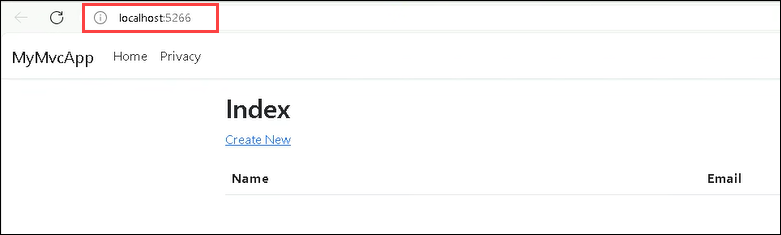
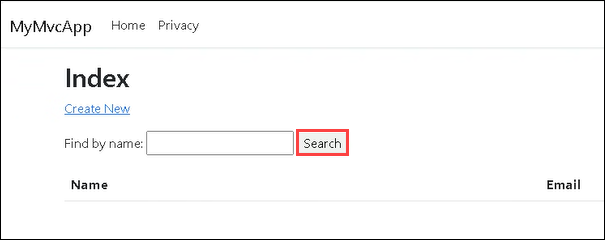

# Desafio 2: Desenvolva uma applicação com o GitHub Copilot

### Duração Estimada: 60 Minutos
  
## Introdução  

Na **Contoso Ltda**, uma empresa líder em desenvolvimento de software, você, como **desenvolvedor(a) de software**, recebeu a tarefa de explorar as capacidades do **GitHub Copilot, um assistente de programação baseado em IA, e aproveitá-las no processo de desenvolvimento de software da empresa. A empresa acredita que a integração da IA no processo de desenvolvimento pode aumentar significativamente a eficiência e a produtividade das equipes.

Como parte desta missão, você foi designado(a) para desenvolver uma aplicação CRUD chamada **MyMvcApp** usando o **GitHub Copilot**. O objetivo deste desafio é entender o potencial da IA no desenvolvimento de software e familiarizá-lo(a) com as capacidades do GitHub Copilot. Com a assistência do GitHub Copilot, espera-se que você gere o código necessário, guiado(a) pelos comentários fornecidos no arquivo. Você utilizará o GitHub Copilot em todas as etapas do processo de desenvolvimento, desde a geração de código para métodos vazios até a construção de funcionalidades essenciais e o teste completo da aplicação.

Ao longo do desafio, você aproveitará a capacidade do Copilot de entender o contexto e fornecer sugestões de código relevantes. Ao interagir com o Copilot Chat, você aprimorará a colaboração e receberá recomendações de codificação perspicazes, enriquecendo ainda mais sua experiência de programação.

Ao final deste desafio, seu objetivo é ter uma **Aplicação CRUD MyMvcApp** totalmente funcional, desenvolvida principalmente com a assistência do **GitHub Copilot**. Após a conclusão, você não apenas terá desenvolvido uma aplicação rica em recursos, mas também terá obtido insights valiosos sobre como a IA pode ser integrada de forma transparente ao fluxo de trabalho de desenvolvimento. Esta experiência prática com o GitHub Copilot o(a) capacitará a explorar suas vastas capacidades e desbloquear seu potencial em vários cenários de desenvolvimento. Isso demonstrará o potencial da IA no desenvolvimento de software e fornecerá insights valiosos sobre sua implementação prática na **Contoso Ltda**.
  
## Pré-requisitos

Certifique-se de ter o seguinte no ambiente integrado fornecido pela CloudLabs:

- Conhecimento básico da linguagem de programação C#.  
- Conta do GitHub.
- Crie uma pasta com o nome **GitHub Copilot** em **C:\Users\azureuser**.

## Configurando o Visual Studio Code

1. Faça login no Visual Studio Code usando suas credenciais de usuário do GitHub a partir da aba **Ambiente > Credenciais do GitHub**.

2. Navegue até o link do GitHub abaixo e faça um fork do repositório para a conta GitHub fornecida pelo CloudLabs.

   ```
   https://github.com/CloudLabsAI-Azure/MyMvcApp-Contact-Databse-Application
   ```

   > **Observação:** Você já fez um fork do repositório GitHub fornecido no Desafio 01.
   
3. Clone o repositório em que anteriormente efetuou um fork no Visual Studio Code usando a conta GitHub fornecida pelo CloudLabs. 

>**Observação:** Se você receber uma mensagem informando que o repositório já existe, por favor, exclua o repositório existente e faça o fork de um novo novamente.

4. No seu Visual Studio Code, navegue até **Extensões** e instale o **Nuget Gallery** e o **C# Dev Kit**.

## Objetivos do Desafio

1. **Desenvolver uma aplicação:** 

      - Você criará uma aplicação CRUD chamada **MyMvcApp**, em C#, com a ajuda do **Github Copilot**, que permitirá aos usuários salvar os detalhes de contato das pessoas conforme os requisitos e também realizem funções básicas como editar seus detalhes, excluir seus perfis, e assim por diante. Você receberá o esqueleto da aplicação já pronto, mas precisará implementar as funcionalidades dentro do arquivo **UserController.cs** por conta própria. Sua tarefa é completar esses métodos utilizando o GitHub Copilot para gerar o código necessário, guiado pelos comentários fornecidos no arquivo.

      - Explore a capacidade do Copilot de entender seu contexto e fornecer sugestões de código relevantes.
        
        >**Dica:** Utilize os recursos **Iniciar no Editor**, **Corrigir** e o **chat do GitHub Copilot** para desenvolver o código necessário.

      - Teste a aplicação minuciosamente e garanta que todas as funcionalidades estejam funcionando conforme o esperado.
  
        

   <validation step="daaa3f6f-00f1-437a-8f35-01b59fb2da41" />

   <validation step="c7f107a0-97a2-4442-9cef-b14297fd5b7a" />

2. **Gerar scripts de casos de teste unitário e validá-los**:

      - Execute os comandos abaixo no prompt de comando para criar uma nova pasta chamada  **MyMvcApp.Tests** em **C:\Users\azureuser\GitHub Copilot** para gerar casos de teste unitário.

        ```
        cd "C:\Users\azureuser\GitHub Copilot"
        ```
        ```
        dotnet new xunit -n MyMvcApp.Tests
        ```

      - No seu Visual Studio Code, localize a pasta **MyMvcApp.Tests** no Gerenciador de Soluções, clique com o botão direito e selecione **Abrir no terminal integrado**. Execute o comando abaixo no terminal para adicionar o pacote dotnet.

        ```
        dotnet add package Microsoft.CodeDom.Providers.DotNetCompilerPlatform
        ```
        
      - Para cada uma das funcionalidades no **MyMvcApp** que você construiu dentro do arquivo **UserController.cs**, gere casos de teste unitário para o arquivo **UserControllerTests.cs** usando **xunit** e utilizando o **Github Copilot**.
        
        >**Dica:** Renomeie o arquivo **UnitTest1.cs** para **UserControllerTests.cs** após criar a pasta **MyMvcApp.Test**.

      - Execute os scripts necessários gerados pelo **GitHub Copilot** e verifique se todos os casos de teste unitário passaram.

3. **Desenvolver e testar funcionalidades:** 

      - Uma vez que os métodos estejam completos, o próximo passo é desenvolver e adicionar uma funcionalidade de busca à aplicação e testar esse recurso minuciosamente.
        
      - Utilize o GitHub Copilot para gerar trechos de código para a construção da funcionalidade de busca.

      - Teste a aplicação e certifique-se de que a funcionalidade de busca está funcionando conforme esperado.
  
        

4. **Usar o GitHub Copilot em cada etapa do desafio:** 

      - Use o GitHub Copilot para auxiliar na escrita de mensagens de commit significativas que descrevam claramente as alterações feitas.

      - Ao longo do processo de desenvolvimento, interaja com o Copilot Chat para aprimorar a colaboração e receber recomendações de codificação perspicazes.
  
## Critérios de Sucesso  

- Verifique se os métodos no arquivo `UserController.cs` foram concluídos com sucesso usando o GitHub Copilot.
- Verifique se todos os casos de teste gerados pelo Copilot passaram.
- Verifique se o recurso de pesquisa desenvolvido está funcionando conforme o esperado.
- Certifique-se de utilizar com sucesso o GitHub Copilot para escrever mensagens de commit.

## Recursos Adicionais:

- Consulte a [Documentação do GitHub Copilot](https://github.com/github/copilot-docs) para esclarecimentos durante a execução do desafio.
  
### Validação do Desafio

Forneça o parâmetro de Nome de Usuário do GitHub no formato **github-cloudlabsuser-XXXX** para a etapa de validação **Validate GitHub directory**.

## Conclusão  

Neste desafio, você conseguiu desenvolver uma aplicação de Banco de Dados de Contatos totalmente funcional, predominantemente com a assistência do GitHub Copilot, demonstrando sua utilidade prática em um cenário de desenvolvimento de software do mundo real. Você navegou com sucesso pelo processo de desenvolvimento, desde a geração de código para métodos vazios no arquivo `UserController.cs` até a construção de funcionalidades essenciais para a aplicação. Você utilizou o GitHub Copilot para entender seu contexto e fornecer sugestões de código relevantes, aprimorando sua experiência de programação.

A interação com o Copilot Chat enriqueceu sua colaboração e forneceu recomendações de codificação perspicazes, mostrando como a IA pode ser integrada de forma transparente ao fluxo de trabalho de desenvolvimento. Os casos de teste gerados com a ajuda do GitHub Copilot garantiram a robustez e a confiabilidade da sua aplicação. Suas conquistas neste desafio demonstraram o potencial da IA no desenvolvimento de software e forneceram insights valiosos sobre sua implementação prática. Você mostrou que, com as ferramentas certas, como o GitHub Copilot, o processo de desenvolvimento pode se tornar mais eficiente e produtivo.

### Clique em Avançar >> para prosseguir com o próximo desafio.


