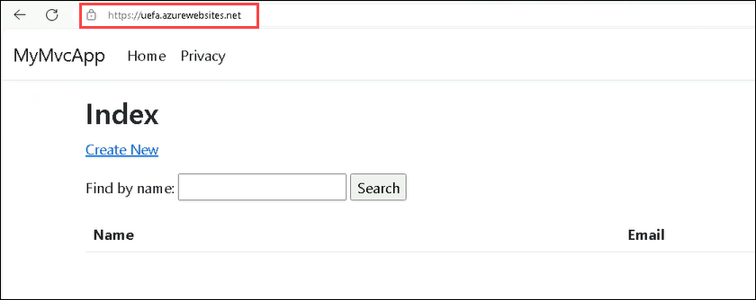

# Desafio 3: Implante a Aplicação no Azure

### Duração Estimada: 60 Minutos

## Introdução

No desafio anterior, você desenvolveu com sucesso uma aplicação: **CRUD MyMvcApp** totalmente funcional, principalmente com a assistência do **GitHub Copilot**, e também adquiriu conhecimento sobre como a IA pode ser integrada de forma eficiente ao fluxo de trabalho de desenvolvimento.

Como desenvolvedor(a) de software na **Contoso Ltda**, uma empresa líder em desenvolvimento de software, você foi designado para explorar tecnologias e ferramentas inovadoras que podem aprimorar o processo de desenvolvimento de software e a gestão da infraestrutura da empresa. A **Contoso Ltda** reconhece o potencial da Infraestrutura como Código (IaC) na gestão e provisão de seus recursos de computação e está particularmente interessada em templates do Azure Resource Manager (ARM) para implantar aplicações no Azure.

Neste desafio, você utilizará o **GitHub Copilot** para otimizar o desenvolvimento de um template do **Azure Resource Manager (ARM)** para implantar a aplicação **CRUD MyMvcApp Application** totalmente funcional que você desenvolveu anteriormente. Os templates ARM são arquivos de Infraestrutura como Código (IaC) usados para implantar e gerenciar recursos no Azure. 

Aproveitando as capacidades de geração de código do Copilot, você acelerará a criação de um template ARM para implantar uma aplicação no Azure. Além disso, você também automatizará os processos de construção e teste do seu código. Você criará um pipeline do GitHub Actions, com o **GitHub Copilot** auxiliando na geração dos scripts necessários. Para documentar o conhecimento e as percepções adquiridas com este exercício, você usará o GitHub Copilot para gerar uma documentação abrangente e precisa para este desafio. Esta documentação servirá como um guia para a criação do template ARM, configuração do pipeline do GitHub Actions e implantação da **CRUD MyMvcApp Application** no Azure.

Com certeza. Segue a tradução do texto, mantendo a formatação e a precisão técnica necessárias para o desafio.

Desafio 3: Implante a Aplicação no Azure
Tempo Estimado: 60 Minutos

Introdução
No desafio anterior, você desenvolveu com sucesso uma Aplicação CRUD MyMvcApp totalmente funcional, principalmente com a assistência do GitHub Copilot, e também obteve insights valiosos sobre como a IA pode ser integrada de forma transparente ao fluxo de trabalho de desenvolvimento.

Como desenvolvedor(a) de software na Contoso Ltd., uma empresa líder no setor, você tem a tarefa de explorar tecnologias e ferramentas inovadoras que possam aprimorar o processo de desenvolvimento de software e o gerenciamento de infraestrutura da empresa. A Contoso Ltd. reconhece o potencial da Infraestrutura como Código (IaC) no gerenciamento e provisionamento de seus recursos computacionais e está particularmente interessada em templates do Azure Resource Manager (ARM) para implantar aplicações no Azure.

Neste desafio, você utilizará o GitHub Copilot para otimizar o desenvolvimento de um template do Azure Resource Manager (ARM) para implantar a Aplicação CRUD MyMvcApp totalmente funcional que você desenvolveu anteriormente. Os templates ARM são arquivos de Infraestrutura como Código (IaC) usados para implantar и gerenciar recursos no Azure. Ao aproveitar as capacidades de geração de código do Copilot, você acelerará a criação de um template ARM para implantar uma aplicação no Azure. Além disso, você também automatizará os processos de build e teste do seu código. Você criará um pipeline do GitHub Actions, com o GitHub Copilot auxiliando na geração dos scripts necessários. Para documentar o conhecimento e os insights obtidos neste exercício, você usará o GitHub Copilot para gerar uma documentação abrangente e precisa para este desafio. Essa documentação servirá como um guia para criar o template ARM, configurar o pipeline do GitHub Actions e implantar a Aplicação CRUD MyMvcApp no Azure.

Ao concluir este desafio, seu objetivo é demonstrar à **Contoso Ltda** como o **GitHub Copilot** pode otimizar o desenvolvimento de templates ARM, automatizar processos de build e teste com o GitHub Actions e gerar documentação perspicaz. Isso destacará ainda mais o valor da integração da IA ao fluxo de trabalho de desenvolvimento, seguindo o sucesso do desenvolvimento da aplicação de Banco de Dados de Contatos no desafio anterior.

## Pré-requisitos

Certifique-se de ter o seguinte no ambiente integrado fornecido pela CloudLabs:

> **Observação:** Os pré-requisitos já estão configurados no ambiente fornecido pelo CloudLabs. Se você estiver usando seu computador pessoal ou laptop, certifique-se de que todos os pré-requisitos necessários estejam instalados para concluir este hackathon.

- [Visual Studio Code](https://code.visualstudio.com/)
- [Conta do GitHub](https://github.com/)
- [Extensão GitHub Copilot](https://marketplace.visualstudio.com/items?itemName=GitHub.copilot) instalada no VS Code.
- Certifique-se de implantar o aplicativo web no grupo de recursos existente chamado **GitHub-Copilot-Challenges**.

## Acessando o Portal do Azure

1. Para acessar o portal do Azure, abra uma janela privada/anônima no seu navegador e navegue até o **[Portal do Azure](https://portal.azure.com)**.

1. Na aba **Entrar no Microsoft Azure**, você verá uma tela de login. Insira o seguinte e-mail/usuário e clique **Avançar**. 
   * E-mail/Usuário: <inject key="AzureAdUserEmail"></inject>
        
1. Agora insira a seguinte senha e clique em **Sign in**.
   * Senha: <inject key="AzureAdUserPassword"></inject>

1. **Ignore** o registro MFA se o pop-up aparecer enquanto faz login no portal do Azure.

1. Se aparecer o pop-up **Permanecer conectado?**, clique em **Não**.

1. Se aparecer o pop-up **Você tem recomendações gratuitas do Azure Advisor!**, feche a janela para continuar o laboratório.

1. Se aparecer uma janela pop-up **Bem-vindo ao Microsoft Azure**, clique em **Cancelar** para ignorar o tour.
   
1. Agora você verá o Painel do Portal do Azure. Clique em **Grupos de Recursos** no painel de navegação para ver os grupos de recursos.
  
1. Confirme que você tem um grupo de recursos chamado **GitHub-Copilot-Challenges**. Você precisará usar o grupo de recursos **GitHub-Copilot-Challenges** ao longo deste desafio.

## Objetivos do Desafio:

1. **Desenvolver um template ARM para implantar uma aplicação no Azure:**
   
   - Use o GitHub Copilot para auxiliá-lo(a) na geração da estrutura inicial de um template ARM para implantar a aplicação **CRUD MyMvcApp** no Azure.
     
   - Defina os recursos necessários do Azure no template ARM, ou seja, um **Aplicativo Web** presente nos **Serviços de Aplicativos do Azure** necessário para implantar sua aplicação. 
     
   - Salve os arquivos do template ARM e de parâmetros no seu repositório GitHub da aplicação **CRUD MyMvcApp** como arquivos **deploy.json** e **deploy.parameters.json** na branch **master**.

   <validation step="93dbb711-57a3-462c-8ffe-699f1208865e" />

2. **Gerar um workflow do GitHub Actions usando o Centro de Implantação do Aplicativo Web no portal do Azure:**
   
      - Implemente e construa o código do workflow apartir do **Centro de Implantação** do seu Aplicativo Web para o repositório GitHub de origem **MyMvcApp-Contact-Database-Application** para iniciar o pipeline do workflow e implantar seu Aplicativo Web no Azure.

         >**Observação:** O build falhará devido ao caminho não definido no seu arquivo YAML do workflow.
  
      - Especifique o caminho como **D:\a\MyMvcApp-Contact-Databse-Application\MyMvcApp-Contact-Databse-Application\bin\Release\net8.0\MyMvcApp** para as etapas **dotnet publish** e **Upload artifact for deployment job** no seu arquivo de workflow.

   <validation step="019351e9-84ff-4623-a26c-66afe706bf66" />

3. **Fazer a aplicação funcionar no Azure:**
   
      - Verifique se o build do pipeline do GitHub Actions foi bem-sucedido e se a aplicação está funcionando como esperado através do Aplicativo Web.
  
         
     
      - Verifique se os recursos implantados correspondem às especificações descritas em seu template ARM e se a aplicação está funcionando a partir do **Domínio Padrão** do Aplicativo Web do Azure.

4. **Gerar documentação com o Copilot para a aplicação:**
   
      - Use o GitHub Copilot para auxiliá-lo(a) na geração de documentação detalhada e precisa especificamente para este desafio.
     
      - Crie um arquivo MD no seu repositório **MyMvcApp-Contact-Database-Application** no GitHub como um arquivo **README.md** na branch **master**. Isso servirá como um guia na criação de um template ARM para implantar a aplicação e o arquivo de workflow do pipeline do GitHub Actions.

## Critérios de Sucesso:

- Verificar se o aplicativo web dos Serviços de Aplicativos do Azure contendo o código da sua aplicação está presente no Azure.
- Verificar se o pipeline do GitHub Actions foi criado com sucesso.
- Verificar se a Aplicação **CRUD MyMvcApp** foi implantada com sucesso no Azure e testar a funcionalidade.
- Verificar se a documentação foi criada com sucesso.

## Recursos adicionais:

- Consulte [aqui](https://learn.microsoft.com/en-us/azure/developer/github/deploy-to-azure) para ajuda adicional.
- Se você encontrar algum desafio ou tiver dúvidas, consulte a [Documentação do GitHub Copilot](https://github.com/github/copilot-docs) para obter orientações.

### Validação do Desafio

Forneça o parâmetro de Nome de Usuário do GitHub no formato **github-cloudlabsuser-XXXX** para a etapa de validação **Validate GitHub directory**.

## Conclusão

Neste desafio, você demonstrou como a IA pode auxiliar significativamente no desenvolvimento e na implantação de aplicações, especificamente através do uso do GitHub Copilot. Você não apenas desenvolveu uma aplicação de Banco de Dados de Contatos totalmente funcional no desafio anterior, mas também a implantou eficazmente no Azure usando um template ARM gerado com a ajuda do GitHub Copilot. Você utilizou o GitHub Copilot para otimizar a criação do template ARM, que é um exemplo poderoso de Infraestrutura como Código (IaC), e também automatizou o processo de build e teste do seu código criando um pipeline do GitHub Actions, com o GitHub Copilot auxiliando na geração dos scripts necessários. Além disso, você produziu uma documentação abrangente e precisa para este desafio, servindo como um guia valioso para projetos futuros.

Através deste desafio, você demonstrou à Contoso Ltd. o potencial de integrar a IA ao fluxo de trabalho de desenvolvimento. Você mostrou como o GitHub Copilot pode auxiliar não apenas no desenvolvimento de aplicações, mas também na implantação e gerenciamento de infraestrutura, destacando assim sua versatilidade e valor. Ao implantar com sucesso a aplicação de Banco de Dados de Contatos no Azure e verificar sua funcionalidade, você forneceu uma demonstração tangível dos benefícios da IA no desenvolvimento de software.

### Clique em Avançar >> para prosseguir com o próximo desafio.

