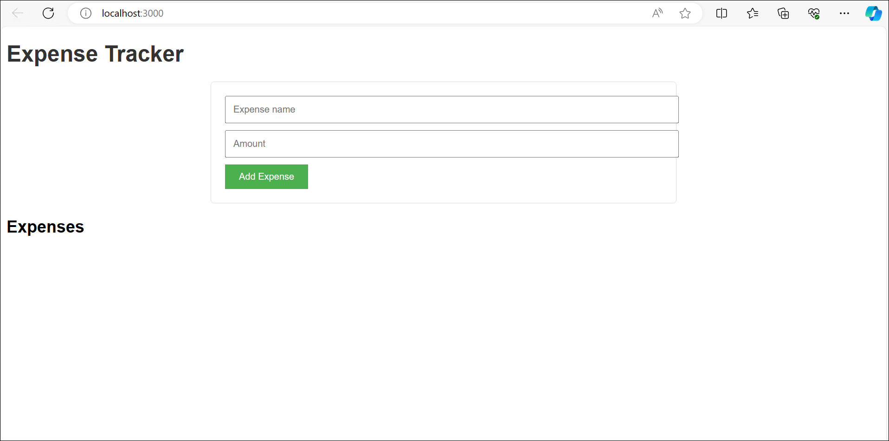
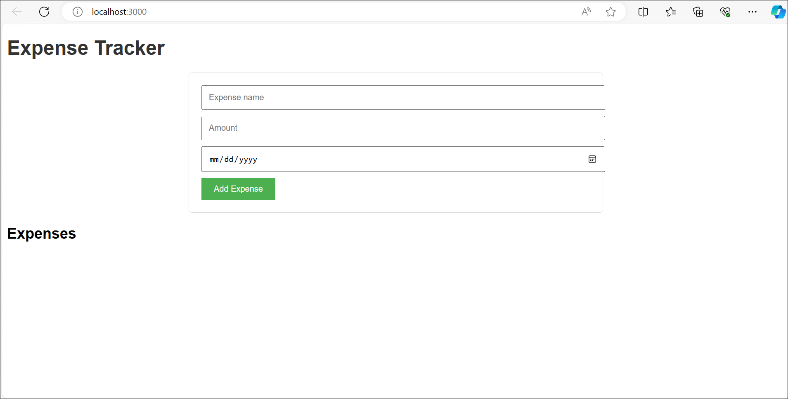

# Desafio 4: Utilizando o workspace e a referência a arquivos do GitHub Copilot

### Duração Estimada: 60 Minutos

## Introdução

Como desenvolvedor(a) de software na **Contoso Ltda**, uma empresa líder no setor, você está sempre buscando maneiras de aprimorar sua eficiência de codificação e a qualidade geral do seu código. Após explorar com sucesso os recursos básicos do **GitHub Copilot** e usá-lo para desenvolver e implantar uma aplicação no Azure, você agora volta seu foco para alguns dos recursos avançados deste assistente de programação baseado em IA.

Neste desafio, sua tarefa é explorar e utilizar dois recursos-chave do **GitHub Copilot**: o **workspace** e o **referência a arquivos**. Compreender e utilizar esses recursos pode aumentar significativamente sua produtividade e eficiência na escrita de código, proporcionando sugestões de código mais precisas e contextualizadas.

- **GitHub Copilot Workspace:** **GitHub Copilot Workspace** é uma funcionalidade avançada do **GitHub Copilot**, uma ferramenta de autocompletação de código com IA. O workspace no GitHub Copilot refere-se ao diretório de trabalho atual onde seus arquivos de código residem.

   Enquanto você programa, o **GitHub Copilot** utiliza as informações em seu workspace para gerar sugestões de código contextualmente relevantes. Isso significa que ele leva em consideração as especificidades do seu projeto atual, como os arquivos de código, bibliotecas e dependências presentes no seu workspace, para fornecer as autocompleções de código mais adequadas. Esse recurso torna o **GitHub Copilot** uum assistente de programação inteligente que não apenas entende a sintaxe e a semântica da linguagem, mas também o contexto do seu projeto, o que resulta em sugestões de código mais precisas e úteis. Ao usar eficazmente o recurso de **Workspace**, os desenvolvedores podem melhorar sua eficiência de codificação, reduzir erros e criar código de maior qualidade.

- **Referência a arquivos no GitHub Copilot:** A **referência a arquivos no GitHub Copilo** refere-se à capacidade da IA de entender e interpretar o contexto do seu projeto, considerando as informações em outros arquivos dentro do seu workspace.

   Quando você está trabalhando em um arquivo específico na sua base de código, o **GitHub Copilot** pode levar em conta as informações, funções, classes ou variáveis definidas em outros arquivos do seu projeto. Isso significa que ele não fornece apenas sugestões baseadas no arquivo atual em que você está trabalhando; ele também pode referenciar outros arquivos para fornecer autocompletar de código mais precisos e relevantes. Esse recurso é particularmente útil quando você está trabalhando em grandes projetos onde o código está espalhado por vários arquivos. A capacidade do GitHub Copilot de referenciar outros arquivos permite que ele entenda melhor o panorama geral do seu projeto, resultando em sugestões mais sensíveis ao contexto. Isso pode melhorar significativamente sua eficiência de codificação e a qualidade geral do seu código.

Seja você um(a) desenvolvedor(a) experiente procurando aprimorar sua eficiência ou um(a) iniciante buscando melhorar suas habilidades de programação, este laboratório fornecerá insights valiosos sobre como o **GitHub Copilot** pode ser uma ferramenta poderosa em sua jornada. Ao final deste desafio, seu objetivo é demonstrar à **Contoso Ltda** como esses recursos avançados do **GitHub Copilot** podem aprimorar significativamente a eficiência da codificação e a qualidade geral do código, reforçando ainda mais os benefícios de integrar a IA ao fluxo de trabalho de desenvolvimento. Vamos começar!

## Pré-requisitos

Certifique-se de ter o seguinte no ambiente integrado fornecido pelo CloudLabs:

- [Visual Studio Code](https://code.visualstudio.com/)
- [Conta do GitHub](https://github.com/)
- [Extensão GitHub Copilot instalada no VS Code](https://marketplace.visualstudio.com/items?itemName=GitHub.copilot)

## Objetivos do Desafio:

1. **Utilize o GitHub Copilot Workspace no aplicativo de Banco de Dados de Contatos existente:**

   - Entenda e explore como o recurso Workspace funciona.

   - Use a mesma janela do VS Code que foi criada no Desafio 01 para o repositório GitHub **CloudLabsAI-Azure/MyMvcApp-Contact-Databse-Application**.
   
   - Forneça alguns prompts ao agente do workspace em seu VS Code e revise os resultados, como fazer perguntas relevantes sobre seu workspace atual, gerar novas funcionalidades, identificar problemas em qualquer arquivo, e mais.

     >**Dica:** Use referências de arquivos **@workspace**, **@vscode** e **@terminal** para os prompts.

2. **Utilize o GitHub Copilot Workspace para criar um novo aplicativo React chamado Expense Tracker:**

   - Crie uma nova pasta chamada **DemoApp** em **C:/Users/azureuser**.
   - Inicie uma nova janela do Visual Studio Code e abra a pasta **DemoApp** dentro do VS Code.
   - Crie a estrutura fundamental do workspace do zero usando o recurso **GitHub Copilot Workspace** em `C:/Users/azureuser/DemoApp`.

     >**Dica:** Peça ao Copilot para criar um workspace para um novo aplicativo React Expense Tracker com todos os arquivos e código necessários.

   - Desenvolva os componentes individuais necessários no esboço da app Expense Tracker usando as capacidades transformadoras do **GitHub Copilot**.

     >**Dica:** Use a referência de arquivo **@workspace** para adicionar funcionalidades a todos os arquivos.

   - Depure todos os possíveis erros que surgirem ao executar a app Expense Tracker usando o GitHub Copilot Workspace.

   - Execute a aplicação em seu sistema local na porta 3000 com sucesso. A aplicação deve ser semelhante ao exemplo abaixo:

      
     
   >**Dica:** Use a referência **@workspace** na janela de chat do GitHub Copilot para perguntar como executar a app Expense Tracker.
   >**Observação:** Ao validar a tarefa, informe o parâmetro Nome de Usuário do GitHub no formato: github-cloudlabsuser-XXXX.

   <validation step="76e12adb-fdce-4aea-a013-b0f721a72995" />

   <validation step="2458065d-db29-4909-a6a8-6be48c96d04b" />

3. **Utilizar as capacidades de referência a arquivos:**

      - Entenda como o GitHub Copilot referencia arquivos em seus documentos e como isso ajuda no fluxo do código.

      - Forneça alguns prompts que exijam que o GitHub Copilot referencie múltiplos arquivos em seu projeto com vários arquivos e analise as referências corretamente, ou seja, forneça prompts que descrevam os usos do arquivo **index.js** na aplicação **Expense Tracker** que você construiu anteriormente.

      - Forneça um prompt usando referências a arquivos que integre o campo **Date** no documento **ExpenseForm** do seu **Expense Tracker Application** e exiba-o no **ExpenseItem**, e então permita que você classifique as despesas por data no componente **ExpenseList**.

      - A saída deve ser semelhante ao que é mostrado abaixo:

         

## Critérios de Sucesso:

- Certificar-se de que você entendeu o funcionamento do GitHub Copilot Workspace e da Referência a Arquivos.
- Certificar-se de que você forneceu com sucesso os prompts relevantes para testar o funcionamento do agente do workspace e da referência a arquivos.
- Verificar se a aplicação **Expense Tracker** está funcionando corretamente.
- Verificar os resultados gerados por seus prompts e sua precisão.
- Verificar se o componente de data foi adicionado à sua aplicação e está funcionando corretamente.

## Recursos Adicionais:

- Consulte [aqui](https://githubnext.com/projects/copilot-workspace/) para mais informações.

## Conclusão

Neste desafio, você obteve uma compreensão mais profunda de como o **Github Copilot Workspace e a Referência a Arquivos** funcionam e como eles podem aprimorar seu processo de codificação. Ao usar eficazmente esses recursos, você pode melhorar significativamente sua eficiência de programação e a qualidade geral do seu código. Seja você um(a) desenvolvedor(a) experiente ou iniciante, esses insights certamente serão valiosos em sua jornada de programação.

### Clique em Avançar >> para prosseguir com o próximo desafio.

