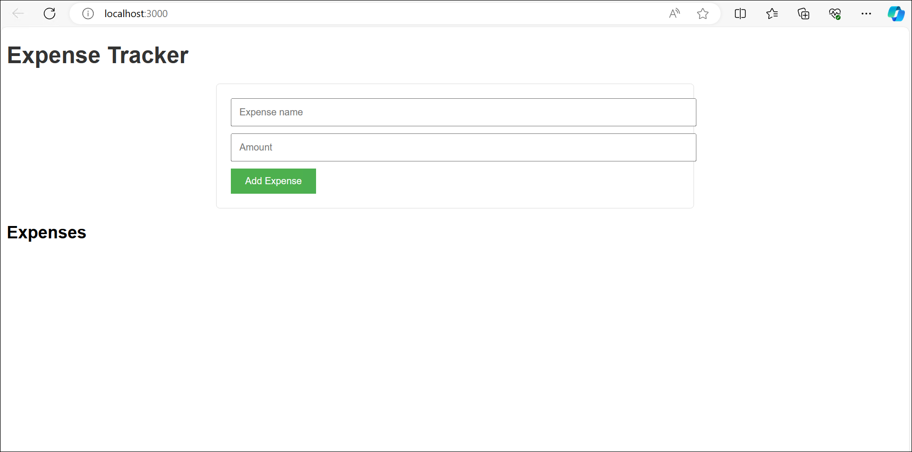
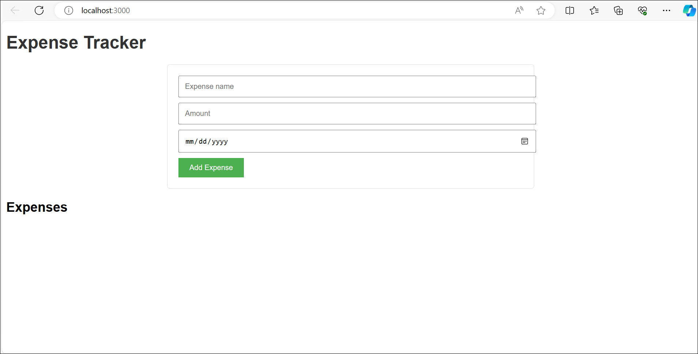

# Challenge 04: Using GitHub Copilot workspace and file reference

### Estimated Duration: 90 Minutes

## Introduction

As a software developer at **Contoso Ltd.**, a leading software development company, you are always looking for ways to enhance coding efficiency and improve overall code quality. After successfully exploring the foundational capabilities of **GitHub Copilot** and using it to develop and deploy an application to Azure, you will now focus on some of the latest advanced capabilities of GitHub Copilot available in Visual Studio Code and GitHub.

In this challenge, you will explore and utilize key GitHub Copilot features such as **context-aware suggestions**, **Copilot Chat**, and **file references**. These capabilities help developers generate more accurate, project-aware code suggestions, streamline development workflows, and improve collaboration across larger codebases.

- **GitHub Copilot Context Awareness:** GitHub Copilot uses the context of your current workspace, open files, project structure, libraries, dependencies, and existing code to provide intelligent and relevant coding assistance. Rather than generating isolated code snippets, Copilot analyzes your project context to deliver suggestions that align with your application's architecture and coding patterns.

   By understanding the broader project environment, GitHub Copilot can assist with generating functions, explaining code, suggesting improvements, creating tests, and accelerating common development tasks. This context-aware assistance helps developers write cleaner, more consistent, and higher-quality code with improved productivity.

- **GitHub Copilot Chat:** GitHub Copilot Chat extends the capabilities of GitHub Copilot by enabling conversational, AI-assisted development directly within Visual Studio Code. Developers can ask natural language questions, generate code, troubleshoot errors, explain existing code, refactor implementations, and receive step-by-step guidance without leaving the editor.

   Copilot Chat can leverage the current workspace context, selected code, terminal output, and referenced files to provide more precise and contextual responses. This significantly improves the developer experience by reducing context switching and enabling faster problem-solving during application development.

- **File Referencing in GitHub Copilot:** File referencing allows GitHub Copilot to understand and utilize information from multiple files across your project. When working in a specific file, Copilot can reference functions, classes, variables, APIs, and configurations defined elsewhere in the codebase to generate more accurate and contextually relevant suggestions.

   This feature is especially valuable in larger, multi-file projects where application logic is distributed across different layers and components. By understanding relationships between files, GitHub Copilot can provide more intelligent code completions, reduce duplication, and help maintain consistency across the application.

Whether you are an experienced developer looking to improve development efficiency or a beginner exploring AI-assisted coding, this challenge will provide practical insights into how modern GitHub Copilot capabilities can enhance software development workflows. By the end of this challenge, you will demonstrate how AI-powered development tools can accelerate coding tasks, improve code quality, and support efficient application development practices at **Contoso Ltd**.

## Prerequisites

Make sure you have the following from the CloudLabs-provided integrated environment:

- [Visual Studio Code](https://code.visualstudio.com/)
- [GitHub account](https://github.com/)

## Challenge Objectives:

1. **Utilize the GitHub Copilot Workspace in the existing Contact Database Application:**

   - Understand and explore how the Workspace feature works.

   - Use the same VS Code window which was created in Challenge 02 for the [CloudLabsAI-Azure/MyMvcApp-Contact-Databse-Application](https://github.com/CloudLabsAI-Azure/MyMvcApp-Contact-Databse-Application) GitHub repository.

   - Give some prompts to the Copilot agent in your VS Code workspace and review its outputs, like asking relevant things related to your current workspace, generating new functionality, identifying issues in any file, and more.

2. **Utilize the GitHub Copilot Workspace to create a new React app named Expense Tracker:**

   - Create a new folder named **DemoApp** in **C:/Users/azureuser**

   - Launch a new Visual Studio Code window and open the **DemoApp** folder inside the VS Code.

   - Create the fundamental workspace structure from scratch using the **GitHub Copilot Workspace** feature in `C:/Users/azureuser/DemoApp`.
     
     >**Hint:** Ask Copilot to create a workspace for a new Expense Tracker React application with all the necessary files and code.

   - Develop the individual components required in the Expense Tracker app outline using **GitHub Copilot's** transformative capabilities.
     
     >**Hint:** Use GitHub Copilot Agent mode to add functionality to all the files.

   - Debug all the possible errors coming out while running the Expense tracker app using the GitHub Copilot Workspace.

   - Run the application on your local system on port **3000** successfully. The application should be similar to the below example:

     > **Hint:** Use GitHub Copilot Agent mode on how to run the app (expense tracker).

      

3. **Utilize the capabilities of file referencing:**

      - Understand how GitHub Copilot references files in your documents and how it helps with code flow.

      - Provide some prompts that require GitHub Copilot to reference multiple files in your multi-file project and analyze the references properly, i.e., provide such prompts that describe the uses of the **index.js** file in the **Expense Tracker** application you built earlier.

      - Provide such a prompt using file references that integrate the **Date** field in the **ExpenseForm** document in your **Expense Tracker Application** and display it in the **ExpenseItem**, and then you will be able to sort the expenses by date in the **ExpenseList** component.

      The output should be similar to what is given below:

      

## Success Criteria:

- Make sure you understand the functioning of the GitHub Copilot Workspace and File Referencing.

- Make sure you successfully provided the relevant prompts to test the working of the Copilot agent and file referencing.

- Verify that the Expense tracker application is running properly.

- Verify the outputs generated by your prompts and their accuracy.

- Verify that the date component is added to your application and working properly.

## Conclusion

In this challenge, you have gained a deeper understanding of how **Github Copilot Agent and File Referencing** function and how they can enhance your coding process. By effectively using these features, you can significantly improve your coding efficiency and the overall quality of your code. Whether you're a seasoned developer or a beginner, these insights will surely be valuable in your coding journey.

## Now, click on Next >> from the lower right corner to move on to the next challenge.

