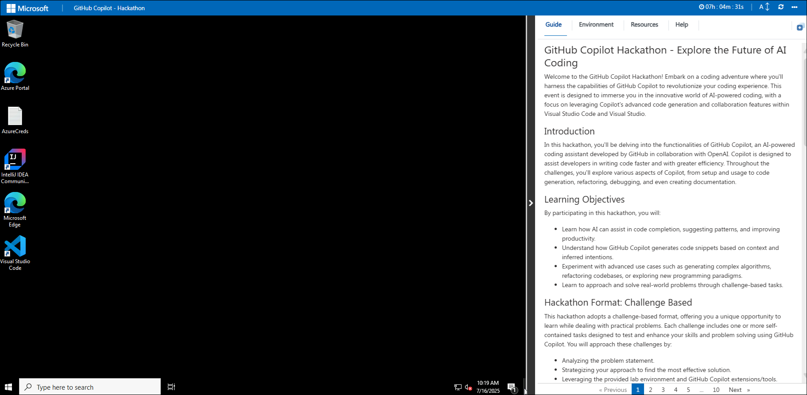
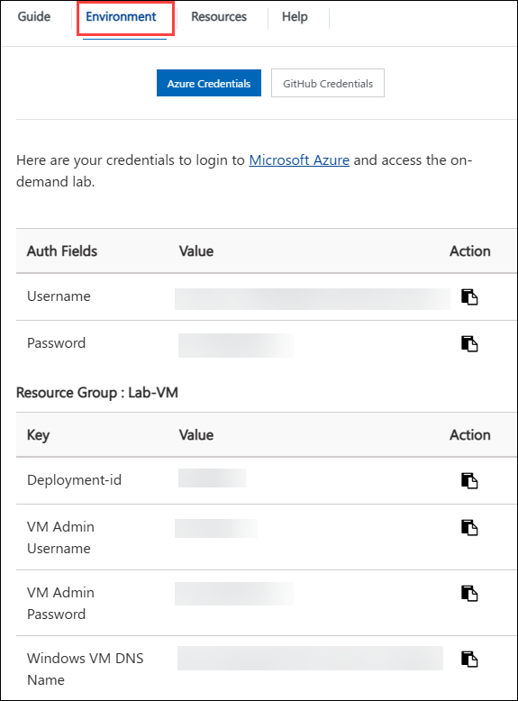
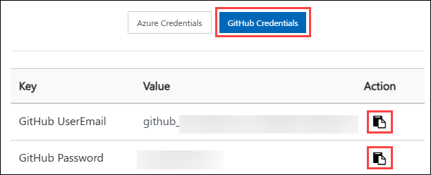
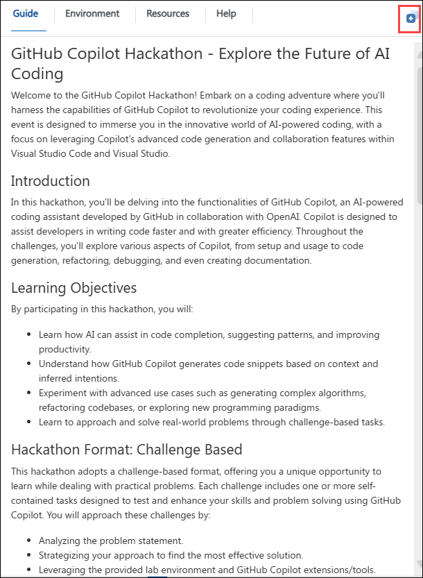
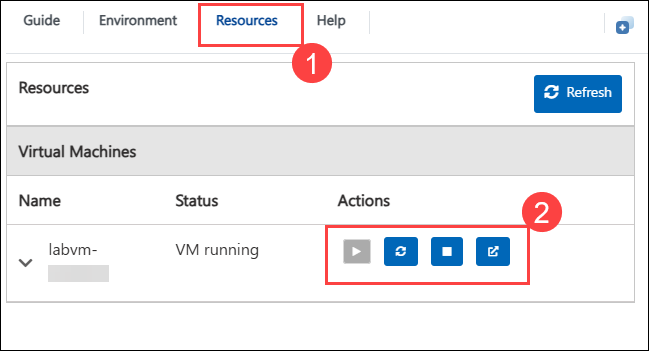

# Getting Started with Your GitHub Copilot Hackathon Workshop

Welcome to your GitHub Copilot Hackathon Workshop! We've prepared a seamless environment for you to explore and learn about Microsoft Copilot services. Let's begin by making the most of this experience:

## Accessing Your Lab Environment

Once you're ready to dive in, your virtual machine and lab **guide** will be right at your fingertips within your web browser.

## Virtual Machine & Lab Guide

Your virtual machine is your workhorse throughout the workshop. The lab guide is your roadmap to success.

## Exploring Your Lab Resources

To get a better understanding of your lab resources and credentials, navigate to the **Environment** tab.

## Accessing Your GitHub credentials

Once you are in the **Environment** tab, click on the **GitHub Credentials** option to get GitHub user credentials. The credentials will also be emailed to your registered email address.

## Utilizing the Split Window Feature

For convenience, you can open the lab guide in a separate window by selecting the **Split Window** button from the top right corner.

## Lab Guide Zoom In/Zoom Out
 
To adjust the zoom level for the environment page, click the **A↕ : 100%** icon located next to the timer in the lab environment.

## Managing Your Virtual Machine

1. Feel free to **Start, Stop, or Restart (2)** your virtual machine as needed from the **Resources (1)** tab. Your experience is in your hands!

    

Now you're all set to explore the powerful world of technology.  

## Support Contact
 
The CloudLabs support team is available via email and live chat to ensure seamless assistance at any time. We offer dedicated support channels tailored specifically for both learners and instructors, ensuring that all your needs are promptly and efficiently addressed.

- Email Support: cloudlabs-support@spektrasystems.com
- Live Chat Support: https://cloudlabs.ai/labs-support

### Now, click on Next from the lower right corner to move on to the next challenge.

### Happy Learning!
