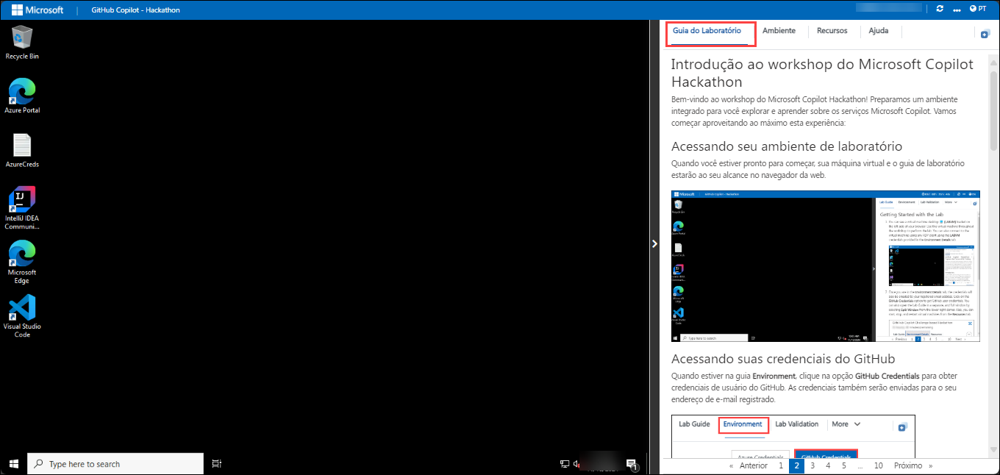
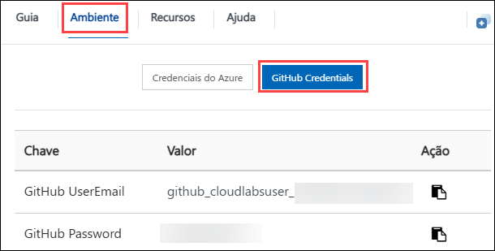
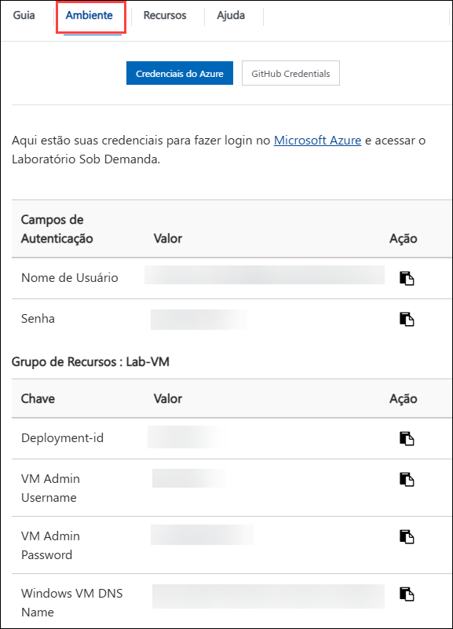
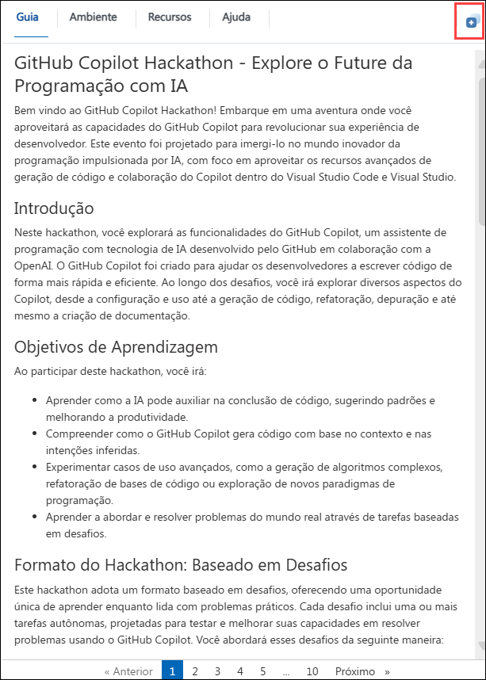
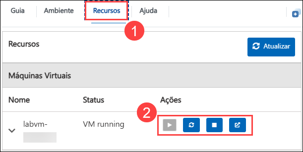

# Introdução ao workshop: GitHub Copilot Hackathon

Bem-vindo(a) ao workshop GitHub Copilot Hackathon! Preparamos um ambiente integrado para você explorar e aprender sobre os serviços Microsoft Copilot. Vamos começar aproveitando ao máximo esta experiência:

## Acessando seu ambiente de laboratório

Quando você estiver pronto para começar, sua máquina virtual e o guia de laboratório estarão ao seu alcance no navegador da web.

## Acessando suas credenciais do GitHub

Quando estiver na guia **Ambiente**, clique na opção **GitHub Credentials** para obter credenciais de usuário do GitHub. As credenciais também serão enviadas para o seu endereço de e-mail registrado.

### Máquina Virtual e Guia do Laboratório

Sua máquina virtual é sua principal ferramenta de trabalho ao longo do workshop. O guia do laboratório é seu roteiro para o sucesso.

## Explorando os recursos do seu Laboratório

Para entender melhor os recursos e credenciais do seu laboratório, navegue até a aba **Ambiente**.

## Utilizando o recurso de janela dividida

Por conveniência, você pode abrir o guia de laboratório em uma janela separada selecionando o botão **Janela dividida** no canto superior direito.

## Gerenciando sua máquina virtual

1. Sinta-se à vontade para iniciar, parar ou reiniciar sua máquina virtual conforme necessário, na partir da aba **Recursos**. Sua experiência está em suas mãos!

    

Agora está tudo pronto para você explorar o poderoso mundo da tecnologia.

## Contato de Suporte

A equipe de suporte da CloudLabs está disponível por e-mail e chat ao vivo para garantir assistência contínua a qualquer momento. Oferecemos canais de suporte dedicados, adaptados especificamente para alunos e instrutores, garantindo que todas as suas necessidades sejam atendidas com rapidez e eficiência.

- Suporte por e-mail: cloudlabs-support@spektrasystems.com
- Suporte por chat ao vivo: https://cloudlabs.ai/labs-support

Bom aprendizado!

## Agora, clique em Próximo no canto inferior direito para passar para o próximo desafio.

