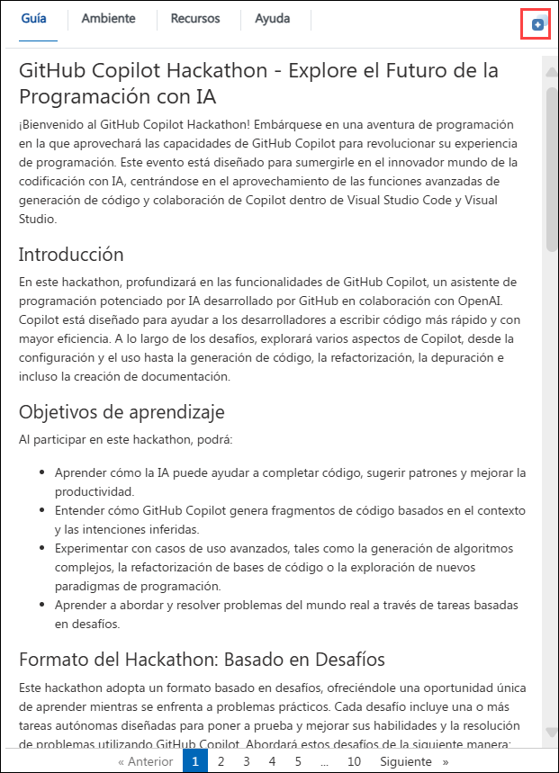

# Introducción al taller Hackathon de Microsoft Copilot

¡Bienvenido a su taller Microsoft Copilot Hackathon! Hemos preparado un entorno perfecto para que explore y conozca los servicios de Microsoft Copilot. Empecemos aprovechando al máximo esta experiencia:

## Acceso al entorno de su laboratorio

Una vez que esté listo para sumergirse, su máquina virtual y su guía de laboratorio estarán al alcance de su mano en su navegador web.

## Accediendo a tus credenciales de GitHub

Una vez que esté en la pestaña **Ambiente**, haga clic en la opción **GitHub Credentials** para obtener las credenciales de usuario de GitHub. Las credenciales también se enviarán por correo electrónico a su dirección de correo electrónico registrada.

### Guía de laboratorio y máquina virtual

Su máquina virtual es su caballo de batalla durante todo el taller. La guía de laboratorio es su hoja de ruta hacia el éxito.

## Explorando los recursos de su laboratorio

Para comprender mejor los recursos y las credenciales de su laboratorio, navegue hasta la pestaña **Ambiente**.

## Utilizando la función de ventana dividida

Para su comodidad, puede abrir la guía de laboratorio en una ventana separada seleccionando el botón **Dividir ventana** en la esquina superior derecha.

## Administrar su máquina virtual

No dude en iniciar, detener o reiniciar su máquina virtual según sea necesario desde la pestaña **Recursos**. ¡Tu experiencia está en tus manos!

Ahora ya está todo listo para explorar el poderoso mundo de la tecnología. No dude en comunicarse si tiene alguna pregunta en el camino. 

## Contacto de Soporte

El equipo de soporte de CloudLabs está disponible por correo electrónico y chat en vivo para garantizar una asistencia fluida en cualquier momento. Ofrecemos canales de soporte dedicados, diseñados específicamente para estudiantes e instructores, para garantizar que todas sus necesidades se atiendan con prontitud y eficiencia.

- Soporte por correo electrónico: cloudlabs-support@spektrasystems.com

- Soporte por chat en vivo: https://cloudlabs.ai/labs-support

Feliz Aprendizaje!
